# Hisingen

[](https://www.apple.com/macos/)
[](https://github.com/NicolasKheirallah/Hisingen/actions/workflows/ci.yml)
[](https://github.com/NicolasKheirallah/Hisingen/releases/latest)
[](https://github.com/NicolasKheirallah/Hisingen/releases)
[](LICENSE)

**Your Polestar or Volvo, right in the macOS menu bar.**

Hisingen is a native macOS app that puts the things you normally open your phone to check directly on your Mac.

Battery, range, charging, locks, climate, vehicle health, location and more are only a click away. On supported vehicles, Hisingen can also control things like climate, locks, charging and other remote functions.

No Electron. No Hisingen cloud account. No analytics platform sitting between you and your car.

[**Download latest release**](https://github.com/NicolasKheirallah/Hisingen/releases/latest) · [Changelog](CHANGELOG.md) · [FAQ](#faq) · [Troubleshooting](#troubleshooting) · [Documentation](docs/README.md) · [Contributing](CONTRIBUTING.md)

<p align="center">
  
</p>

> [!IMPORTANT]
> Hisingen is an independent open-source project. It is **not affiliated with, endorsed by or
> sponsored by Polestar or Volvo Car Corporation**. The Volvo integration uses Volvo's official,
> documented developer APIs. The Polestar integration is built on interfaces that are **not** a
> supported public third-party API, so it may change or break without notice, and using it could
> be considered a violation of Polestar's terms of service. Use at your own discretion.

## Table of contents

**Features:** [Why Hisingen?](#why-hisingen) · [Polestar and Volvo](#polestar-and-volvo) · [What Hisingen can show](#what-hisingen-can-show) · [Remote controls](#remote-controls) · [Vehicle support](#vehicle-support) · [Product tour](#product-tour)

**Using Hisingen:** [Multiple vehicles](#multiple-vehicles) · [Notifications](#notifications) · [macOS integration](#macos-integration) · [Make it yours](#make-it-yours) · [Privacy](#privacy)

**Getting started:** [Installation](#installation) · [Polestar setup](#polestar-setup) · [Volvo setup](#volvo-setup)

**Help:** [FAQ](#faq) · [Troubleshooting](#troubleshooting) · [Known limitations](#known-limitations) · [Roadmap & non-goals](#roadmap--non-goals)

**Project:** [Build from source](#build-from-source) · [Documentation](#documentation) · [Contributing](#contributing) · [Support](#support) · [Project history](#project-history) · [Credits](#credits) · [License](#license) · [Disclaimer](#disclaimer)

---

## Why Hisingen?

Sometimes you just want to know whether the car is charged, locked or ready to go.

You shouldn't always have to find your phone, unlock it, open another app and wait for it to connect just to check something simple.

Hisingen keeps that information close by on the Mac you're already using.

With Hisingen you can:

* check battery, range, fuel and charging status
* see whether doors, windows and the car itself are locked
* keep an eye on vehicle health and service information
* view trips, odometer and consumption data
* explore grouped trip, charging and command history with charts and CSV export
* check climate and cabin information
* see your car's latest reported location
* keep a local history of charging sessions
* receive useful macOS notifications
* manage multiple vehicles
* use supported remote controls without picking up your phone
* bring vehicle information into Apple Shortcuts
* monitor a real multi-provider garage in one place
* manage saved Polestar charge locations — rename, per-location current limit,
  minimum charge level, optimised-charging mode, delete
* log fuel fill-ups so hybrid and petrol costs count toward lifetime cost-per-distance
* keep an optional always-on-top charging mini-panel on screen while plugged in
* surface vehicle state in system Spotlight and act on banners with quick actions

What appears in Hisingen depends on what your individual car actually supports.

---

## Polestar and Volvo

Hisingen supports both Polestar and Volvo, but the two integrations work differently.

|                         | Polestar                                | Volvo                                                                |
| ----------------------- | --------------------------------------- | -------------------------------------------------------------------- |
| **Setup**               | Sign in with your Polestar account      | Sign in with your Volvo ID — ready out of the box (own developer application optional) |
| **Battery EVs**         | Yes                                     | Yes                                                                  |
| **Plug-in hybrids**     | No                                      | Yes                                                                  |
| **Combustion vehicles** | No                                      | Yes                                                                  |
| **Multiple vehicles**   | Yes                                     | Yes                                                                  |
| **Vehicle location**    | Where available                         | Where available                                                      |
| **Remote controls**     | Experimental and vehicle-dependent      | API and vehicle-dependent                                            |
| **Vehicle images**      | Multiple exterior views where available | Volvo-provided imagery where available                               |

### Polestar

Polestar doesn't currently provide a supported public vehicle API for third-party applications like Hisingen.

The Polestar integration therefore uses interfaces based on the services used by Polestar's own applications and real-world vehicle testing.

<table>
<tr>
<td width="50%" align="center">
<strong>Vehicle overview</strong><br><br>
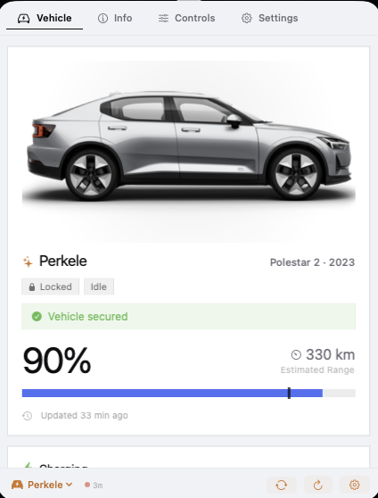
</td>
<td width="50%" align="center">
<strong>Charging history</strong><br><br>

</td>
</tr>
<tr>
<td width="50%" align="center">
<strong>Openings and tyre state</strong><br><br>

</td>
<td width="50%" align="center">
<strong>Vehicle health and climate</strong><br><br>

</td>
</tr>
<tr>
<td width="50%" align="center">
<strong>Vehicle software</strong><br><br>

</td>
<td width="50%" align="center">
<strong>Detailed openings and tyre view</strong><br><br>

</td>
</tr>
</table>

### Volvo

Volvo provides official developer APIs, and Hisingen ships with default developer application credentials — so most people can simply sign in with their Volvo ID, no registration needed.

If you prefer, you can use your own Volvo Cars Developer application and credentials instead. See [Volvo setup](#volvo-setup).

<table>
<tr>
<td width="50%" align="center">
<strong>Vehicle overview</strong><br><br>

</td>
<td width="50%" align="center">
<strong>Energy and powertrain telemetry</strong><br><br>

</td>
</tr>
<tr>
<td width="50%" align="center">
<strong>Trip and diagnostic information</strong><br><br>
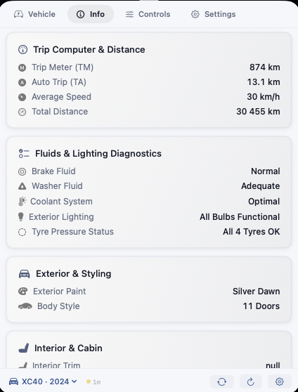
</td>
<td width="50%" align="center">
<strong>Powertrain, health and service</strong><br><br>
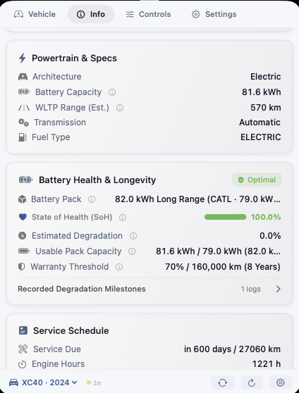
</td>
</tr>
<tr>
<td width="50%" align="center">
<strong>Vehicle identity and ownership information</strong><br><br>

</td>
<td width="50%" align="center">
<strong>Vehicle controls</strong><br><br>
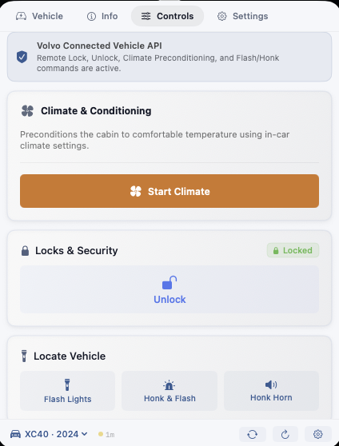
</td>
</tr>
</table>

---

## What Hisingen can show

The exact information varies by car, but Hisingen can work with much more than just battery percentage.

### Battery & range

For electric and plug-in hybrid vehicles, Hisingen can show information such as:

* state of charge
* electric range
* charging state
* charger connection
* AC or DC charging
* charging power
* current and voltage
* charge target
* charging-current limit
* estimated charging completion
* energy consumption
* one-tap amp presets (6/8/10/13/16 A) beside the current-limit slider
* saved charge location settings (Polestar): rename, per-location current limit,
  minimum charge level, optimised-charging mode, delete

The interface only shows values that make sense for the selected vehicle.

If a completed session at a known location peaks far below its usual level,
Hisingen flags it — often the first sign of a failing cable or derated charger.

Hisingen can also calculate an experimental battery State of Health estimate
from the telemetry it has observed. This is always labelled as a calculated
estimate, includes its input signals and confidence, and must not be confused
with a battery-management-system measurement or a warranty diagnosis. Exact
usable capacity and WLTP references can be entered per VIN in Settings.

### Fuel & hybrid information

Volvo support isn't limited to electric cars.

On compatible hybrid and combustion vehicles, Hisingen can also show:

* fuel level
* remaining fuel
* distance to empty
* fuel consumption
* combined battery and fuel information on plug-in hybrids

A combustion Volvo won't be shown a meaningless EV battery interface, and an EV won't be shown fuel information it doesn't have.

### Charging history

Hisingen can keep a local record of charging sessions.

Depending on the telemetry available, a session can include:

* starting battery level
* ending battery level
* estimated energy added
* charging duration
* peak charging power
* electricity price
* estimated charging cost

Charging data can also be exported for your own analysis.

Energy and cost figures are estimates based on available vehicle data rather than utility-grade metering.

### Doors, windows & locks

Hisingen can show the state reported for things such as:

* central locking
* individual doors
* windows
* hood
* tailgate
* charge flap
* fuel filler
* sunroof
* alarm

If the car doesn't report something, Hisingen doesn't quietly turn that missing information into “closed” or “locked”.

### Vehicle health

Depending on the car, Hisingen can surface:

* tyre warnings
* individual tyre-pressure information
* exterior-light warnings
* fluid warnings
* 12 V battery warnings
* service information
* service countdown
* odometer
* trip meters
* average speed
* consumption data
* battery and powertrain health information

Different vehicle platforms expose different levels of detail.

### Climate

Hisingen can show climate information and, where supported, control climatization remotely.

Depending on the vehicle this can include:

* current climate state
* heating or cooling activity
* cabin-temperature information
* remaining runtime
* climate timers
* seat-heating capabilities
* steering-wheel heating
* cabin cleaning

Climate is a good example of why Hisingen adapts to the individual car.

A Polestar 2, for example, may allow climatization to be started without exposing the same temperature controls available on newer platforms.

Instead of presenting controls that won't work, Hisingen adjusts the interface to what's actually available.

### Location

When enabled and available from the vehicle provider, Hisingen can show the car's latest reported location as a street **address** (with precise coordinates below), open it in Apple Maps, and chart cabin temperature trends where the vehicle reports them.

Vehicle location should be treated as the **latest location reported by the car**, not as guaranteed real-time tracking.

A parked or sleeping vehicle may report an older position.

### Weather at the car

Vehicle weather is optional.

When enabled, Hisingen can use the vehicle's reported location to show local weather around the car.

Weather data comes from [Open-Meteo](https://open-meteo.com/).

Because coordinates are needed to retrieve local weather, the vehicle's latitude and longitude are sent to Open-Meteo while this feature is enabled.

### Vehicle software

Where the provider exposes it, Hisingen can show vehicle software and update-related information.

Polestar currently exposes more software information to Hisingen than Volvo's developer APIs do, so this section can look different between the two brands.

---

## Remote controls

Hisingen can control supported vehicle functions directly from your Mac.

The controls you see depend on the selected vehicle rather than on a fixed list that is shown to everyone.

Examples include:

* start or stop climate
* lock or unlock the car
* horn and lights
* windows
* tailgate
* cabin cleaning
* charging settings
* charging schedules
* climate schedules
* supported OTA functions
* engine start or stop on compatible Volvo vehicles

### Supported commands

This table describes the commands currently implemented in Hisingen itself.

It does **not** mean every car supports every command.

| Function               |    Polestar   | Volvo |
| ---------------------- | :-----------: | :---: |
| Climate start / stop   |       ✓*      |   ✓*  |
| Lock / unlock          |       ✓*      |   ✓*  |
| Horn / lights          |       ✓*      |   ✓*  |
| Window controls        |       ✓*      |   —   |
| Tailgate controls      |       ✓*      |   —   |
| Cabin cleaning         |       ✓*      |   —   |
| Charge target          |       ✓*      |   —   |
| Charging-current limit |       ✓*      |   —   |
| Charging override      |       ✓*      |   —   |
| Charging schedules     |       ✓*      |   —   |
| Climate schedules      |       ✓*      |   —   |
| OTA controls           | Experimental* |   —   |
| Engine start / stop    |       —       |   ✓*  |

\* Availability still depends on the vehicle, account and services available for that car.

For sensitive commands such as unlocking the car, Hisingen can require authentication through Touch ID or the Mac password.

### About Polestar remote controls

Polestar remote commands use undocumented interfaces and should be considered experimental.

They can change independently of Hisingen if Polestar changes its backend.

Hisingen tries to distinguish between a command being accepted by the server and the vehicle actually completing it whenever the available service makes that possible.

---

## Vehicle support

A model appearing here means Hisingen knows how to identify and handle that vehicle family.

It does **not** mean every feature has been tested on every model year, region and software version.

### Recognized Polestar models

* Polestar 1
* Polestar 2
* Polestar 3
* Polestar 4
* Polestar 5

Support differs between platforms.

For example, a Polestar 2 and Polestar 4 may expose different climate, charging and remote-control capabilities even though both appear in the same app.

### Recognized Volvo models

* XC40
* EX40
* C40
* EC40
* XC60
* XC90
* S60
* S90
* V60
* V90
* EX30
* EX90
* ES90

Other vehicles may still be discovered through Volvo's API, but Hisingen won't assume a complete capability profile until enough is known about that model.

Real-world testing across different model years, regions and vehicle configurations is extremely useful.

If you're using Hisingen with a car or configuration that hasn't been tested before, please [share it with the vehicle compatibility template](https://github.com/NicolasKheirallah/Hisingen/issues/new?template=vehicle_compatibility.md).

---

## Product tour

The screenshots below show more of Hisingen in detail, grouped by the part of the app they show.

<details>
<summary><strong>Settings & personalization</strong></summary>

<br>

<table>
<tr>
<td width="50%" align="center">
<strong>Accounts & vehicle providers</strong><br><br>

</td>
<td width="50%" align="center">
<strong>Appearance</strong><br><br>

</td>
</tr>
<tr>
<td width="50%" align="center">
<strong>Local data</strong><br><br>

</td>
<td width="50%" align="center">
<strong>Trip & diagnostics</strong><br><br>

</td>
</tr>
</table>

<p align="center">
<strong>Storage & export details</strong><br><br>

</p>

A more detailed look at locally stored Hisingen data and storage-related controls.

</details>

<details>
<summary><strong>Detailed vehicle information (Polestar)</strong></summary>

<br>

<table>
<tr>
<td width="50%" align="center">
<strong>Vehicle views & openings</strong><br><br>
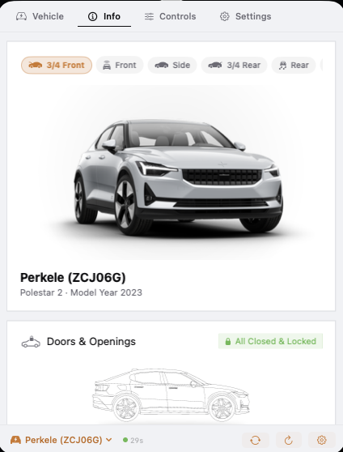
</td>
<td width="50%" align="center">
<strong>Tyres, location & weather</strong><br><br>
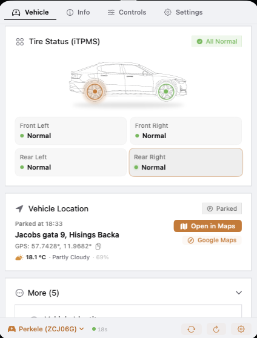
</td>
</tr>
<tr>
<td width="50%" align="center">
<strong>Diagnostics</strong><br><br>

</td>
<td width="50%" align="center">
<strong>Battery & powertrain health</strong><br><br>

</td>
</tr>
</table>

<p align="center">
<strong>Vehicle identity & ownership details</strong><br><br>

</p>

Detailed information tied to the selected vehicle and the data made available for it.

</details>

<details>
<summary><strong>History dashboard</strong></summary>

<br>

<table>
<tr>
<td width="50%" align="center">
<strong>Trip, energy and cost overview</strong><br><br>
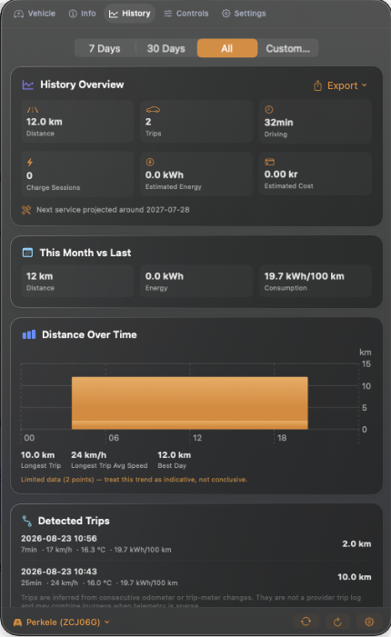
</td>
<td width="50%" align="center">
<strong>Odometer and battery health trends</strong><br><br>
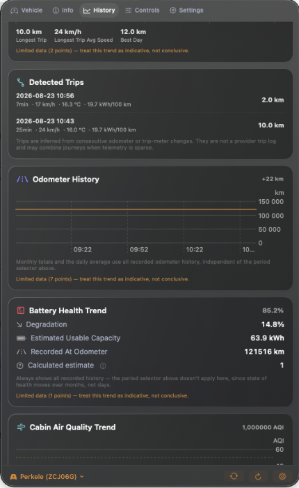
</td>
</tr>
</table>

<p align="center">
<strong>Cabin air quality and command statistics</strong><br><br>
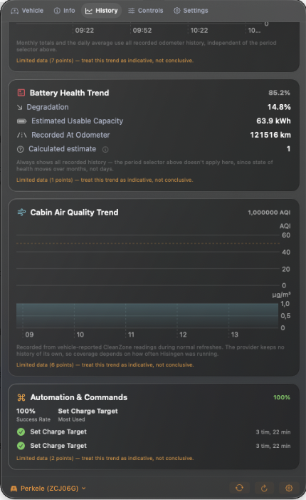
</p>

Trends built from locally recorded history — odometer, battery health and cabin air quality are labelled as calculated estimates whenever the data behind them is limited.

</details>

<details>
<summary><strong>Remote controls & capabilities</strong></summary>

<br>

<table>
<tr>
<td width="50%" align="center">
<strong>Extended vehicle controls</strong><br><br>
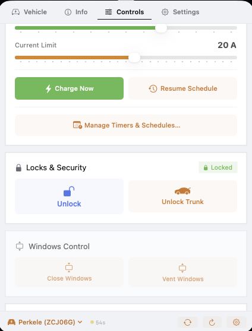
</td>
<td width="50%" align="center">
<strong>Vehicle identity & health</strong><br><br>

</td>
</tr>
<tr>
<td width="50%" align="center">
<strong>Charging controls</strong><br><br>

</td>
<td width="50%" align="center">
<strong>When a control isn't available</strong><br><br>

</td>
</tr>
<tr>
<td width="50%" align="center">
<strong>Capability overview</strong><br><br>

</td>
<td width="50%" align="center">
<strong>Capability detail</strong><br><br>
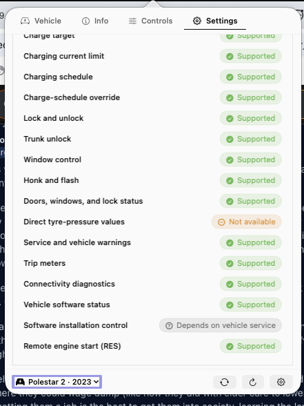
</td>
</tr>
</table>

Additional controls appear when Hisingen knows the selected vehicle can expose them — and when a feature isn't available, Hisingen explains why instead of leaving behind a control that looks like it should work.

</details>

---

## Multiple vehicles

Hisingen supports accounts with more than one vehicle.

Each vehicle keeps its own:

* current cached state
* charging history
* charging baselines
* capability observations
* local nickname
* vehicle-specific settings

Polestar and Volvo authentication are also kept separate.

Switching cars doesn't mean mixing their histories or cached information together.

---

## Notifications

Hisingen can let you know about useful vehicle events without requiring the app to stay open in front of you.

Depending on the vehicle and the features you've enabled, notifications can include:

* charging started
* charging completed
* charging interrupted
* low battery
* tyre warnings
* service or vehicle-health warnings
* software-update information
* authentication issues
* an unlocked parked vehicle
* weather-related warnings when openings are detected
* unusually slow charging vs a location's own history
* interactive banners: Lock from an unlocked-vehicle alert, Resume Schedule
  from an interrupted-charging alert

<p align="center">
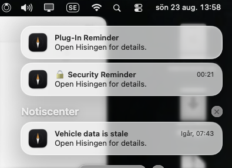
</p>

Notification behaviour can be configured in Settings.

---

## macOS integration

Hisingen is built as a native Mac application rather than a wrapped web app.

### Menu bar

The menu bar can show useful information without even opening the Hisingen window.

Depending on your preferences this can include:

* battery level
* range
* charging time
* charging power
* lock state
* compact status
* icon-only status

### Launch at Login

Hisingen can start automatically using the normal macOS Login Items system.

### Keyboard shortcuts

Keyboard shortcuts are available for common actions such as navigating the app or switching between vehicles.

Global shortcuts can require macOS Accessibility permission.

### System Spotlight

Search your car's nickname and see battery, range and charging state right in Spotlight
results — entirely local, no VIN stored in the index.

### Screenshot Privacy Mode

One toggle blurs VIN, registration plate, coordinates and addresses across the app so shared
screenshots stay safe.

### Floating charging panel

Optional tiny always-on-top panel with SoC→target, power and ETA while charging. It never
steals focus; drag it anywhere and the position is remembered.

### Apple Shortcuts

Hisingen exposes cached vehicle information and verified Volvo command handoffs to Apple
Shortcuts using App Intents.

That makes it possible to use information such as:

* battery percentage
* range
* charging state
* lock vehicle
* authenticated unlock
* start or stop cabin climate

inside your own macOS automations.

Command intents never announce that the car changed state merely because the shortcut ran.
They hand the request to Hisingen, apply the same capability and authentication gates as the
normal controls, and let the app report the provider result. Volvo lock/location permissions
must first be approved for the developer application and enabled in Hisingen Settings.

### URL scheme

Hisingen also registers:

```text
hisingen://
```

for local application navigation and automation. Recognized routes:

| Route | Action | Brand |
| --- | --- | --- |
| `hisingen://lock` | Lock vehicle | Volvo |
| `hisingen://unlock` | Unlock vehicle | Volvo |
| `hisingen://climate/start?temp=21` | Start climate (temp optional) | Volvo |
| `hisingen://climate/stop` | Stop climate | Volvo |
| `hisingen://flash` | Flash lights | Volvo |
| `hisingen://honk-flash` | Honk + flash | Volvo |
| `hisingen://charge-target?percent=80` | Set charge target | Polestar |

Commands follow the same capability gates as the in-app controls: an unsupported brand or
vehicle answers with a local notice instead of dispatching anything to a backend.

---

## Make it yours

Hisingen doesn't need to look identical on every Mac.

### Themes

Nine themes are currently included:

* Hisingen Glass
* Polestar Minimal
* Volvo Iron
* Nordic Night
* Aurora Borealis
* Swedish Gold
* Cyan Racing
* Gothenburg Forest
* Sand Dune

Theme names are visual references only and don't imply affiliation or endorsement.

### Panel size & content density

The menu bar dropdown adapts to how you use it. In
**Settings → General → Panel Size** you can pick one of five presets — Compact,
Standard, Large (tall), Wide, Grand (wide & tall) — or enable **Custom Size**
for independent width and height sliders. On Wide and Grand panels, mid-size
cards flow two per row and the vehicle render grows to use the extra room.

**Content Density** zooms everything inside the panel independently of its
window size: Compact (85%) shows more content before scrolling, Relaxed (115%)
enlarges text and controls. The right-click menu on the status icon offers both
settings for quick switching, every change applies live to an open panel, and
the panel never grows taller than the screen it opens on. The floating charging
panel follows the same density choice.

### Units

Units are selectable in **Settings → General**. Choosing miles as the distance
unit pre-selects the matching North American defaults for the other units, and
each can still be overridden individually.

Hisingen supports:

* kilometers / miles
* Celsius (°C) / Fahrenheit (°F)
* kilopascals (kPa) / PSI
* liters / US gallons / Imperial gallons
* L/100 km / US MPG / Imperial MPG / km/L
* kWh/100 km / kWh/100 mi / mi/kWh

### Languages

Hisingen currently includes:

* English
* Swedish
* German
* Norwegian (Bokmål)
* Danish
* Dutch
* French
* Spanish
* Italian
* Finnish
* Portuguese
* Polish
* Simplified Chinese
* Korean

You can also let Hisingen follow the system language automatically.

---

## Privacy

Hisingen doesn't operate a vehicle-data backend.

Your Mac communicates directly with the services needed for the features you use.

In practical terms:

|                                  |                                                           |
| -------------------------------- | --------------------------------------------------------- |
| **Hisingen account required**    | No                                                        |
| **Hisingen vehicle-data server** | No                                                        |
| **Analytics**                    | No                                                        |
| **Advertising**                  | No                                                        |
| **Credentials**                  | Stored using macOS Keychain where persistence is required |
| **Vehicle cache**                | Stored locally                                            |
| **Current vehicle coordinates**  | Not stored in the normal persistent vehicle-state cache   |
| **Vehicle weather**              | Coordinates are sent to Open-Meteo when enabled           |
| **Map integration**              | Uses Apple services where applicable                      |
| **Update checks**                | Uses GitHub Releases                                      |

Your vehicle account, VIN, location and remote-control access are sensitive information, so Hisingen treats them accordingly.

For the full breakdown, see [Privacy](docs/security/privacy.md), [Data retention](docs/data-retention.md) and [Security](docs/security/overview.md).

---

## Installation

Hisingen requires **macOS 14 Sonoma or later**.

Releases are universal and support both:

* Apple Silicon
* Intel Macs

Published releases are Developer ID signed, hardened-runtime enabled, notarized by Apple and distributed with SHA-256 checksums and GitHub build provenance.

### Install

**Option 1 — Homebrew:**

```bash
brew install --cask nicolaskheirallah/tap/hisingen
```

Updates are picked up with `brew upgrade --cask hisingen`. The cask is updated automatically on every release.

**Option 2 — Manual download:**

1. [Download the latest `Hisingen.dmg`](https://github.com/NicolasKheirallah/Hisingen/releases/latest/download/Hisingen.dmg).
2. Open the disk image.
3. Drag **Hisingen.app** into **Applications**.
4. Open Hisingen.
5. Open **Settings** and connect your vehicle account.

### Verify the download checksum

Every release publishes a `SHA256SUMS` file covering all artifacts. To verify:

```bash
shasum -a 256 -c SHA256SUMS
```

Run this in the folder containing the downloaded files. It should report `OK` for each one.

[View all releases](https://github.com/NicolasKheirallah/Hisingen/releases)

---

## Polestar setup

Polestar setup is straightforward.

1. Open **Settings**.
2. Select **Polestar**.
3. Sign in with your Polestar account.
4. Select your vehicle if your account contains more than one.

There is no Hisingen account or Hisingen authentication server between the app and Polestar.

Because the services used for vehicle data aren't a documented third-party API, an upstream change can occasionally require a Hisingen update.

---

## Volvo setup

Hisingen works with Volvo out of the box — no developer registration required.

### Just sign in

1. Open **Settings**.
2. Select **Volvo**.
3. Choose **Sign In with Volvo ID** and complete authentication in your browser.

That's it. Hisingen ships with default developer application credentials, shown in Settings as *“Developer access ready”*. You only need your Volvo ID account.

Sign-in happens in a system browser window, so Hisingen never sees your Volvo ID password directly. Credentials and long-lived session material that need to persist are stored using macOS Keychain.

### Optional: use your own developer application

If you'd rather use your own free [Volvo Cars Developer Platform](https://developer.volvocars.com/) application — for example to bill API usage against your own quota — click **Custom App** in the Volvo section of Settings and:

1. Create an application in the [Volvo Developer Portal](https://developer.volvocars.com/) and enable the API products you want (Connected Vehicle and Energy as a baseline; add Location if you want vehicle location).
2. Add this exact OAuth callback URL to your application:

   ```text
   https://nicolaskheirallah.github.io/Hisingen/oauth-callback.html
   ```

   Volvo requires an HTTP(S) OAuth callback. The small Hisingen GitHub Pages callback passes the authorization result back to the installed app through the local `hisingen://` URL scheme. It isn't a Hisingen login service and doesn't act as a vehicle-data backend.
3. Enter your **Client ID**, **Client Secret** and **VCC API Key** in Settings, then sign in.

You can switch back to the built-in credentials at any time with **Use Default Developer Keys**.

Some features — particularly location and remote operations — depend on the permissions approved for whichever developer application is in use.

For the technical details, see [Authentication](docs/api/authentication.md).

---

## FAQ

**Do I need a Hisingen account?**
No. There is no Hisingen account, no subscription and no middleman server.

**Does Volvo setup really need nothing but my Volvo ID?**
Correct. Hisingen ships with default developer application credentials, so you can just sign in. Creating your own Volvo developer application is entirely optional.

**Is Hisingen affiliated with Polestar or Volvo?**
No. It's independent open-source software. See the [Disclaimer](#disclaimer).

**Can using Hisingen affect my vehicle account?**
The Volvo integration uses APIs designed for third-party developers. The Polestar integration uses undocumented interfaces, which means it can break without notice and may be viewed by the provider as a terms-of-service matter. Treat Polestar remote controls as experimental and use at your own discretion.

**How fresh is the vehicle data?**
It reflects what the car last reported. Parked or sleeping vehicles can stop sending telemetry; Hisingen keeps the last useful values rather than showing zeroes. Check the last-updated time in the app.

**Does Hisingen update while my Mac is asleep?**
No. Like any menu bar app, it refreshes while your Mac is awake.

**Where is my data stored?**
Locally on your Mac. Credentials live in the macOS Keychain. There is no Hisingen backend — see [Privacy](#privacy).

**Can I mix Polestar and Volvo cars in one garage?**
Yes, and their histories, caches and authentication stay separate per vehicle.

**Is Hisingen free?**
Yes, MIT-licensed open source. [Build it yourself](#build-from-source) if you prefer.

---

## Troubleshooting

### The car is showing old information

Parked cars can enter low-power or sleep states and stop sending fresh telemetry.

Hisingen keeps the last useful information rather than replacing missing values with zeroes.

Check the last-updated time in Hisingen to see how fresh the displayed data is.

### A feature is missing

Not every model exposes the same online functionality.

Availability can depend on:

* vehicle model
* model year
* vehicle software
* region
* account
* provider service
* API permissions (mainly relevant when using your own Volvo developer application)

### Polestar suddenly stopped updating

The interfaces used by the Polestar integration aren't a supported public third-party API and can change.

Check the [latest release](https://github.com/NicolasKheirallah/Hisingen/releases/latest) and [existing issues](https://github.com/NicolasKheirallah/Hisingen/issues) first.

### Volvo sign-in isn't working

If you're using the built-in default credentials:

* make sure you're running the [latest release](https://github.com/NicolasKheirallah/Hisingen/releases/latest)
* complete sign-in in the browser window that opens — allow pop-ups if your default browser blocks them
* try again later; temporary gateway issues on Volvo's side do happen

If you're using your own developer application, check that:

* Client ID is correct
* Client Secret is correct
* VCC API Key is correct
* the required API products are enabled
* the callback URL matches exactly
* the application has the permissions required for the feature you're trying to use

### A remote control isn't available

The command has to be supported by Hisingen **and** available for your individual vehicle.

If it isn't, Hisingen keeps the control unavailable rather than showing something that looks like it should work.

---

## Known limitations

Hisingen depends on vehicle services it doesn't control.

A few things are worth keeping in mind:

* Polestar's vehicle interfaces can change without notice.
* Volvo API availability varies between vehicles, regions and Developer applications.
* A recognized vehicle model doesn't mean every feature has been tested on every model year.
* Parked or sleeping vehicles can report older data.
* Some information simply isn't exposed by every vehicle.
* Location is the latest reported position, not guaranteed live tracking.
* Charging energy and cost are estimates.
* A cloud service can accept a remote command before the physical vehicle completes it.
* Experimental remote functionality shouldn't be relied on for safety-critical or time-critical use.

---

## Roadmap & non-goals

Development direction is driven by real-world testing feedback — see [open issues](https://github.com/NicolasKheirallah/Hisingen/issues) and propose features with the [feature request template](https://github.com/NicolasKheirallah/Hisingen/issues/new?template=feature_request.md).

Things Hisingen deliberately will not do:

* run any Hisingen cloud service, account or middleman server
* include analytics or advertising SDKs
* provide live tracking — location is the latest reported position only
* ship iOS or Android companions — this is a macOS menu bar app
* present controls a vehicle cannot actually perform

---

## Build from source

### Requirements

* macOS 14 or later
* Xcode 16 or a compatible Apple development toolchain
* Git

Clone the repository:

```bash
git clone https://github.com/NicolasKheirallah/Hisingen.git
cd Hisingen
```

Useful targets:

| Command        | What it does                                    |
| -------------- | ----------------------------------------------- |
| `make doctor`  | Check your development environment               |
| `make ci`      | Run the same validation CI performs              |
| `make test`    | Run the test suite                               |
| `make app`     | Build `Hisingen.app`                             |
| `make run`     | Build and launch a debug build                   |
| `make clean`   | Remove build artifacts                           |

Then open the app:

```bash
make app
open Hisingen.app
```

Normal CI and the deterministic test suite don't need access to a real Polestar or Volvo account. If `.env.secrets` isn't present, the build injects empty placeholder credentials and compiles cleanly — the app then asks for your own Volvo credentials at sign-in. Live integration testing is kept separate from the deterministic test suite.

See [Getting Started](docs/development/getting-started.md) for the development setup.

---

## Documentation

This README is meant for people who want to understand, install or try Hisingen.

The deeper engineering material lives under [`docs/`](docs/README.md).

Useful places to start:

* [Documentation Index](docs/README.md)
* [Architecture](docs/architecture/overview.md)
* [Architecture Decision Records](docs/adr/README.md)
* [Vehicle Capabilities](docs/domain/capability-matrix.md)
* [Glossary](docs/glossary.md)
* [API Overview](docs/api/overview.md)
* [Polestar Integration](docs/api/polestar.md)
* [Volvo Integration](docs/api/volvo.md)
* [Authentication](docs/api/authentication.md)
* [Privacy](docs/security/privacy.md)
* [Data Retention](docs/data-retention.md)
* [Security](docs/security/overview.md)
* [Threat Model](docs/security/threat-model.md)
* [Testing](docs/testing/strategy.md)
* [Release Process](docs/operations/releases.md)

---

## Contributing

Bug reports, pull requests and real-world vehicle testing are welcome.

Different cars, model years, regions and software versions don't always behave the same way, so testing on vehicles that aren't already well covered is especially useful.

See [CONTRIBUTING.md](CONTRIBUTING.md) for the development guide and pull-request checklist.

Security vulnerabilities should be reported privately through [SECURITY.md](SECURITY.md), not through a public issue.

---

## Support

* Found a bug? → [bug report template](https://github.com/NicolasKheirallah/Hisingen/issues/new?template=bug_report.md)
* Missing a feature? → [feature request template](https://github.com/NicolasKheirallah/Hisingen/issues/new?template=feature_request.md)
* Tested Hisingen with an unusual model, year or region? → [vehicle compatibility template](https://github.com/NicolasKheirallah/Hisingen/issues/new?template=vehicle_compatibility.md) — this is one of the most useful contributions there is
* Security issue? → [responsible disclosure via SECURITY.md](SECURITY.md)

Please check the [Troubleshooting](#troubleshooting) section and [existing issues](https://github.com/NicolasKheirallah/Hisingen/issues) before opening a new one.

---

## Project history

Hisingen started from a pretty simple frustration: I was sitting at my Mac and wanted to check or control something on the car without having to reach for my phone.

The name **Hisingen** comes from Gothenburg, where both Volvo and Polestar have strong roots, and reflects where the project itself comes from as well.

---

## Credits

Hisingen is maintained by [Nicolas Kheirallah](https://github.com/NicolasKheirallah).

Thanks as well to everyone testing the app on different cars and configurations. Real-world feedback is one of the most useful ways to improve Hisingen, especially when vehicle behaviour differs between models in ways that aren't obvious from documentation alone.

Thanks to the [pypolestar devs](https://github.com/pypolestar/polestar_api/) who have made much of this work possible!

---

## License

Hisingen is released under the [MIT License](LICENSE).

---

## Disclaimer

Hisingen is independent open-source software.

It is **not affiliated with, endorsed by, sponsored by or maintained by Polestar or Volvo Car Corporation**.

Polestar and Volvo are trademarks of their respective owners and are referenced only to describe vehicle compatibility.

Vehicle accounts, APIs and cloud services remain subject to the terms, policies and availability of their respective providers.

See [Terms & Conditions](TERMS.md) for additional information.
