# Hisingen

[](https://www.apple.com/macos/)
[](https://github.com/NicolasKheirallah/Hisingen/actions/workflows/ci.yml)
[](https://github.com/NicolasKheirallah/Hisingen/releases/latest)
[](LICENSE)

**Your Polestar or Volvo, right in the macOS menu bar.**

Hisingen is a native macOS app that puts the things you normally open your phone to check directly on your Mac.

Battery, range, charging, locks, climate, vehicle health, location and more are only a click away. On supported vehicles, Hisingen can also control things like climate, locks, charging and other remote functions.

No Electron. No Hisingen cloud account. No analytics platform sitting between you and your car.

[**Download Hisingen.dmg**](https://github.com/NicolasKheirallah/Hisingen/releases/latest/download/Hisingen.dmg) · [Website](https://nicolaskheirallah.github.io/Hisingen/) · [Releases](https://github.com/NicolasKheirallah/Hisingen/releases) · [Documentation](docs/README.md)

<p align="center">
  
</p>

---

## Why Hisingen?

Sometimes you just want to know whether the car is charged, locked or ready to go.

You shouldn't always have to find your phone, unlock it, open another app and wait for it to connect just to check something simple.

Hisingen keeps that information close by on the Mac you're already using.

With Hisingen you can:

* check battery, range, fuel and charging status
* see whether doors, windows and the car itself are locked
* keep an eye on vehicle health and service information
* view trips, odometer and consumption data
* check climate and cabin information
* see your car's latest reported location
* keep a local history of charging sessions
* receive useful macOS notifications
* manage multiple vehicles
* use supported remote controls without picking up your phone
* bring vehicle information into Apple Shortcuts

What appears in Hisingen depends on what your individual car actually supports.

---

## Polestar and Volvo

Hisingen supports both Polestar and Volvo, but the two integrations work differently.

|                         | Polestar                                | Volvo                                                |
| ----------------------- | --------------------------------------- | ---------------------------------------------------- |
| **Setup**               | Sign in with your Polestar account      | Volvo account + your own Volvo Developer application |
| **Battery EVs**         | Yes                                     | Yes                                                  |
| **Plug-in hybrids**     | No                                      | Yes                                                  |
| **Combustion vehicles** | No                                      | Yes                                                  |
| **Multiple vehicles**   | Yes                                     | Yes                                                  |
| **Vehicle location**    | Where available                         | Where available                                      |
| **Remote controls**     | Experimental and vehicle-dependent      | API and vehicle-dependent                            |
| **Vehicle images**      | Multiple exterior views where available | Volvo-provided imagery where available               |

### Polestar

Polestar doesn't currently provide a supported public vehicle API for third-party applications like Hisingen.

The Polestar integration therefore uses interfaces based on the services used by Polestar's own applications and real-world vehicle testing.

That gives Hisingen access to a lot of useful information, but it also means Polestar can change something upstream without warning. When that happens, a Hisingen update may occasionally be needed.

### Volvo

Volvo provides official developer APIs, but setup takes a few more steps.

You'll need your own Volvo Cars Developer application and API credentials before signing in through Hisingen.

[Jump to Volvo setup](#volvo-setup)

---

# A quick look

Here are a few of the main parts of Hisingen.

<table>
<tr>
<td width="50%" valign="top">

### Polestar


Your car's main status in one place, including the most useful information for a quick check from your Mac.

</td>
<td width="50%" valign="top">

### Volvo

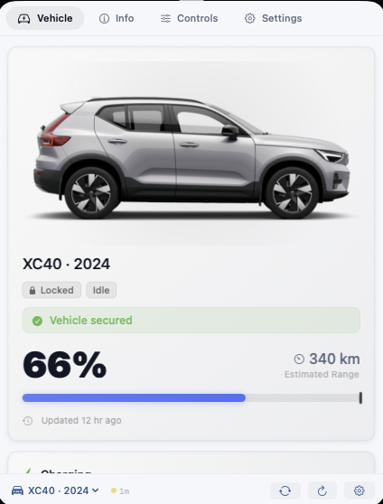

The same Hisingen experience adapts to Volvo vehicles, including electric, hybrid and combustion-specific information where available.

</td>
</tr>
<tr>
<td width="50%" valign="top">

### Charging history


Keep a local record of charging sessions, including estimated energy, duration and cost.

</td>
<td width="50%" valign="top">

### Vehicle controls

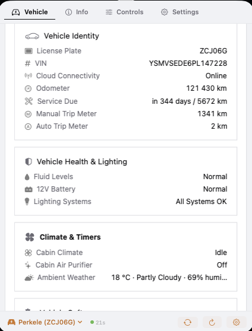

Supported remote functions are presented alongside the rest of the car instead of hidden in a separate companion app.

</td>
</tr>
</table>

---

# What Hisingen can show

The exact information varies by car, but Hisingen can work with much more than just battery percentage.

## Battery & range

For electric and plug-in hybrid vehicles, Hisingen can show information such as:

* state of charge
* electric range
* charging state
* charger connection
* AC or DC charging
* charging power
* current and voltage
* charge target
* charging-current limit
* estimated charging completion
* energy consumption

The interface only shows values that make sense for the selected vehicle.

---

## Fuel & hybrid information

Volvo support isn't limited to electric cars.

On compatible hybrid and combustion vehicles, Hisingen can also show:

* fuel level
* remaining fuel
* distance to empty
* fuel consumption
* combined battery and fuel information on plug-in hybrids

A combustion Volvo won't be shown a meaningless EV battery interface, and an EV won't be shown fuel information it doesn't have.

---

## Charging history

Hisingen can keep a local record of charging sessions.

Depending on the telemetry available, a session can include:

* starting battery level
* ending battery level
* estimated energy added
* charging duration
* peak charging power
* electricity price
* estimated charging cost

Charging data can also be exported for your own analysis.

Energy and cost figures are estimates based on available vehicle data rather than utility-grade metering.

---

## Doors, windows & locks

Hisingen can show the state reported for things such as:

* central locking
* individual doors
* windows
* hood
* tailgate
* charge flap
* fuel filler
* sunroof
* alarm

If the car doesn't report something, Hisingen doesn't quietly turn that missing information into “closed” or “locked”.

---

## Vehicle health

Depending on the car, Hisingen can surface:

* tyre warnings
* individual tyre-pressure information
* exterior-light warnings
* fluid warnings
* 12 V battery warnings
* service information
* service countdown
* odometer
* trip meters
* average speed
* consumption data
* battery and powertrain health information

Different vehicle platforms expose different levels of detail.

---

## Climate

Hisingen can show climate information and, where supported, control climatization remotely.

Depending on the vehicle this can include:

* current climate state
* heating or cooling activity
* cabin-temperature information
* remaining runtime
* climate timers
* seat-heating capabilities
* steering-wheel heating
* cabin cleaning

Climate is a good example of why Hisingen adapts to the individual car.

A Polestar 2, for example, may allow climatization to be started without exposing the same temperature controls available on newer platforms.

Instead of presenting controls that won't work, Hisingen adjusts the interface to what's actually available.

---

## Location

When enabled and available from the vehicle provider, Hisingen can show the car's latest reported location and open it in Apple Maps.

Vehicle location should be treated as the **latest location reported by the car**, not as guaranteed real-time tracking.

A parked or sleeping vehicle may report an older position.

---

## Weather at the car

Vehicle weather is optional.

When enabled, Hisingen can use the vehicle's reported location to show local weather around the car.

Weather data comes from [Open-Meteo](https://open-meteo.com/).

Because coordinates are needed to retrieve local weather, the vehicle's latitude and longitude are sent to Open-Meteo while this feature is enabled.

---

## Vehicle software

Where the provider exposes it, Hisingen can show vehicle software and update-related information.

Polestar currently exposes more software information to Hisingen than Volvo's developer APIs do, so this section can look different between the two brands.

---

# Remote controls

Hisingen can control supported vehicle functions directly from your Mac.

The controls you see depend on the selected vehicle rather than on a fixed list that is shown to everyone.

Examples include:

* start or stop climate
* lock or unlock the car
* horn and lights
* windows
* tailgate
* cabin cleaning
* charging settings
* charging schedules
* climate schedules
* supported OTA functions
* engine start or stop on compatible Volvo vehicles

## Current implementation

This table describes the commands currently implemented in Hisingen itself.

It does **not** mean every car supports every command.

| Function               |    Polestar   | Volvo |
| ---------------------- | :-----------: | :---: |
| Climate start / stop   |       ✓*      |   ✓*  |
| Lock / unlock          |       ✓*      |   ✓*  |
| Horn / lights          |       ✓*      |   ✓*  |
| Window controls        |       ✓*      |   —   |
| Tailgate controls      |       ✓*      |   —   |
| Cabin cleaning         |       ✓*      |   —   |
| Charge target          |       ✓*      |   —   |
| Charging-current limit |       ✓*      |   —   |
| Charging override      |       ✓*      |   —   |
| Charging schedules     |       ✓*      |   —   |
| Climate schedules      |       ✓*      |   —   |
| OTA controls           | Experimental* |   —   |
| Engine start / stop    |       —       |   ✓*  |

* Availability still depends on the vehicle, account and services available for that car.

For sensitive commands such as unlocking the car, Hisingen can require authentication through Touch ID or the Mac password.

### About Polestar remote controls

Polestar remote commands use undocumented interfaces and should be considered experimental.

They can change independently of Hisingen if Polestar changes its backend.

Hisingen tries to distinguish between a command being accepted by the server and the vehicle actually completing it whenever the available service makes that possible.

---

# Vehicle support

A model appearing here means Hisingen knows how to identify and handle that vehicle family.

It does **not** mean every feature has been tested on every model year, region and software version.

## Polestar

Hisingen currently recognizes:

* Polestar 1
* Polestar 2
* Polestar 3
* Polestar 4
* Polestar 5

Support differs between platforms.

For example, a Polestar 2 and Polestar 4 may expose different climate, charging and remote-control capabilities even though both appear in the same app.

## Volvo

Hisingen currently recognizes:

* XC40
* EX40
* C40
* EC40
* XC60
* XC90
* S60
* S90
* V60
* V90
* EX30
* EX90
* ES90

Other vehicles may still be discovered through Volvo's API, but Hisingen won't assume a complete capability profile until enough is known about that model.

Real-world testing across different model years, regions and vehicle configurations is extremely useful.

If you're using Hisingen with a car or configuration that hasn't been tested before, feedback is welcome.

---

# Product tour

The screenshots below show more of Hisingen in detail.

They're grouped by the part of the app they show rather than by the filenames of the image files.

---

<details>
<summary><strong>Volvo: vehicle information</strong></summary>

<br>

<table>
<tr>
<td width="50%" valign="top">

### Vehicle overview


A quick overview of the selected Volvo and the most useful information currently available from the car.

</td>
<td width="50%" valign="top">

### Energy & range

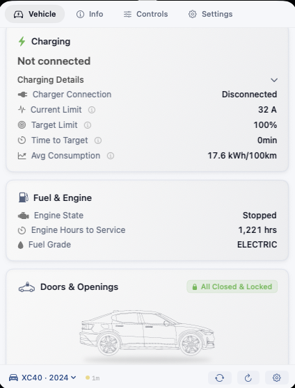

Energy information adapts to the vehicle's powertrain, including EV, plug-in hybrid and fuel-related data where relevant.

</td>
</tr>

<tr>
<td width="50%" valign="top">

### Trips & driving information


Trip and driving data such as distance, odometer, average speed and consumption when reported by the vehicle.

</td>
<td width="50%" valign="top">

### Vehicle health


Health and service information collected in one place instead of spread across several vehicle screens.

</td>
</tr>

<tr>
<td width="50%" valign="top">

### Vehicle details

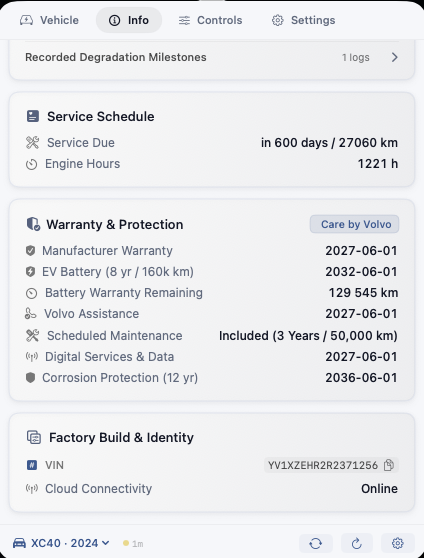

Detailed information about the selected vehicle and the identity data available from Volvo.

</td>
<td width="50%" valign="top">

### Volvo controls


Remote operations that are available through Volvo's API and supported by the selected vehicle.

</td>
</tr>
</table>

</details>

---

<details>
<summary><strong>Polestar: everyday information</strong></summary>

<br>

<table>
<tr>
<td width="50%" valign="top">

### Vehicle overview


The main Polestar view brings the car's most useful day-to-day information together.

</td>
<td width="50%" valign="top">

### Charging history


A history of locally recorded charging sessions with useful charging and cost information.

</td>
</tr>

<tr>
<td width="50%" valign="top">

### Doors, windows & tyres


A quick check of the parts of the car you normally want to know about before walking away from it.

</td>
<td width="50%" valign="top">

### Climate & vehicle health


Climate and health information available from the selected Polestar.

</td>
</tr>

<tr>
<td width="50%" valign="top">

### Vehicle software


Software and update-related information reported by the vehicle services used by Hisingen.

</td>
<td width="50%" valign="top">

### Detailed openings & tyres

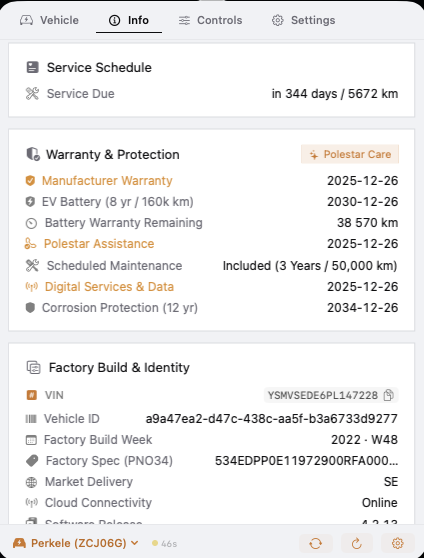

A more detailed look at individual openings and tyre information when the car exposes it.

</td>
</tr>
</table>

</details>

---

<details>
<summary><strong>Polestar: detailed vehicle information</strong></summary>

<br>

<table>
<tr>
<td width="50%" valign="top">

### Vehicle information

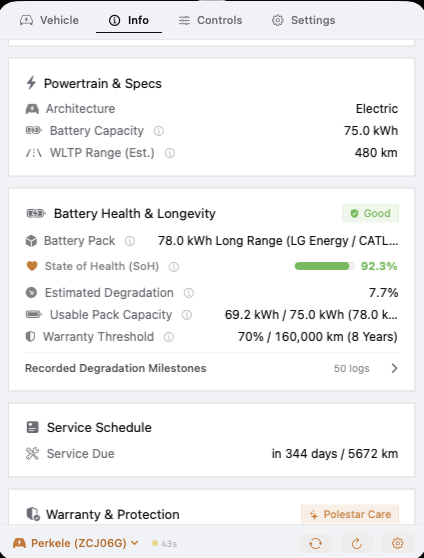

More detailed vehicle information for when you want to go beyond the everyday overview.

</td>
<td width="50%" valign="top">

### Location & cabin environment

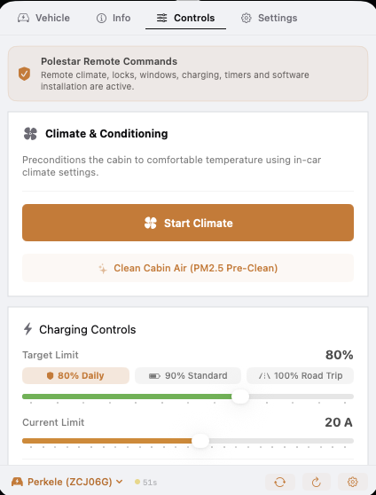

Location and environmental information made available for the selected car.

</td>
</tr>

<tr>
<td width="50%" valign="top">

### Diagnostics


Vehicle information useful for understanding warnings, status and reported diagnostic conditions.

</td>
<td width="50%" valign="top">

### Battery & powertrain health


Available health and powertrain information presented without mixing it into the main day-to-day overview.

</td>
</tr>

<tr>
<td width="50%" valign="top">

### Vehicle identity & ownership details


Detailed information tied to the selected vehicle and the data made available for it.

</td>
<td width="50%"></td>
</tr>
</table>

</details>

---

<details>
<summary><strong>Remote controls</strong></summary>

<br>

<table>
<tr>
<td width="50%" valign="top">

### Vehicle controls


The main remote operations available for the selected vehicle.

</td>
<td width="50%" valign="top">

### Additional controls

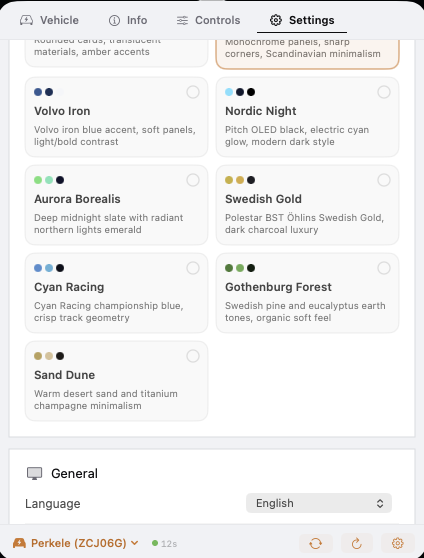

Additional controls appear when Hisingen knows the selected vehicle can expose them.

</td>
</tr>

<tr>
<td width="50%" valign="top">

### Charging controls

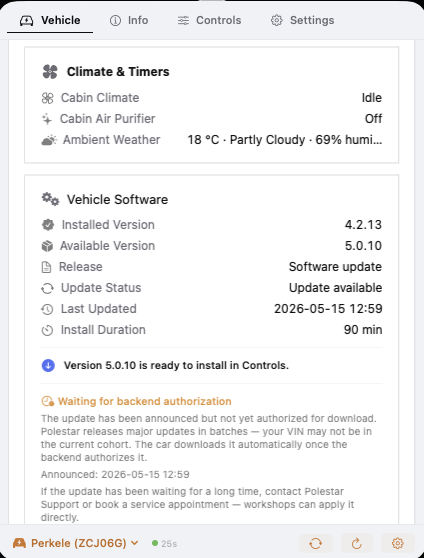

Charging-related controls and configuration available for the selected vehicle.

</td>
<td width="50%" valign="top">

### When a control isn't available

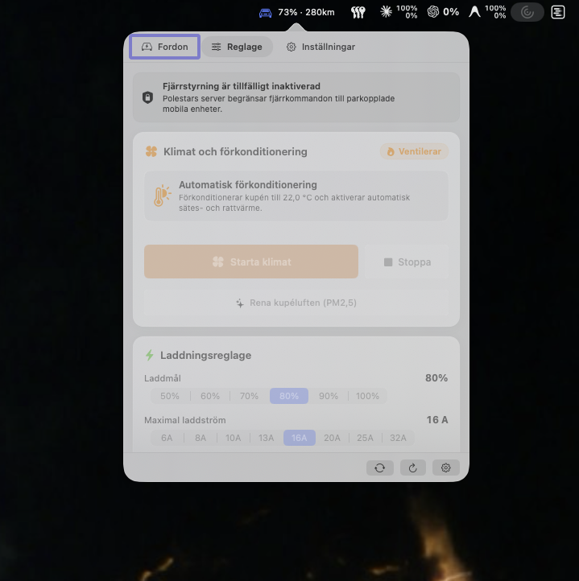

Hisingen can explain when a feature isn't available instead of leaving behind a control that looks like it should work.

</td>
</tr>
</table>

</details>

---

<details>
<summary><strong>Settings & personalization</strong></summary>

<br>

<table>
<tr>
<td width="50%" valign="top">

### Accounts & vehicle providers


Manage connected vehicle accounts and provider-specific configuration.

</td>
<td width="50%" valign="top">

### Appearance

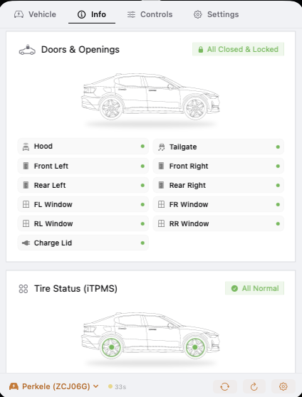

Choose the look that fits your Mac, from understated manufacturer-inspired themes to more colorful Hisingen styles.

</td>
</tr>

<tr>
<td width="50%" valign="top">

### Local data

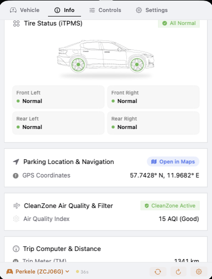

See and manage data Hisingen keeps locally on your Mac.

</td>
<td width="50%" valign="top">

### Features & telemetry

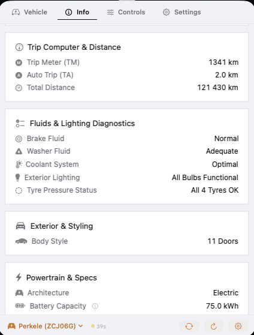

Control optional features and how Hisingen uses the information available from your vehicle.

</td>
</tr>

<tr>
<td width="50%" valign="top">

### Storage details

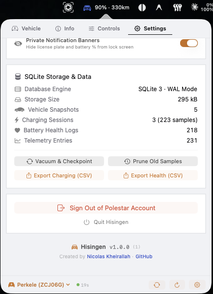

A more detailed look at locally stored Hisingen data and storage-related controls.

</td>
<td width="50%"></td>
</tr>
</table>

</details>

---

<details>
<summary><strong>Vehicle capabilities</strong></summary>

<br>

<table>
<tr>
<td width="50%" valign="top">

### Capability overview


See which vehicle functions Hisingen currently understands for the selected car.

</td>
<td width="50%" valign="top">

### Capability details


Detailed information helps explain why a feature is available, unavailable or still unknown for a particular vehicle.

</td>
</tr>
</table>

</details>

---

# Multiple vehicles

Hisingen supports accounts with more than one vehicle.

Each vehicle keeps its own:

* current cached state
* charging history
* charging baselines
* capability observations
* local nickname
* vehicle-specific settings

Polestar and Volvo authentication are also kept separate.

Switching cars doesn't mean mixing their histories or cached information together.

---

# Notifications

Hisingen can let you know about useful vehicle events without requiring the app to stay open in front of you.

Depending on the vehicle and the features you've enabled, notifications can include:

* charging started
* charging completed
* charging interrupted
* low battery
* tyre warnings
* service or vehicle-health warnings
* software-update information
* authentication issues
* an unlocked parked vehicle
* weather-related warnings when openings are detected

Notification behaviour can be configured in Settings.

---

# macOS integration

Hisingen is built as a native Mac application rather than a wrapped web app.

## Menu bar

The menu bar can show useful information without even opening the Hisingen window.

Depending on your preferences this can include:

* battery level
* range
* charging time
* charging power
* lock state
* compact status
* icon-only status

## Launch at Login

Hisingen can start automatically using the normal macOS Login Items system.

## Keyboard shortcuts

Keyboard shortcuts are available for common actions such as navigating the app or switching between vehicles.

Global shortcuts can require macOS Accessibility permission.

## Apple Shortcuts

Hisingen exposes cached vehicle information to Apple Shortcuts using App Intents.

That makes it possible to use information such as:

* battery percentage
* range
* charging state

inside your own macOS automations.

## URL scheme

Hisingen also registers:

```text
hisingen://
```

for local application navigation and automation.

---

# Make it yours

Hisingen doesn't need to look identical on every Mac.

## Themes

Nine themes are currently included:

* Hisingen Glass
* Polestar Minimal
* Volvo Iron
* Nordic Night
* Aurora Borealis
* Swedish Gold
* Cyan Racing
* Gothenburg Forest
* Sand Dune

Theme names are visual references only and don't imply affiliation or endorsement.

## Units

Hisingen supports:

* kilometers
* miles
* liters
* US gallons
* Imperial gallons
* L/100 km
* US MPG
* Imperial MPG
* km/L

## Languages

Hisingen currently includes:

* English
* Swedish
* German
* Norwegian
* Danish
* Dutch
* French
* Spanish
* Italian
* Finnish
* Portuguese
* Polish
* Simplified Chinese
* Korean

You can also let Hisingen follow the system language automatically.

---

# Privacy

Hisingen doesn't operate a vehicle-data backend.

Your Mac communicates directly with the services needed for the features you use.

In practical terms:

|                                  |                                                           |
| -------------------------------- | --------------------------------------------------------- |
| **Hisingen account required**    | No                                                        |
| **Hisingen vehicle-data server** | No                                                        |
| **Analytics**                    | No                                                        |
| **Advertising**                  | No                                                        |
| **Credentials**                  | Stored using macOS Keychain where persistence is required |
| **Vehicle cache**                | Stored locally                                            |
| **Current vehicle coordinates**  | Not stored in the normal persistent vehicle-state cache   |
| **Vehicle weather**              | Coordinates are sent to Open-Meteo when enabled           |
| **Map integration**              | Uses Apple services where applicable                      |
| **Update checks**                | Uses GitHub Releases                                      |

Your vehicle account, VIN, location and remote-control access are sensitive information, so Hisingen treats them accordingly.

For the full breakdown, see [Privacy](docs/security/privacy.md) and [Security](docs/security/overview.md).

---

# Installation

Hisingen requires **macOS 14 Sonoma or later**.

Releases are universal and support both:

* Apple Silicon
* Intel Macs

Published releases are Developer ID signed, hardened-runtime enabled, notarized by Apple and distributed with SHA-256 checksums and GitHub build provenance.

## Install

1. [Download the latest `Hisingen.dmg`](https://github.com/NicolasKheirallah/Hisingen/releases/latest/download/Hisingen.dmg).
2. Open the disk image.
3. Drag **Hisingen.app** into **Applications**.
4. Open Hisingen.
5. Open **Settings** and connect your vehicle account.

[View all releases](https://github.com/NicolasKheirallah/Hisingen/releases)

---

# Polestar setup

Polestar setup is straightforward.

1. Open **Settings**.
2. Select **Polestar**.
3. Sign in with your Polestar account.
4. Select your vehicle if your account contains more than one.

There is no Hisingen account or Hisingen authentication server between the app and Polestar.

Because the services used for vehicle data aren't a documented third-party API, an upstream change can occasionally require a Hisingen update.

---

# Volvo setup

Volvo takes a little more initial setup because Volvo requires third-party applications to use the Volvo Cars Developer Platform.

You only need to configure this once.

## 1. Create a Volvo Developer application

Go to the [Volvo Cars Developer Portal](https://developer.volvocars.com/) and create your own application.

Enable the API products needed for the information and functionality you want to use.

Some features, particularly location and remote operations, can require additional API products or permissions.

## 2. Configure the callback

Add this exact OAuth callback URL to your Volvo Developer application:

```text
https://nicolaskheirallah.github.io/Hisingen/oauth-callback.html
```

Volvo requires an HTTP(S) OAuth callback.

The small Hisingen GitHub Pages callback passes the authorization result back to the installed app through the local `hisingen://` URL scheme.

It isn't a Hisingen login service and doesn't act as a vehicle-data backend.

## 3. Add your Volvo credentials

In Hisingen Settings, enter the values from your Volvo Developer application:

* Client ID
* Client Secret
* VCC API Key

Then choose **Sign In with Volvo ID** and complete authentication in your browser.

Credentials and long-lived session material that need to persist are stored using macOS Keychain.

For the technical details, see [Authentication](docs/api/authentication.md).

---

# Troubleshooting

## The car is showing old information

Parked cars can enter low-power or sleep states and stop sending fresh telemetry.

Hisingen keeps the last useful information rather than replacing missing values with zeroes.

Check the last-updated time in Hisingen to see how fresh the displayed data is.

## A feature is missing

Not every model exposes the same online functionality.

Availability can depend on:

* vehicle model
* model year
* vehicle software
* region
* account
* provider service
* API permissions

For Volvo, the products and permissions enabled for your Developer application matter too.

## Polestar suddenly stopped updating

The interfaces used by the Polestar integration aren't a supported public third-party API and can change.

Check the [latest release](https://github.com/NicolasKheirallah/Hisingen/releases/latest) and [existing issues](https://github.com/NicolasKheirallah/Hisingen/issues) first.

## Volvo sign-in isn't working

Check that:

* Client ID is correct
* Client Secret is correct
* VCC API Key is correct
* the required API products are enabled
* the callback URL matches exactly
* the application has the permissions required for the feature you're trying to use

## A remote control isn't available

The command has to be supported by Hisingen **and** available for your individual vehicle.

If it isn't, Hisingen keeps the control unavailable rather than showing something that looks like it should work.

---

# Known limitations

Hisingen depends on vehicle services it doesn't control.

A few things are worth keeping in mind:

* Polestar's vehicle interfaces can change without notice.
* Volvo API availability varies between vehicles, regions and Developer applications.
* A recognized vehicle model doesn't mean every feature has been tested on every model year.
* Parked or sleeping vehicles can report older data.
* Some information simply isn't exposed by every vehicle.
* Location is the latest reported position, not guaranteed live tracking.
* Charging energy and cost are estimates.
* A cloud service can accept a remote command before the physical vehicle completes it.
* Experimental remote functionality shouldn't be relied on for safety-critical or time-critical use.

---

# Build from source

## Requirements

* macOS 14 or later
* Xcode 16 or a compatible Apple development toolchain
* Git

Clone the repository:

```bash
git clone https://github.com/NicolasKheirallah/Hisingen.git
cd Hisingen
```

Check your environment:

```bash
make doctor
```

Run the same validation used by CI:

```bash
make ci
```

Build the app:

```bash
make app
```

Then open it:

```bash
open Hisingen.app
```

Normal CI doesn't need access to a real Polestar or Volvo account. Live integration testing is kept separate from the deterministic test suite.

See [Getting Started](docs/development/getting-started.md) for the development setup.

---

# Documentation

This README is meant for people who want to understand, install or try Hisingen.

The deeper engineering material lives under [`docs/`](docs/README.md).

Useful places to start:

* [Documentation Index](docs/README.md)
* [Architecture](docs/architecture/overview.md)
* [Vehicle Capabilities](docs/domain/capability-matrix.md)
* [API Overview](docs/api/overview.md)
* [Polestar Integration](docs/api/polestar.md)
* [Volvo Integration](docs/api/volvo.md)
* [Authentication](docs/api/authentication.md)
* [Privacy](docs/security/privacy.md)
* [Security](docs/security/overview.md)
* [Threat Model](docs/security/threat-model.md)
* [Testing](docs/testing/strategy.md)
* [Release Process](docs/operations/releases.md)

---

# Contributing

Bug reports, pull requests and real-world vehicle testing are welcome.

Different cars, model years, regions and software versions don't always behave the same way, so testing on vehicles that aren't already well covered is especially useful.

Before submitting a change:

1. Read the [development guide](docs/development/getting-started.md).
2. Run `make ci`.
3. Add or update tests where practical.
4. Keep vehicle behaviour tied to what the individual car supports.
5. Don't commit real credentials, access tokens, secrets or full VINs.
6. Keep detailed implementation documentation under `/docs` rather than growing the root README indefinitely.

Security vulnerabilities should be reported privately through [SECURITY.md](SECURITY.md), not through a public issue.

---

# Project history

Hisingen started from a pretty simple frustration: I was sitting at my Mac and wanted to check or control something on the car without having to reach for my phone.

The name **Hisingen** comes from Gothenburg, where both Volvo and Polestar have strong roots, and reflects where the project itself comes from as well.

---

# Credits

Hisingen is maintained by [Nicolas Kheirallah](https://github.com/NicolasKheirallah).

Thanks as well to everyone testing the app on different cars and configurations. Real-world feedback is one of the most useful ways to improve Hisingen, especially when vehicle behaviour differs between models in ways that aren't obvious from documentation alone.

---

# License

Hisingen is released under the [MIT License](LICENSE).

---

# Disclaimer

Hisingen is independent open-source software.

It is **not affiliated with, endorsed by, sponsored by or maintained by Polestar or Volvo Car Corporation**.

Polestar and Volvo are trademarks of their respective owners and are referenced only to describe vehicle compatibility.

Vehicle accounts, APIs and cloud services remain subject to the terms, policies and availability of their respective providers.

See [Terms & Conditions](TERMS.md) for additional information.
