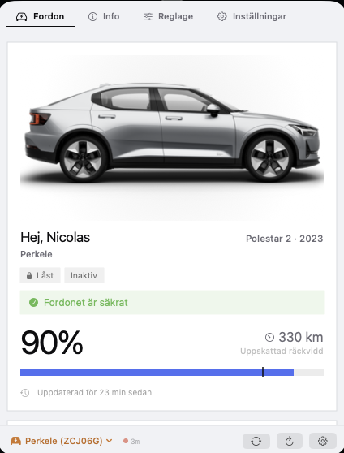
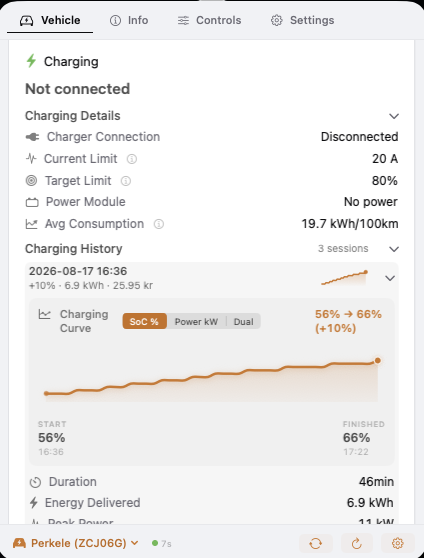
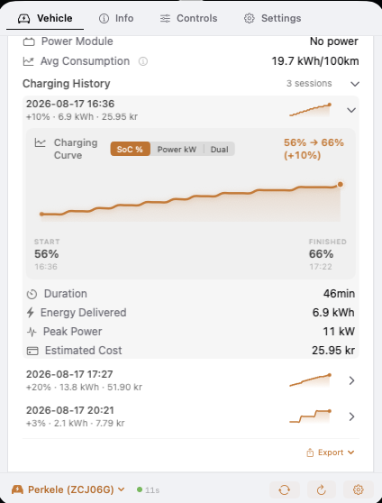
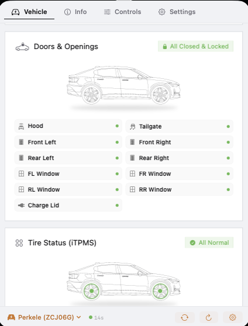
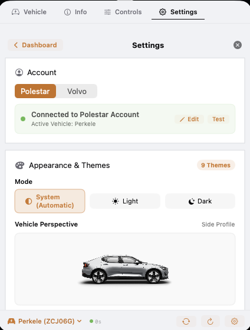
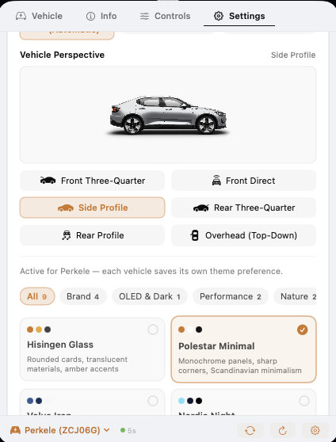
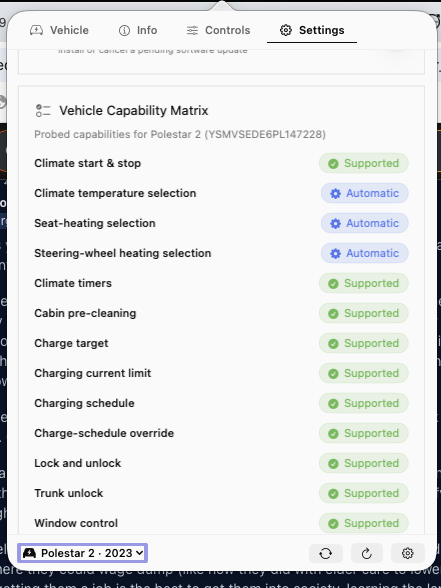

# Hisingen

[](https://www.apple.com/macos/)
[](https://swift.org)
[](https://github.com/NicolasKheirallah/Hisingen/actions/workflows/ci.yml)
[](https://github.com/NicolasKheirallah/Hisingen/releases/latest)
[](LICENSE)

**Your Polestar or Volvo, in the macOS menu bar.**

Hisingen is a native macOS app for checking your car without reaching for your phone. Battery, range, charging, locks, vehicle health and other useful information stay one click away in the menu bar.

Where the vehicle, provider and account support them, Hisingen can also expose remote controls.

Hisingen is open source, runs locally on your Mac, and has no Hisingen-operated vehicle-data backend or account service.

[**Download latest release**](https://github.com/NicolasKheirallah/Hisingen/releases/latest) · [Changelog](CHANGELOG.md) · [Vehicle support](#vehicle-support) · [Volvo setup](#volvo-setup) · [Documentation](docs/README.md) · [Security](SECURITY.md)

<p align="center">
  
</p>

## Why Hisingen?

The Polestar and Volvo mobile apps are useful, but checking something simple like battery level, charging state or whether the car is locked should not always require reaching for your phone.

Hisingen keeps the information you are most likely to check during the day directly on your Mac.

Depending on the vehicle and provider, Hisingen can show:

- battery level, range and charging
- fuel and hybrid information
- doors, windows, locks and other openings
- tyre and vehicle-health information
- service and trip information
- climate status
- software information where exposed by the provider
- last reported vehicle location
- charging history and estimated charging cost
- useful vehicle notifications
- supported remote controls

Support is capability-aware. Hisingen does not assume that every feature exists simply because a particular vehicle model is recognized.

## At a Glance

| | Polestar | Volvo |
| --- | :---: | :---: |
| Battery, range and charging | ✓ | ✓ |
| Doors, windows and locks | ✓ | ✓ |
| Vehicle health and service | ✓ | ✓ |
| BEV support | ✓ | ✓ |
| PHEV / combustion support | X | ✓ |
| Multiple vehicles | ✓ | ✓ |
| Vehicle location | Capability dependent | Capability dependent |
| Remote controls | Capability dependent | Capability / scope dependent |
| Multi-angle vehicle images | Up to 6 exterior views | Provider-supplied imagery |
| Public documented vehicle API | No | Yes |

Availability can vary by model, model year, vehicle software, region, account, permissions and backend rollout.

## Product Tour

These captures show different parts and states of the current Hisingen interface.

The gallery is deliberately grouped by **what the screen communicates**, rather than relying on the source filename. Similar-looking captures are kept when they represent different application states or different parts of the same workflow.

<details open>
<summary><strong>Volvo — overview, energy, diagnostics and controls</strong></summary>

<br>

<table>
<tr>
<td width="50%" align="center">
<strong>Vehicle overview</strong><br><br>

</td>
<td width="50%" align="center">
<strong>Energy and powertrain telemetry</strong><br><br>

</td>
</tr>
<tr>
<td width="50%" align="center">
<strong>Trip and diagnostic information</strong><br><br>

</td>
<td width="50%" align="center">
<strong>Powertrain, health and service</strong><br><br>

</td>
</tr>
<tr>
<td width="50%" align="center">
<strong>Vehicle identity and ownership information</strong><br><br>

</td>
<td width="50%" align="center">
<strong>Vehicle controls</strong><br><br>

</td>
</tr>
</table>

</details>

<details open>
<summary><strong>Polestar — everyday vehicle status</strong></summary>

<br>

<table>
<tr>
<td width="50%" align="center">
<strong>Vehicle overview</strong><br><br>

</td>
<td width="50%" align="center">
<strong>Charging history</strong><br><br>

</td>
</tr>
<tr>
<td width="50%" align="center">
<strong>Openings and tyre state</strong><br><br>

</td>
<td width="50%" align="center">
<strong>Vehicle health and climate</strong><br><br>

</td>
</tr>
<tr>
<td width="50%" align="center">
<strong>Vehicle software</strong><br><br>

</td>
<td width="50%" align="center">
<strong>Detailed openings and tyre view</strong><br><br>

</td>
</tr>
</table>

</details>

<details>
<summary><strong>Settings, appearance and local data</strong></summary>

<br>

<table>
<tr>
<td width="50%" align="center">
<strong>Account and provider setup</strong><br><br>

</td>
<td width="50%" align="center">
<strong>Appearance and themes</strong><br><br>

</td>
</tr>
<tr>
<td width="50%" align="center">
<strong>Storage and local-data settings</strong><br><br>

</td>
<td width="50%" align="center">
<strong>Telemetry and feature settings</strong><br><br>

</td>
</tr>
<tr>
<td width="50%" align="center">
<strong>Additional storage state</strong><br><br>

</td>
<td width="50%"></td>
</tr>
</table>

</details>

<details>
<summary><strong>Detailed vehicle information</strong></summary>

<br>

<table>
<tr>
<td width="50%" align="center">
<strong>Powertrain, battery health and service</strong><br><br>

</td>
<td width="50%" align="center">
<strong>Location and environmental information</strong><br><br>

</td>
</tr>
<tr>
<td width="50%" align="center">
<strong>Diagnostics</strong><br><br>

</td>
<td width="50%" align="center">
<strong>Powertrain and vehicle health detail</strong><br><br>

</td>
</tr>
<tr>
<td width="50%" align="center">
<strong>Vehicle identity and warranty detail</strong><br><br>

</td>
<td width="50%"></td>
</tr>
</table>

</details>

<details>
<summary><strong>Remote and charging controls</strong></summary>

<br>

Remote controls are capability-gated. A control appearing in a screenshot does not mean that the same operation is available on every vehicle, account or region.

<table>
<tr>
<td width="50%" align="center">
<strong>Extended vehicle controls</strong><br><br>

</td>
<td width="50%" align="center">
<strong>Vehicle controls</strong><br><br>

</td>
</tr>
<tr>
<td width="50%" align="center">
<strong>Charging controls and configuration</strong><br><br>

</td>
<td width="50%"></td>
</tr>
</table>

</details>

<details>
<summary><strong>Capability inspector and unavailable states</strong></summary>

<br>

Hisingen exposes capability state instead of assuming that a recognized vehicle supports every operation.

<table>
<tr>
<td width="50%" align="center">
<strong>Capability overview</strong><br><br>

</td>
<td width="50%" align="center">
<strong>Capability detail</strong><br><br>

</td>
</tr>
<tr>
<td width="50%" align="center">
<strong>Unavailable control state</strong><br><br>

</td>
<td width="50%"></td>
</tr>
</table>

</details>

## How Vehicle Support Works

Vehicle-cloud functionality is not always binary, so Hisingen deliberately avoids treating every model as having the same feature set.

A capability can be treated as:

- **Supported** — Hisingen and the vehicle are expected to support it.
- **Vehicle managed** — the vehicle handles the behavior without exposing the same user control.
- **Backend dependent** — support depends on the service available for the individual vehicle.
- **Unavailable** — the capability is known not to be available.

Runtime observations can further refine what is available for a particular vehicle.

This is especially important for remote controls, charging settings, climate functions and diagnostics.

See [Vehicle Capabilities](docs/domain/capability-matrix.md) for the detailed model.

## Features

### Battery, Range & Charging

For electric and plug-in hybrid vehicles, Hisingen can show available information such as:

- battery state of charge
- electric range
- charging state
- charger connection
- AC/DC charging type
- charging power
- charging current and voltage
- charge target
- charging-current limit
- estimated completion time
- charging speed
- average consumption

Exactly which fields are available depends on the vehicle and provider.

### Fuel & Hybrid Vehicles

Hisingen also understands vehicles that are not purely electric.

Depending on what the provider reports, the interface can adapt to BEV, plug-in hybrid and combustion powertrains and display relevant information such as:

- fuel level
- remaining fuel volume
- distance to empty
- average fuel consumption
- battery and fuel information together on hybrids

Irrelevant EV or combustion information is hidden rather than left as meaningless empty values.

### Charging History

Hisingen can keep local summaries of charging sessions.

A session can include:

- starting and ending battery level
- estimated energy added
- charging duration
- peak charging power
- configured electricity price
- estimated charging cost

Charging history can be exported for further analysis.

Energy and cost calculations are estimates based on the telemetry available to Hisingen. They are not utility-grade metering.

### Doors, Windows & Openings

Where the provider exposes them, Hisingen can show:

- central lock state
- doors
- windows
- hood
- tailgate
- charge lid
- fuel filler
- sunroof
- alarm state

The interface only presents values actually reported by the provider.

### Vehicle Health

Available health information can include:

- tyre warnings
- individual tyre pressure where supported
- lighting warnings
- fluid warnings
- 12 V battery warnings
- service state
- service countdown
- odometer
- trip meters
- average speed

Different providers and vehicle platforms expose different levels of detail.

### Climate

Hisingen can show vehicle climatization information where supported.

Depending on the vehicle this can include:

- climate activity
- heating or cooling state
- temperature information
- remaining climate runtime
- climate timers
- heating-related capability information
- cabin-cleaning information where exposed

Climate capabilities differ significantly between vehicle platforms. A Polestar 2 should not be assumed to expose the same selectable climate controls as newer Polestar platforms.

### Vehicle Software

Polestar vehicles can expose vehicle-software and OTA-related information through the services Hisingen uses.

Volvo's public developer APIs do not expose the same software information, so Hisingen does not fabricate a vehicle-software state for Volvo vehicles.

### Location

Vehicle location is optional.

When enabled, Hisingen can show the latest location reported by the provider and provide Apple Maps integration.

Location is the latest position made available by the provider and should not be treated as guaranteed real-time tracking.

### Vehicle Weather

Weather is a separate optional feature.

When enabled, Hisingen can retrieve weather for the vehicle's location using Open-Meteo.

Because this requires coordinates, the vehicle's location is sent to Open-Meteo when the feature is enabled.

Leave Vehicle Weather disabled if you do not want vehicle coordinates sent to that service.

## Vehicle Images

### Polestar

Where image data is available, Hisingen supports six Polestar exterior render positions:

1. Front three-quarter
2. Front
3. Side
4. Rear three-quarter
5. Rear
6. Overhead

Available images are cached locally.

### Volvo

Volvo provides vehicle imagery differently from Polestar.

Where available, Hisingen uses the exterior and interior vehicle images supplied by Volvo rather than presenting a Polestar-style multi-angle selector.

## Remote Controls

Remote controls are **opt-in** and capability-aware.

A control is only made available when the relevant conditions are met, including:

1. Hisingen implements the operation for the active provider.
2. The vehicle capability model permits the operation.
3. The feature is enabled.
4. Required authentication and provider permissions are available.

Depending on the vehicle and provider, controls can include operations related to:

- climate
- locking
- windows
- horn and exterior lights
- charging settings
- charging schedules
- climate schedules
- other provider-specific functions

Not every control is available on every vehicle.

### Sensitive Operations

Sensitive remote operations can require device-owner authentication through macOS using Touch ID or the Mac password.

### Command Results

Vehicle commands are often asynchronous.

There is an important difference between:

- the backend accepting a command
- the backend delivering it
- the vehicle completing it

Hisingen does not treat a simple backend acknowledgement as proof that the physical vehicle completed an operation.

Where possible, provider command status and subsequent vehicle telemetry are used to determine the result.

### Polestar Remote Controls

Polestar remote functionality uses undocumented vehicle-cloud interfaces.

These interfaces can change without notice and can behave differently depending on model, model year, vehicle software, account, region, backend rollout and current vehicle state.

A working command on one Polestar model does not imply the same operation works identically on another.

### Volvo Remote Controls

Volvo remote commands use the documented Connected Vehicle API.

Availability can depend on:

- vehicle
- model year
- region
- Volvo account
- Developer application
- subscribed API products
- granted OAuth scopes
- application approval
- current vehicle state

Some Volvo OAuth scopes and vehicle operations require additional approval beyond basic read access.

## Notifications

Depending on enabled features and available telemetry, Hisingen can notify you about events such as:

- charging started
- charging completed
- charging interrupted or failed
- low battery
- service or vehicle-health warnings
- tyre warnings
- software-update information
- authentication problems
- an unlocked parked vehicle
- weather-related opening warnings

Notification behavior can be configured in Settings.

## macOS Integration

Hisingen is a native macOS application rather than a wrapped web application.

### Menu Bar

The menu bar can be configured to show combinations such as:

- battery level
- range
- charging time
- charging power
- lock state
- icon-only status

### Launch at Login

Hisingen supports the normal macOS Login Items mechanism.

### Keyboard Shortcuts

Keyboard shortcuts are available for common navigation and vehicle-switching actions.

Some global shortcuts require macOS Accessibility permission.

### URL Scheme

Hisingen registers the:

```text
hisingen://
```

URL scheme for local automation.

Available routes include application navigation and operations implemented by Hisingen, such as refreshing vehicle data, opening Settings and copying the current VIN.

Remote actions still pass through Hisingen's normal capability and authorization checks.

### Apple Shortcuts

Hisingen includes a read-only App Intent that can expose cached vehicle information such as battery, range and charging status to Apple Shortcuts.

Remote command App Intents are not advertised as a supported feature until they dispatch through the same validated command path as the main application.

## Multiple Vehicles

Hisingen supports accounts containing multiple vehicles.

Vehicle-specific state is kept separate by VIN, including information such as:

- cached vehicle state
- charging history
- charging baselines
- capability observations
- local nicknames

If both Polestar and Volvo are configured, each provider retains separate authentication and vehicle state.

## Appearance, Units & Languages

Hisingen supports:

- System appearance
- Light appearance
- Dark appearance
- configurable themes
- kilometers and miles
- liters, US gallons and Imperial gallons
- several fuel-economy formats
- multiple interface languages with an in-app language selector

Nine optional themes are currently included:

- Hisingen Glass
- Polestar Minimal
- Volvo Iron
- Nordic Night
- Aurora Borealis
- Swedish Gold
- Cyan Racing
- Gothenburg Forest
- Sand Dune

Theme names are visual references only and do not imply endorsement or affiliation.

## Vehicle Support

### Polestar

Hisingen recognizes:

- Polestar 1
- Polestar 2
- Polestar 3
- Polestar 4
- Polestar 5

Recognizing a model does **not** mean that every Hisingen capability is available on it.

Polestar 2, Polestar 3 and Polestar 4 have different capability profiles, particularly around climate, charging, connectivity and remote controls.

Less widely tested models should be considered backend-dependent until their capabilities have been confirmed against real vehicles.

### Volvo

Hisingen contains model handling for:

- XC40
- EX40
- C40
- EC40
- XC60
- XC90
- S60
- S90
- V60
- V90
- EX30
- EX90
- ES90

Other Volvo models can still be discovered without Hisingen pretending their capability profile is already known.

The support decision is made from both vehicle identification and runtime capability information.

## Polestar Integration

Polestar does not currently provide a supported public third-party vehicle-cloud API for this use case.

Hisingen therefore uses interfaces derived from current first-party client behavior and vehicle testing.

These services can change without notice, making upstream change the largest external reliability risk for the Polestar integration.

See [Polestar API](docs/api/polestar.md) for technical details.

## Volvo Integration

Volvo support uses Volvo Cars' documented developer APIs, including:

- Connected Vehicle API v2
- Energy API v2
- Location API v1 when authorized

Vehicle and command availability remain vehicle-specific. The APIs expose different capabilities depending on vehicle platform and application permissions.

See [Volvo API](docs/api/volvo.md) for implementation details.

## Privacy at a Glance

| Data or service | What happens |
| --- | --- |
| Polestar account | Communicates with Polestar services |
| Volvo account | Communicates with Volvo services |
| Persistent secrets / refresh sessions | Stored in macOS Keychain |
| Vehicle telemetry | Fetched from the selected vehicle provider |
| Persistent vehicle cache | Stored locally on the Mac |
| VIN | Can be retained in local vehicle state |
| Current vehicle coordinates | Not persisted in the normal vehicle-state cache |
| Reverse geocoding | Uses Apple's system services when enabled |
| Vehicle weather | Coordinates sent to Open-Meteo when enabled |
| Update checks | GitHub Releases when enabled |
| Analytics | None |
| Advertising | None |
| Hisingen vehicle-data backend | None |
| Hisingen account service | None |

For exact field-by-field behavior, see [Privacy](docs/security/privacy.md).

## Credentials & Keychain

Sensitive credentials and refresh tokens that need to persist are stored in the macOS Keychain.

Hisingen uses:

```text
AfterFirstUnlockThisDeviceOnly
```

Keychain accessibility.

This means the stored item remains tied to the Mac and does not sync through iCloud Keychain.

Hisingen uses the macOS Keychain. It does **not** claim that ordinary vehicle-account credentials are stored as Secure Enclave-backed cryptographic keys.

Polestar and Volvo credentials are stored separately.

## Security

Hisingen handles information that deserves careful treatment, including account sessions, VINs, location, telemetry and remote vehicle operations.

See:

- [Security Policy](SECURITY.md)
- [Security Overview](docs/security/overview.md)
- [Privacy](docs/security/privacy.md)
- [Keychain Storage](docs/security/keychain.md)
- [Threat Model](docs/security/threat-model.md)

If you discover a security problem, report it privately through the process in [SECURITY.md](SECURITY.md).

Do not post real credentials, access tokens, API secrets or full VINs in public issues.

## Installation

Hisingen requires **macOS 14 Sonoma or later**.

Published releases support:

- Apple Silicon
- Intel Macs

### Install a Release

1. Download `Hisingen.dmg` from the [latest release](https://github.com/NicolasKheirallah/Hisingen/releases/latest).
2. Open the disk image.
3. Drag **Hisingen.app** into **Applications**.
4. Open Hisingen.
5. Open **Settings** and choose your vehicle provider.

Production releases are built as universal binaries, Developer ID signed, hardened-runtime enabled, notarized by Apple and stapled before publication.

SHA-256 checksums are published with release artifacts.

## Polestar Setup

1. Open **Settings**.
2. Select **Polestar**.
3. Sign in using your Polestar account.
4. Select your vehicle if the account contains more than one.

Hisingen communicates directly with the services used by the Polestar integration. There is no Hisingen account or Hisingen authentication server in between.

Because the Polestar vehicle interfaces are undocumented, authentication or vehicle functionality can occasionally require a Hisingen update after an upstream change.

## Volvo Setup

Volvo support requires your own application in the [Volvo Cars Developer Portal](https://developer.volvocars.com/).

### 1. Create a Volvo Developer Application

Create an application and add the API products required for the features you intend to use.

Location and remote commands can require additional products, scopes or approval.

### 2. Register the OAuth Callback

Configure this callback URL:

```text
https://nicolaskheirallah.github.io/Hisingen/oauth-callback.html
```

Volvo requires an HTTP(S) OAuth callback.

Hisingen therefore uses a small static GitHub Pages bridge. Volvo redirects the authorization response there and the page passes the response back to Hisingen through its local `hisingen://` URL scheme.

The bridge is not a Hisingen account or vehicle-data backend.

### 3. Add Your Volvo Credentials

Enter the credentials for your Volvo Developer application in Hisingen Settings:

- Client ID
- Client Secret
- VCC API Key

Then choose **Sign In with Volvo ID** and complete authorization in your browser.

Secrets and session material that need to persist are stored locally using the macOS Keychain.

See [Authentication](docs/api/authentication.md) for the complete flow.

## Troubleshooting

### The vehicle shows old data

A parked vehicle may enter a low-power state and stop reporting fresh telemetry.

Hisingen keeps the last usable snapshot instead of replacing missing values with zeroes. Check the timestamp in the interface to understand how fresh the state is.

### A feature is missing

Recognizing a vehicle does not guarantee every service is available.

Features can vary by model, model year, region, vehicle software, account permissions, backend rollout and — for Volvo — Developer application permissions.

### A Polestar feature suddenly stopped working

The Polestar interfaces used by Hisingen are undocumented. An upstream service change can therefore break a previously working feature even when nothing changed locally.

Check the latest release and open issues before reporting a new problem.

### Volvo sign-in fails

Check that:

- the Client ID is correct
- the Client Secret is correct
- the VCC API Key is correct
- the required API products are enabled
- the OAuth callback URL matches exactly
- the application has the scopes required for the requested functionality

### A Volvo command is unavailable

Volvo commands can require permissions beyond ordinary telemetry access.

The vehicle, Developer application and OAuth grant all need to support the operation.

## Known Limitations

Hisingen depends on vehicle-cloud services it does not control.

Keep these limitations in mind:

- Polestar's vehicle interfaces used by Hisingen are undocumented and can change without notice.
- Volvo API availability varies between vehicles, regions and Developer applications.
- A supported model does not imply support for every capability.
- Vehicle data can be delayed while a car is asleep or offline.
- Some telemetry is not exposed by every provider.
- Location is the latest position reported by the provider, not guaranteed live tracking.
- Charging energy and cost calculations are estimates.
- Remote commands can be accepted by a backend before the physical vehicle has completed them.
- Backend changes can temporarily break a feature without any Hisingen code change.

Hisingen tries to expose uncertainty rather than turning missing information into a successful-looking result.

## Build From Source

Requirements:

- macOS 14 or later
- Swift 5.9 or later
- Xcode or compatible Command Line Tools

```bash
git clone https://github.com/NicolasKheirallah/Hisingen.git
cd Hisingen
make doctor
make ci
make app
open Hisingen.app
```

Normal CI does not require a real vehicle account and keeps live integration testing separate from the deterministic test suite.

See [Getting Started](docs/development/getting-started.md) for the development workflow.

## Contributing

Issues, testing and pull requests are welcome.

Before making a larger change:

1. Read the [development guide](docs/development/getting-started.md).
2. Run `make ci`.
3. Add or update tests for behavior you change where practical.
4. Keep provider functionality capability-aware.
5. Prefer an explicit unavailable or unknown state over fabricated data.
6. Do not add real credentials, tokens or VINs to fixtures, documentation or public issues.
7. Keep deep implementation detail under `/docs` rather than growing duplicate explanations in the root README.

## Documentation

Detailed engineering documentation lives under [`docs/`](docs/README.md).

Useful starting points:

- [Documentation Index](docs/README.md)
- [Architecture Overview](docs/architecture/overview.md)
- [Vehicle Capabilities](docs/domain/capability-matrix.md)
- [API Overview](docs/api/overview.md)
- [Polestar API](docs/api/polestar.md)
- [Volvo API](docs/api/volvo.md)
- [Authentication](docs/api/authentication.md)
- [Privacy](docs/security/privacy.md)
- [Security](docs/security/overview.md)
- [Testing](docs/testing/strategy.md)
- [Release Process](docs/operations/releases.md)

## Project History

Hisingen originally started as because I got tired of not being able to control the fan control in my car from my Mac because my phone was dead or I was in the zone

## Credits

Hisingen is maintained by [Nicolas Kheirallah](https://github.com/NicolasKheirallah).

Thanks to everyone testing Hisingen across different vehicles, model years, regions and configurations. Real-world feedback is especially useful because vehicle-cloud behavior often varies beyond what a model name alone can tell us.

## License

Hisingen is released under the [MIT License](LICENSE).

## Disclaimer

Hisingen is independent open-source software.
It is **not affiliated with, endorsed by, sponsored by, or maintained by Polestar Performance AB or Volvo Car Corporation**.
Polestar and Volvo are trademarks of their respective owners and are referenced only to describe vehicle compatibility.
Use of their accounts, APIs and vehicle services remains subject to the terms, policies and availability of the respective providers.
See [Terms & Conditions](TERMS.md) for additional information.
