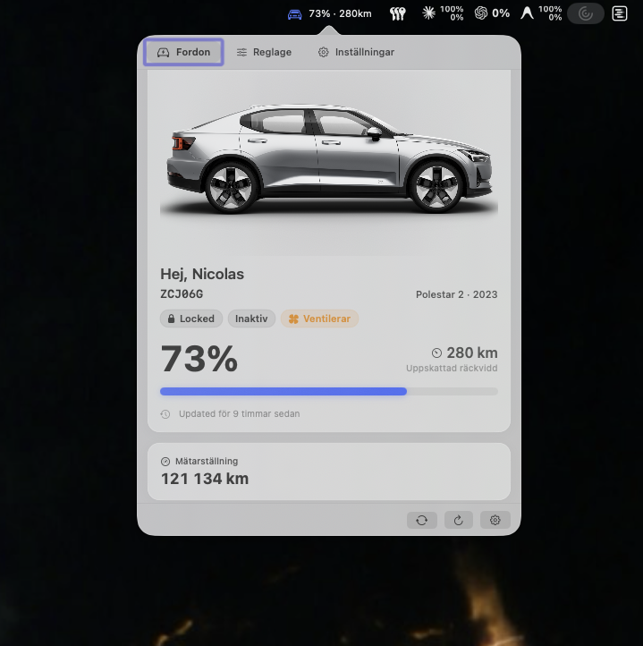
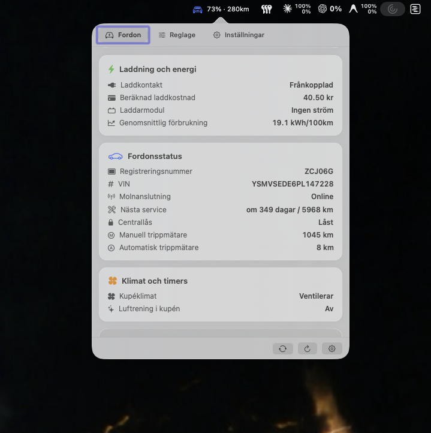
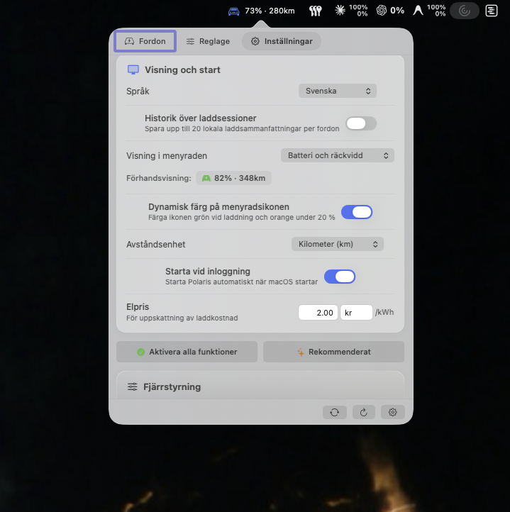
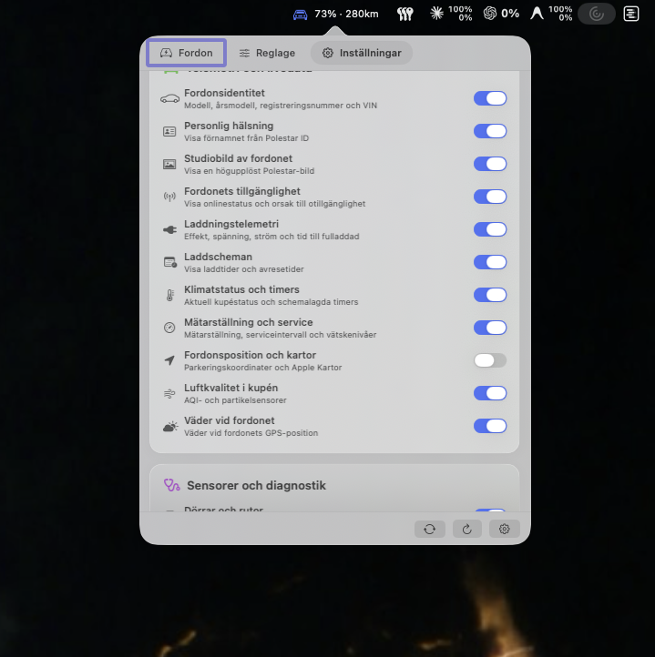
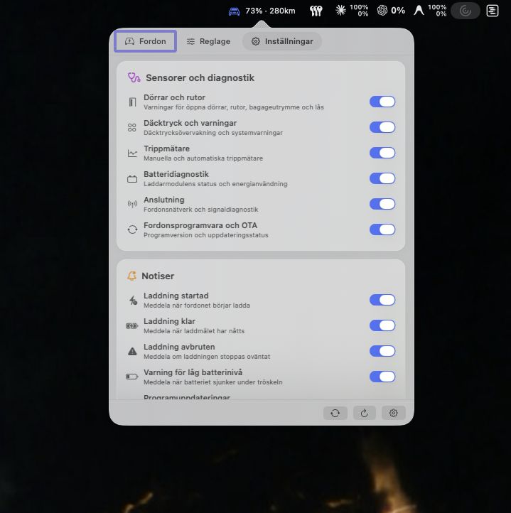

# Hisingen

[](https://www.apple.com/macos/)
[](https://swift.org)
[-purple)]()
[](LICENSE)

Hisingen is a native macOS menu bar application for monitoring Polestar and Volvo vehicles. It is written in Swift with AppKit and SwiftUI. Polestar support communicates directly with Polestar-operated OIDC, GraphQL, C3, and PCCS services; Volvo support uses Volvo's official Connected Vehicle API v2 and Energy API v2 via Volvo ID OAuth2. The two brands are entirely separate providers behind a shared `VehicleProviding` interface — see [Architecture And Security](#architecture-and-security) — so signing into one never touches the other's credentials or vehicle state.

Polestar does not publish a supported third-party vehicle-cloud API. Hisingen therefore uses undocumented interfaces reconstructed from current first-party client behavior for Polestar vehicles. These interfaces can change without notice, and optional capabilities vary by model, model year, region, account role, vehicle state, and backend rollout. Volvo support is built on Volvo's *official*, documented Connected Vehicle API — but using it requires each user to register their own free API application at [developer.volvocars.com](https://developer.volvocars.com) (a Client ID, Client Secret, and VCC API Key), which Hisingen cannot do on your behalf. See [Volvo Support](#volvo-support) below.

[Download Latest Release](https://github.com/NicolasKheirallah/hisingen/releases/latest) · [All Releases](https://github.com/NicolasKheirallah/hisingen/releases) · [Features](#read-only-capabilities) · [Vehicle Support](#supported-vehicles) · [Volvo Support](#volvo-support) · [Installation](#installation) · [Changelog](changelog.md)

## Table of Contents

- [Screenshots](#screenshots)
- [At A Glance](#at-a-glance)
- [Multilingual Support](#multilingual-support)
- [Design, Liquid Glass & Themes](#design-liquid-glass--themes)
- [Powertrain Support & Measurement Units](#powertrain-support--measurement-units)
- [Read-Only Capabilities](#read-only-capabilities)
- [Charging Intelligence](#charging-intelligence)
- [Notifications](#notifications)
- [Menu Bar And macOS Integration](#menu-bar-and-macos-integration)
- [Multiple Vehicles](#multiple-vehicles)
- [Supported Vehicles](#supported-vehicles)
- [Volvo Support](#volvo-support)
- [Refresh And Reliability](#refresh-and-reliability)
- [Architecture And Security](#architecture-and-security)
- [Remote Controls](#remote-controls)
- [Installation & Setup](#installation)
- [Frequently Asked Questions](#frequently-asked-questions)
- [Authors And Credits](#authors-and-credits)
- [License And Disclaimer](#license-and-disclaimer)

## Screenshots

The screenshots show the current native popover with Apple Liquid Glass styling. Hisingen supports extensive multilingual localization across 16+ languages and can follow macOS system appearance or be set to Light Mode or Dark Mode independently.

| Vehicle overview | Telemetry details |
| --- | --- |
|  |  |

| Controls status | Display settings |
| --- | --- |
|  |  |

| Telemetry features | Diagnostics and notifications |
| --- | --- |
|  |  |

## At A Glance

Hisingen keeps the selected vehicle visible without opening a full application window:

- **Electric, Hybrid & Combustion Powertrains**: Adaptive telemetry cards customized strictly for Pure Electric (BEV), Plug-in Hybrid (PHEV), or Combustion (Petrol/Diesel ICE);
- **Multi-Angle Studio Renders**: Configurable 4-angle studio photography (Front 3/4, Rear 3/4, Side Profile, Overhead Top-Down) cached per angle;
- **Factory Build Specs & Options**: Real-time vehicle spec decoding showing exterior paint name, interior upholstery trim, wheel package, and factory option packages (*Pilot, Plus, Performance*);
- **Apple Liquid Glass Materials**: Multi-layer frosted translucent cards (`.regularMaterial`) with specular top-leading light-catchers, subtle luminance sheens, and dual-layer ambient occlusion shadows;
- **Light Mode & Dark Mode Architecture**: System (Automatic), Forced Light Mode (WCAG AAA high-contrast slate ink), or Forced Dark Mode (smoked obsidian OLED pitch black);
- **9 Scalable Themes**: Hisingen Glass, Polestar Minimal, Volvo Iron, Nordic Night, Aurora Borealis, Swedish Gold, Cyan Racing, Gothenburg Forest, and Sand Dune;
- **Multilingual Support**: Fully localized in 16+ languages with independent in-app language switching;
- **Configurable Measurement Units**: Distance (`km` / `mi`), Fuel Volume (`L` / `gal US` / `UK gal`), and Fuel Economy (`L/100km` / `MPG US` / `MPG UK` / `km/L`);
- **Pixel-Perfect Vehicle Outline**: Interactive animated schematics for iTPMS tire status, doors, windows, sunroof, hood, tailgate, charge lid, and fuel filler flap;
- **Extended Location & Movement**: GPS coordinates, elevation/altitude, accuracy radius, electronic parking brake status, transmission gear (PRND), heading, speed, reverse-geocoded street address, and 1-click Maps shortcuts;
- **Battery, Range & Engine Telemetry**: SoC %, electric range, time to min SoC, avg consumption since charge, fuel level %, fuel volume, distance to empty, avg fuel consumption, and charging speed;
- **CleanZone Cabin Air Filtration**: In-cabin vs outside PM2.5 particulate matter comparison, AQI index, and air filter remaining life %;
- **Charging Cost & Tariff Calculator**: Configurable currency & price/kWh with automated session cost estimation;
- **Charging History CSV & JSON Export**: Native macOS `NSSavePanel` export tool for exporting charging history for expense or tax reports;
- **`hisingen://` URL Scheme & Deep Linking**: Full automation support for Raycast, Alfred, Apple Shortcuts, and Terminal scripts;
- **macOS App Intents & Siri Shortcuts**: Siri voice queries and Shortcuts automation for battery levels, locks, and climate preconditioning;
- **Menu Bar Quick Controls**: Context menu on right-click for instant lock/unlock, climate start/stop, flash lights, VIN copying, and Maps;
- **Live Capabilities Matrix**: Interactive inspector in Settings showing live support state across all 21 vehicle capabilities;
- **Adaptive Fast Refresh**: 60-second fast polling while charging or preconditioning, and 5-minute cadence when idle;
- **Diagnostics, Lighting & Hardware Health**: 22-circuit exterior lighting monitor, 4-wheel indirect TPMS, brake fluid, washer fluid, service countdown, and 12V battery health;
- **Privacy-First & Secure**: Hardware-backed Keychain token isolation, zero external tracking, and automatic stripping of raw GPS coordinates before disk caching.

## Multilingual Support

Hisingen is built for drivers worldwide with full multilingual localization across **16+ languages**. The language can follow your macOS system language automatically or be selected independently inside Settings:

| Language | Locale Code | Native Name | Status |
|---|---|---|---|
| **English** | `en` | English | Base / Full Support |
| **Swedish** | `sv` | Svenska | Full Support |
| **German** | `de` | Deutsch | Full Support |
| **Norwegian (Bokmål)** | `nb` | Norsk bokmål | Full Support |
| **Danish** | `da` | Dansk | Full Support |
| **Dutch** | `nl` | Nederlands | Full Support |
| **French** | `fr` | Français | Supported (with English fallback) |
| **Spanish** | `es` | Español | Supported (with English fallback) |
| **Italian** | `it` | Italiano | Supported (with English fallback) |
| **Finnish** | `fi` | Suomi | Supported (with English fallback) |
| **Portuguese** | `pt` | Português | Supported (with English fallback) |
| **Norwegian (Nynorsk)** | `nn` | Norsk nynorsk | Supported (with English fallback) |
| **Norwegian (General)** | `no` | Norsk | Supported (with English fallback) |
| **Polish** | `pl` | Polski | Supported (with English fallback) |
| **Chinese (Simplified)** | `zh` | 简体中文 | Supported (with English fallback) |
| **Korean** | `ko` | 한국어 | Supported (with English fallback) |

All vehicle terms, door names, charging states, diagnostics, unit strings, and settings descriptions are dynamically translated using native string catalogs with automatic fallback.

## Design, Liquid Glass & Themes

### Apple Liquid Glass Material Engine
Hisingen introduces Apple's modern **Liquid Glass** dynamic material system:
- **Specular Top-Leading Hairlines**: Two-tone light refraction gradient borders that physically catch ambient light from the top-left corner and smoothly dissipate toward bottom-right shadows.
- **Translucent Optical Lensing**: Layered `.regularMaterial` frosted glass with adaptive luminance sheens that reflect colors from background desktop wallpapers and windows.
- **Dual-Layer Ambient Occlusion Shadows**: Crisp 1px contact edge shadow layered over a soft 12px ambient elevation blur.

### Multi-Angle Studio Vehicle Renders
Customize your vehicle's appearance in the header card with 4 official studio camera angles:
- **Front 3/4 View** (Angle 0) — Standard dynamic front-corner presentation.
- **Rear 3/4 View** (Angle 1) — Tailgate, light bar, and rear diffuser angle.
- **Side Profile** (Angle 2) — Clean architectural side silhouette and wheel stance.
- **Overhead View** (Angle 3) — Top-down panoramic glass roof and silhouette view.

Angle choices are cached per angle and automatically fetched from GraphQL `getCarImages`.

### Light Mode & Dark Mode Architecture
- **Appearance Mode Selector**: Switch freely between **System (Automatic)**, **Light Mode**, and **Dark Mode** via a 3-way toggle in Settings.
- **Light Mode**: High-contrast, WCAG AAA compliant deep charcoal/slate typography (`#0F172A`), crystal-clear glass cards, and punchy saturated accents.
- **Dark Mode**: Smoked obsidian OLED canvases (`#000000` / `#0B0F19`), luminous electric neon glows, and edge specular highlights.

### 9 Curated Themes Ecosystem
Choose from 9 distinct visual personalities with category filter pills (`All`, `Brand`, `OLED & Dark`, `Performance`, `Nature`):
1. **Hisingen Glass** (`.hisingen`): 14pt radius, `.regularMaterial` liquid glass background, Amber `#E56E23` accent.
2. **Polestar Minimal** (`.polestar`): 0pt radius, sharp architectural edges, Scandinavian monochrome minimalism.
3. **Volvo Iron** (`.volvo`): 10pt radius, Volvo Iron blue `#1C6BBA` accent, soft navy cards.
4. **Nordic Night** (`.nordicNight`): 12pt radius, pitch black OLED canvas (`#000000`), electric cyan `#00E5FF` glow.
5. **Aurora Borealis** (`.aurora`): 16pt radius, midnight slate canvas (`#0B132B`), emerald `#00E676` northern lights.
6. **Swedish Gold** (`.swedishGold`): 10pt radius, Polestar Engineered Öhlins gold `#D4AF37` accent.
7. **Cyan Racing** (`.cyanRacing`): 8pt radius, Cyan Racing championship blue `#0090D0` accent.
8. **Gothenburg Forest** (`.forest`): 14pt radius, Swedish pine green `#4CAF50` earth tones.
9. **Sand Dune** (`.sandDune`): 12pt radius, warm champagne/titanium `#C5A059` luxury minimalism.

## Powertrain Support & Measurement Units

Hisingen is built with powertrain-aware UI logic that automatically tailors cards and controls to the exact vehicle powertrain:

- **Pure Electric (BEV)** (*Polestar 2, Polestar 3, Polestar 4, Volvo EX30, EX40, EX90, XC40 Recharge BEV*):
  - Displays Battery SoC %, Electric Range, Charging Status, and `BatteryGauge`.
  - Shows Charging Details, Charging Curves, Session History, and Range Health Estimate.
  - Fuel cards and combustion metrics are cleanly hidden.
- **Pure Combustion (ICE)** (*Volvo XC90 Petrol/Diesel, XC60 B5, XC40 B4, V60 T5*):
  - Displays Fuel Level %, Remaining Volume, Fuel Range, and `FuelGauge`.
  - Displays Fuel & Engine Card with Average Fuel Consumption, Engine State (Running/Stopped), Engine Hours to Service, and Fuel Grade.
  - EV charging cards, battery diagnostics, and charge port controls are cleanly hidden.
- **Plug-in Hybrid (PHEV)** (*Volvo XC60 T8 Recharge, V60 T6 Recharge, Polestar 1*):
  - Displays dual readouts (**Battery % + Fuel %**), **`DualEnergyGauge`**, and Combined Total Range.
  - Renders both Charging Telemetry and Fuel & Engine cards simultaneously.

### Configurable Units
- **Distance Unit**: Kilometers (`km`) or Miles (`mi`).
- **Fuel Volume Unit**: Liters (`L`), US Gallons (`gal`), or Imperial Gallons (`UK gal`).
- **Fuel Economy Unit**: Liters per 100 km (`L/100km`), Miles per Gallon US (`mpg`), Miles per Gallon UK (`mpg (UK)`), or Kilometers per Liter (`km/L`).

## Read-Only Capabilities

Every optional group can be enabled independently. Unsupported services degrade gracefully and do not prevent core battery refreshes.

| Capability | Data shown |
| --- | --- |
| Core telemetry | Battery, range, charging state, time to full, time to minimum SOC, fetch time, vehicle-reported time, and stale/asleep state |
| Vehicle identity | Model, year, registration, VIN, paint color name, interior upholstery trim, wheel package, option packages, production build week, factory PNO34 code, market, steering orientation, per-VIN local nickname, and account vehicle discovery |
| Owner greeting | Polestar ID first name localized using the selected app language |
| Studio image | Configurable transparent vehicle renders across 4 camera angles |
| Charging details | Plug state, type, power, current draw vs current limit, voltage, target SOC, current limit where supported, ready time, speed, average consumption since charge, and charger module state |
| Charging history | Optional local summaries: SOC gained, estimated energy, peak power, duration, tariff cost, and native CSV export |
| Availability | Online/offline state, cellular signal strength (bars), modem wake reason, and connectivity mode |
| Odometer and service | Odometer, service countdown, service state, service trigger reasons, and fluid warnings |
| Exterior | Central lock, doors, windows, sunroof, hood, tailgate, charge lid, and alarm |
| Tyres and warnings | Direct pressures where reported, tyre warnings, 22-circuit exterior lights monitor, fluids, and 12 V battery health |
| Trip meters | Manual and automatic trip distances, average speed, trip computer electric/fuel range with Digital Twin and legacy fallback |
| Climate | Activity, heating/cooling/ventilation, seat & steering wheel heating levels, time remaining, actual/requested temperature, and departure timers |
| Charging schedules | Global and saved-location charge windows with location names; precise coordinates and aliases are discarded |
| Air quality | Cleaning state, in-cabin vs outside PM2.5, AQI index, air filter remaining life %, runtime remaining, and reported errors |
| Connectivity | Network generation (4G/5G), connection status, signal strength bars (1-4), modem wake reason, and timestamp |
| Vehicle software | Installed version, latest available OTA target version, OTA readiness banner, scheduled installation, and update timestamp |
| Vehicle location | Opt-in coordinates, elevation/altitude, accuracy radius, electronic parking brake status, transmission gear (PRND), heading, speed, Apple reverse geocoding, and Maps shortcuts |
| Vehicle weather | Opt-in temperature, condition, apparent temperature, and relative humidity using Open-Meteo with first-party fallback |
| Capability observations | Live inspector in Settings showing runtime support state across all 21 vehicle capabilities |

## Charging Intelligence

- Dynamic battery gauge with charge-target marker and subtle charging pulse.
- **Dual-Mode Live Charging Power Curve**: Interactive chart supporting **`SoC %`**, **`Power kW`**, and **`Dual`** overlay modes with peak power callouts and average power lines.
- **Micro-Sparklines in History**: Anti-aliased vector sparklines embedded directly inside collapsed charging session rows.
- Ready-time calculation based on the vehicle-reported sample timestamp.
- Charging-speed estimate in `km/h` or `mph`.
- **Electricity Rate & Tariff Calculator**: Estimated session and completion cost using a configurable electricity rate (per kWh) and currency symbol.
- **CSV & JSON Exporter**: Native export of stored charging sessions with full energy, duration, battery delta, peak kW, and calculated tariff cost columns.
- Session sparkline with a capped rolling sample buffer.
- Optional local session summaries; raw long-term telemetry is not collected.
- **Range Health Estimate**, explicitly labeled as range-based rather than measured battery State of Health.
- Anti-phantom filtering to avoid treating regenerative power as plug-in charging.

## Notifications

- charging started, completed, interrupted, or faulted;
- configurable low-battery threshold from 5% to 50%;
- vehicle software available, completed, or failed;
- newly appearing service, tyre, light, fluid, 12 V, and alarm warnings;
- rain or snow near the vehicle while a window or sunroof is open;
- parked and unlocked reminder between 21:00 and 06:00;
- authentication-required reminder when the session cannot be restored.

Private notification mode hides detailed vehicle values from banners. Stable identifiers and notification threads prevent repeated copies of the same alert.

## Vehicle Info & Build Specifications (`Info` Tab)

A dedicated top-level **Info** tab (`info.circle`) breaks down complete vehicle build details and styling specifications:
- **Hero Studio Visual**: High-resolution studio exterior render with paint color pill and model year badge.
- **Exterior & Styling**: Exterior paint finish (`externalColour`), factory wheels & rims (`wheels`), factory equipment packages (`packages` with badge pills like `Pilot`, `Plus`, `Performance`), and door body style.
- **Interior & Cabin**: Interior trim & upholstery material (`upholstery`), steering orientation (`steeringOrientation`), multi-stage heated seats & heated steering wheel levels, and CleanZone cabin air purification.
- **Powertrain & Battery**: Architecture (`BEV`, `PHEV`, `ICE`), usable battery capacity (kWh), gearbox transmission, and fuel type.
- **Factory Build & Identity**: License plate, 1-click copyable VIN, factory build week (`structureWeek` e.g. `2023 · W42`), factory spec code (`pno34`), market code, and software release version.

## Menu Bar And macOS Integration

### Display Presets

1. **Battery Percentage** — `73%`
2. **Battery and Range** — `73% · 280km`
3. **Charging Aware** — `73% · 1h42m` while charging
4. **Compact Charging** — `73% (1h42m)` while charging
5. **Battery and Power** — `73% · 7.2 kW` while charging
6. **Range** — `280km`
7. **Icon Only** — Minimal battery icon without text
8. **Lock and Battery** — `🔒 73%` / `🔓 73%` with live lock state

The icon can remain monochrome or tint green while charging and orange at low battery. Values use tabular digits to avoid width jitter.

### Deep Linking & Automation (`hisingen://` URL Scheme)

Hisingen registers the `hisingen://` custom URL scheme for direct scripting and triggers from **Raycast, Alfred, Apple Shortcuts, Stream Deck, and Terminal**:

| URL Command | Action | Supported Brands |
|---|---|---|
| `hisingen://refresh` | Force an immediate background telemetry refresh | Polestar & Volvo |
| `hisingen://status` / `hisingen://toggle` | Open or toggle the main popover window | Polestar & Volvo |
| `hisingen://settings` / `hisingen://preferences` | Open Settings directly | Polestar & Volvo |
| `hisingen://copy-vin` | Copy active vehicle VIN to system clipboard | Polestar & Volvo |
| `hisingen://climate/start?temp=21` | Start cabin climate preconditioning (supports custom temperature) | Volvo *(Restricted on Polestar)* |
| `hisingen://climate/stop` | Stop cabin climate preconditioning | Volvo *(Restricted on Polestar)* |
| `hisingen://lock` | Lock vehicle central doors | Volvo *(Restricted on Polestar)* |
| `hisingen://unlock` | Unlock vehicle central doors | Volvo *(Restricted on Polestar)* |
| `hisingen://flash` | Flash exterior hazard lights | Volvo *(Restricted on Polestar)* |
| `hisingen://honk-flash` | Honk horn and flash lights | Volvo *(Restricted on Polestar)* |

### macOS App Intents & Shortcuts (macOS 13+)

Hisingen integrates with Apple's **App Intents** framework for native Siri voice actions and Shortcuts app workflows:

- **`GetVehicleBatteryIntent`**: Queries current battery percentage, estimated range, and charging power.
  - Voice phrases: *"Check my car battery"*, *"What is my charge level?"*, *"How much range is left?"*
- **`LockVehicleIntent` & `UnlockVehicleIntent`**: Dispatches remote lock and unlock commands to the active vehicle.
- **`StartClimateIntent` & `StopClimateIntent`**: Starts or stops cabin climate preconditioning.
- **`AppShortcutsProvider`**: Automatically registers shortcuts into macOS Shortcuts without manual setup.

### macOS Desktop & Notification Center Widgets (`WidgetKit`)

Hisingen provides native macOS desktop and Notification Center widgets:

- **System Small Widget**: Circular battery gauge with live percentage, estimated range, charging wattage pulse, and vehicle lock state pill.
- **System Medium Widget**: Multi-column vehicle dashboard featuring battery %, range, lock state, live cabin climate activity, charging speed, and odometer reading.

### Touch ID & Biometric Protection

Protect remote operations with macOS Touch ID or device-owner authentication:
- **Automatic Protection for Sensitive Controls**: Critical and security-sensitive commands (e.g. remote unlock, window ventilation, OTA installation) automatically require biometric authentication.
- **Optional Universal Touch ID Mode**: Enable *"Require Touch ID"* in Settings to mandate fingerprint verification for every remote command (including climate preconditioning and locking).

### Interactive Charging & Departure Schedule Editor

Configure departure and charging schedules directly from the Mac without needing the mobile app:
- **Cabin Preconditioning (Departure Timers)**: Configure target departure time and select recurring days of the week (Mon–Sun).
- **Charging Windows**: Set start and end times for off-peak charging schedules with recurring weekday selectors.
- **Manage Timers Modal**: View, toggle, edit, or delete active timers with a single click.

### Keyboard And Context Menu

- `Option + P` toggles the popover globally after macOS Accessibility approval.
- `Option + [` and `Option + ]` move between vehicles.
- `Option + 1` through `Option + 9` select a vehicle directly.
- **Status Bar Right-Click Context Menu**:
  - **Quick Controls**: Instant **Lock / Unlock Doors**, **Start / Stop Climate**, **Flash Lights**, **Honk Horn**, and **Honk & Flash**.
  - **Export Charging History (CSV)…**: Exports session history to a CSV file.
  - **Telemetry & Navigation**: Quick access to **Refresh Telemetry**, **Open in Apple Maps**, and **Copy VIN**.
- Scrolling remains enabled while visual scroll indicators stay hidden.
- Launch at login uses `SMAppService` and the normal Login Items approval flow.

### Personalization

- Per-vehicle local nicknames.
- System, English, or Swedish interface language.
- Kilometers or miles.
- Electricity rate and currency for dynamic charge cost estimation.
- Configurable read-only feature groups and notifications.
- Optional charging-session history with CSV and JSON export.

## Multiple Vehicles & Dual-Brand Multi-Car Switcher

Hisingen discovers all vehicles returned by the signed-in account and isolates state, charging baselines, capability observations, and nicknames per VIN. Vehicles can be switched from the footer, keyboard, or context menu:
- **Seamless Dual-Brand Switching**: If you own both a Polestar and a Volvo, Hisingen stores both provider sessions in the macOS Keychain. Switching between Polestar and Volvo instantly restores the stored credentials and active API provider without requiring manual re-authentication.
- **Isolated Telemetry & Nicknames**: Each vehicle maintains independent cached snapshots, local nicknames, and charging history.

## Supported Vehicles

| Vehicle | Current behavior |
| --- | --- |
| Polestar 1 | Best-effort core and optional services; broad live verification remains required |
| Polestar 2 | Model-aware support; direct tyre pressure and selectable climate temperature are not assumed |
| Polestar 3 | Model-aware support with runtime confirmation for backend-dependent capabilities |
| Polestar 4 | Digital Twin support; current limit, pre-cleaning, legacy connectivity, and remote OTA are not assumed |
| Polestar 5 and 6 | Conservative backend-dependent profile with positive runtime observations |
| Future/unknown | Model name is preserved and capabilities remain probeable rather than rejected |

The model table is deliberately conservative: service availability is confirmed at runtime per VIN and may vary independently of the model badge.

## Volvo Support

Hisingen supports Volvo Cars as an independent, first-class provider alongside Polestar — selectable directly from the account picker in Settings. It is built on Volvo's official Connected Vehicle API v2 and Energy API v2 (not the discontinued "Volvo On Call" API, which Volvo shut down in 2025 and which no longer works with any third-party client).

### Developer Portal Setup
Volvo issues each application its own OAuth Client ID, Client Secret, and VCC API Key rather than a shared public client:
1. Register a free developer account at [developer.volvocars.com](https://developer.volvocars.com).
2. Create an Application and add the **Connected Vehicle API**, **Energy API**, and optionally **Location API** products.
3. Set the redirect URI to `hisingen://oauth/volvo/callback`.
4. Enter your **Client ID**, **Client Secret**, and **VCC API Key** in Hisingen Settings.
5. Click **Sign In with Volvo ID** in Hisingen to complete OAuth 2.0 PKCE authentication in the system browser.

---

### Supported Volvo APIs (Standard / Developer Tier)

The following official developer endpoints are fully supported and mapped into Hisingen's native GUI:

| Category | API Endpoint | Data & Telemetry Provided | Hisingen UI Feature |
|---|---|---|---|
| **Vehicle Identity & Render** | `GET /connected-vehicle/v2/vehicles/{vin}` | Model, model year, exterior color, gearbox type, battery capacity (kWh), transparent exterior studio image URL, upholstery/interior trim, steering orientation | Transparent vehicle hero render with ambient glow, Vehicle Identity card |
| **Doors & Security** | `GET /connected-vehicle/v2/vehicles/{vin}/doors` | Central lock status, front/rear left/right doors, hood, tailgate, charge/tank lid | Door schematic, lock/unlock status pill |
| **Windows & Sunroof** | `GET /connected-vehicle/v2/vehicles/{vin}/windows` | Front/rear left/right windows, sunroof status | Window status indicators |
| **Energy & Battery** | `GET /energy/v2/vehicles/{vin}/state` | Battery SoC (%), electric range (km), charger connection, charging status (Idle/Charging), charging current draw (A), current limit (A), target SoC (%), charging power (kW) | Battery gauge with target marker, charging details card, live charging speed |
| **Energy Capabilities** | `GET /energy/v2/vehicles/{vin}/capabilities` | Hardware feature support matrix for all 10 energy fields | Runtime capability probing & feature degradation in Settings matrix |
| **Odometer** | `GET /connected-vehicle/v2/vehicles/{vin}/odometer` | Total vehicle odometer mileage (km) | Vehicle Identity card odometer reading |
| **Diagnostics & Health** | `GET /connected-vehicle/v2/vehicles/{vin}/diagnostics` | Service warning, serviceTrigger, time to service (months/days), distance to service (km), engine operating hours to service (h), washer fluid warning, 12V auxiliary battery status | Service due countdown (days, km, hours), fluid warning badges, 12V health indicator |
| **Brake System** | `GET /connected-vehicle/v2/vehicles/{vin}/brakes` | Brake fluid level warning status | Vehicle Health & fluid warning alerts |
| **Lighting & Bulb Monitors** | `GET /connected-vehicle/v2/vehicles/{vin}/warnings` | 18 individual light bulb sensor monitors (brake lights, fog lights, position lights, high/low beams, DRLs, turn signals, license plate, hazard lights, reversing lights) | Exterior lighting health status and fault alerts |
| **Tyres (iTPMS)** | `GET /connected-vehicle/v2/vehicles/{vin}/tyres` | 4-wheel indirect tire pressure status (`No Warning`, `Low`, `Very Low`) | 4-wheel iTPMS schematic card |
| **Trip & Speed Analytics** | `GET /connected-vehicle/v2/vehicles/{vin}/statistics` | Average energy consumption (kWh/100km), average speed (km/h), manual trip meter (km), automatic trip meter (km), trip computer electric/fuel distance to empty | Trip & Consumption card, average speed telemetry |
| **Cloud Availability** | `GET /connected-vehicle/v2/vehicles/{vin}/command-accessibility` | Real-time vehicle cloud connectivity status (`AVAILABLE`) | Connectivity status pill |
| **Remote Commands** | `POST /connected-vehicle/v2/vehicles/{vin}/commands/{action}` | Remote execution for `lock`, `unlock`, `climatization-start`, `climatization-stop`, `flash`, `honk`, `honk-flash` | **Controls (Reglage)** tab with biometric authorization |
| **Command Execution Polling** | `GET /connected-vehicle/v2/vehicles/{vin}/commands/{commandId}` | Asynchronous command lifecycle tracking (`PENDING` ➔ `STARTED` ➔ `DELIVERED` ➔ `COMPLETED`) | Real-time progress monitoring & completion confirmation |
| **Location API** | `GET /location/v1/vehicles/{vin}/location` | GPS coordinates, heading, and timestamp *(requires subscribing to the Location API product in portal)* | Vehicle map & reverse-geocoded address |

---

### Enterprise & Unsupported Volvo APIs

Certain APIs exposed or discussed in automotive telematics are restricted to enterprise commercial contracts or are discontinued:

| Category / API | Status | Reason & Limitation |
|---|---|---|
| **Extended Vehicle Data API (CAN / Telematics)** | 🔒 **Enterprise Only** | High-frequency raw CAN telemetry (raw battery cell voltages, steering angle, acceleration profiles, instantaneous torque, micro-trip breadcrumbs) is restricted to commercial fleet partners, insurance telematics, and certified Tier-1 developers under enterprise NDAs. Not accessible via self-service developer accounts. |
| **Commercial Fleet Management API** | 🔒 **Enterprise Only** | Multi-tenant fleet provisioning, driver assignment, centralized keyless entry provisioning, and commercial geofencing require a Volvo Fleet Enterprise agreement. |
| **Remote OTA Software Rollout API** | 🔒 **Enterprise Only** | Remote initiation or fleet-wide scheduling of over-the-air firmware/software updates is restricted to internal workshop systems and enterprise fleet managers. |
| **Real-Time Streaming Telematics (WebSockets / MQTT)** | 🔒 **Enterprise Only** | Real-time broker feeds for live vehicle tracking are available only to enterprise telematics aggregators; standard developer accounts use REST polling. |
| **Legacy Climatization Endpoints (`/climatization/status`, `/climatization/timers`)** | ❌ **Deprecated / Not Supported** | Legacy endpoints return HTTP 404 in Connected Vehicle API v2. Climate control is operated exclusively via the unified `/commands/climatization-start` and `/commands/climatization-stop` endpoints. |
| **Discontinued "Volvo On Call" API** | ❌ **Shut Down** | Completely decommissioned by Volvo in 2025. Third-party libraries relying on VOC endpoints no longer function. |

## Refresh And Reliability

- One in-flight refresh with duplicate manual-refresh coalescing.
- **Adaptive Cadence**: 60-second fast polling while charging or actively preconditioning, and 5-minute cadence while idle.
- Exponential backoff, jitter, `Retry-After`, and rate-limit enforcement.
- Network reachability, macOS sleep/wake, and stale-on-activation handling.
- Optional capability cache/backoff so one unavailable service cannot fail core telemetry.
- Freshness-aware merging; missing data never becomes a fabricated zero.
- Seven-day privacy-safe core cache and restart-safe charging baselines.


## Deep Technical Architecture & Engineering

### 1. Zero-Dependency Protobuf & gRPC Wire Engine

Unlike traditional Swift projects that bundle heavy external runtimes (like `SwiftProtobuf` or C++ gRPC binaries), Hisingen features a **lightweight, pure-Swift binary serialization and gRPC framing engine** (`PolestarGRPC.swift`, `PolestarGRPCCapabilities.swift`):

- **Varint Encoding & ZigZag Serialization**: Implements 7-bit payload chunking with MSB continuation markers for arbitrary integers, signed values, and booleans.
- **Wire Type Decoding**: Directly parses wire types `0` (Varint), `1` (64-bit fixed), `2` (Length-delimited strings/embedded messages), and `5` (32-bit fixed) into structured byte slices.
- **HTTP/2 gRPC Framing**: Generates the standard 5-byte length-prefixed binary envelope (`[compressed_flag: 1 byte][message_length: 4 bytes big-endian]`) over ephemeral HTTP/2 `URLSession` data tasks.
- **Internal Service Topology**:
  - **C3 Dynamic Discovery**: `https://cnepmob.volvocars.com`
  - **Polestar GraphQL Gateway**: `https://api.polestar.com/v2/graphql`
  - **Chronos / PCCS Services**: `https://api.pccs-prod.plstr.io:443` (Target SoC & Ampere limits)
  - **Volvo Connected Vehicle API v2 & Energy API v2**: `https://api.volvocars.com`

### 2. Actor-Isolated Concurrency & Refresh State Machine

Hisingen enforces strict compile-time Swift 6 concurrency (`-strict-concurrency=complete`) with zero mutexes or manual locks:

```
┌─────────────────────────────────────────────────────────────┐
│                 @MainActor RefreshCoordinator               │
│  - State Machine (idle, refreshing, error, sleeping)        │
│  - In-flight Task Coalescing & Deduplication                │
│  - Adaptive Jitter Backoff Algorithm                        │
└──────────────┬───────────────────────────────┬──────────────┘
               │                               │
               ▼                               ▼
    ┌────────────────────┐          ┌────────────────────┐
    │ actor PolestarAPI  │          │   actor VolvoAPI   │
    │ + actor gRPC Engine│          │ + REST & Energy v2 │
    └────────────────────┘          └────────────────────┘
```

- **In-Flight Task Coalescing**: Multiple UI triggers or simultaneous timer events join a single active `Task<VehicleState, Error>`, eliminating redundant round-trips.
- **Adaptive Backoff & Jitter**: Failed network calls apply truncated exponential backoff with random jitter to prevent thundering herd against backend gateways:
  $$\text{Interval} = \min\Big(\text{MaxInterval},\; \text{BaseInterval} \times 2^{\text{retries}}\Big) \pm \text{UniformRandom}(0, \text{Jitter})$$
- **System Power Lifecycle Integration**: Subscribes to `NSWorkspace.willSleepNotification` to immediately halt network polling and `NSWorkspace.didWakeNotification` to schedule immediate stale-recovery refresh cycles upon machine wakeup.
- **Reachability Monitoring**: Hooks `NWPathMonitor` to seamlessly pause dispatch queues when offline and resume upon network restoration.

### 3. Digital Twin Normalization & Charging Intelligence

Vehicular telemetry arrives in drastically different formats across brands and protocols. Hisingen normalizes these into an immutable `VehicleState` domain model:

- **Anti-Phantom Charging Filter**: Prevents false charging alerts caused by downhill regenerative energy harvesting or battery voltage bounce. A state transition to `.charging` is only committed when physical plug-in state is confirmed alongside sustained positive wattage deltas.
- **Per-VIN Dynamic Capability Probing**: Instead of making brittle assumptions based on model names (e.g. Polestar 2 vs Polestar 4 vs Volvo XC60 Recharge), the runtime dynamically probes capabilities (amperage control, charge windows, direct tyre pressures) and caches positive responses locally.
- **Range Health Estimation**: Calculates dynamic baseline efficiency against standard battery temperature and SOC curves without pretending to be a battery degradation gauge.

### 4. Hardware-Backed Security & Cryptography

- **PKCE Implementation (RFC 7636)**: Generates 32-byte cryptographically secure random verifiers using Apple's `SecRandomCopyBytes`, computing `CC_SHA256` digests formatted as base64url strings.
- **Isolated Keychain Partitioning**: Access tokens and refresh tokens are stored in the macOS Keychain (`kSecClassGenericPassword`) bound strictly to `kSecAttrAccessibleWhenUnlockedThisDeviceOnly`. Polestar and Volvo credentials reside in completely segregated service domains (`io.kheirallah.hisingen`).
- **Privacy-Scrubbed Persistence Pipeline**: Before writing cached snapshots to disk, Hisingen's `VehicleStateStore` strips all raw GPS coordinates, VIN details, owner names, license plates, and schedule location strings.

### 5. Hybrid AppKit / SwiftUI Menu Bar Engine

- **Jitter-Free Status Item**: Implements custom AppKit `NSStatusItem` metrics with `monospacedDigit()` font tracking, ensuring the menu bar item width remains stable as percentage and charging timer strings update.
- **Global Event Interception**: Coordinates global hotkey dispatch (`Option + P`, `Option + [`, `Option + ]`) via `NSEvent.addGlobalMonitorForEvents(matching: .keyDown)` after Accessibility grant.
- **Ventura+ Login Items**: Integrates modern `SMAppService.mainApp` daemon control, adhering to macOS Ventura/Sonoma/Sequoia background management without legacy helper bundles.


## Installation & Setup

1. Download `Hisingen.dmg` from [the latest release](https://github.com/NicolasKheirallah/hisingen/releases/latest).
2. Open the disk image and drag `Hisingen.app` into `/Applications`.
3. Launch Hisingen and open **Settings**:
   - **For Polestar**: Select *Polestar* as brand and sign in directly with your Polestar ID.
   - **For Volvo**: Select *Volvo* as brand, enter your Client ID, Client Secret, and VCC API Key from [developer.volvocars.com](https://developer.volvocars.com), and complete authorization in the browser.
4. Enable optional read-only telemetry capabilities individually after vehicle discovery.

Production releases are universal binaries, Developer ID signed, hardened-runtime enabled, notarized, and stapled. Checksums are published with release assets.

### Build From Source

Requirements: macOS 13 Ventura or later and Xcode 15+ or compatible Command Line Tools with Swift 5.9+. CI and production releases build with Xcode 16.2 specifically (see `.github/workflows/release.yml`); older Xcode 15.x installations are expected to work for local development but aren't what ships.

```bash
git clone https://github.com/NicolasKheirallah/hisingen.git
cd hisingen
make doctor
make test
make app
open Hisingen.app
```

`make app` produces an ad-hoc-signed local build. Rebuilding changes its identity and can cause Keychain or Accessibility approval to be requested again. Stable trust across rebuilds requires a Developer ID-signed release.

## Documentation & Terms

- [Changelog](changelog.md) — Release notes, historical fixes, and new features.
- [Terms & Conditions](TERMS.md) — Data privacy, account handling, and disclaimers.

## Frequently Asked Questions

### Why does the vehicle show as asleep or stale?

Polestar vehicles enter a low-power state while parked. Hisingen distinguishes fetch time from vehicle-reported sample time and retains the last safe snapshot while the vehicle is asleep or unreachable.

### Is Range Health Estimate battery State of Health?

No. Polestar does not reliably expose measured usable capacity or battery State of Health through these services. Range Health compares current range at the reported SOC with a model baseline; weather, wheels, speed, terrain, HVAC, and recent driving all affect it.

### Can Hisingen retrieve the nickname configured in the Polestar app?

No known current or legacy response includes an owner-assigned vehicle nickname. Hisingen stores optional nicknames locally and separately per VIN.

### Why are remote controls disabled?

Polestar rejects these commands without official paired-mobile authorization. Hisingen keeps the UI disabled rather than implying that an unverified mutation succeeded.

### Why can weather reveal the vehicle position to Open-Meteo?

Weather requires coordinates. When **Vehicle Weather** is enabled, Hisingen sends latitude and longitude to Open-Meteo. Disable Vehicle Weather if that disclosure is not acceptable.

## Authors And Credits

- **Nicolas Kheirallah** ([@NicolasKheirallah](https://github.com/NicolasKheirallah)) — architecture, API integration, security, localization, notifications, and native macOS experience.

## License And Disclaimer

Hisingen is released under the [MIT License](LICENSE).

Hisingen is independent open-source software and is not affiliated with, maintained by, or endorsed by Polestar Performance AB or Volvo Car Corporation.

See [Terms & Conditions](TERMS.md) for details on data handling, third-party account usage, and liability.
