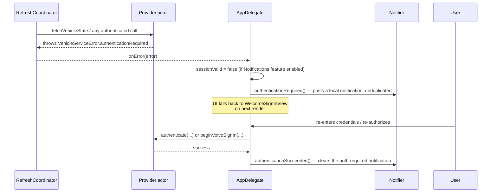

# Authentication

Polestar and Volvo use genuinely different flows. Both end up with a bearer access token and a persisted refresh token, but how they get there — and how Hisingen has to work around each vendor's constraints — differs substantially.

## Polestar: scraped OIDC login

Polestar has no documented third-party OAuth client registration process, so Hisingen's login flow reproduces what the official web/app client does against Polestar ID's PingFederate-based identity provider, rather than a simple redirect-and-exchange.

```mermaid
sequenceDiagram
    participant User
    participant App as PolestarAPI (actor)
    participant OIDC as polestarid.eu.polestar.com
    App->>OIDC: GET .well-known/openid-configuration
    OIDC-->>App: issuer, authorization_endpoint, token_endpoint (validated: https, *.polestar.com)
    App->>App: generate PKCE verifier + challenge (SecRandomCopyBytes, SHA256, base64url)
    App->>OIDC: GET authorization_endpoint (client_id, redirect_uri, code_challenge, state, ...)
    Note over App,OIDC: OAuthRedirectDelegate (URLSessionTaskDelegate)<br/>intercepts the redirect chain instead of following it
    OIDC-->>App: login page HTML
    App->>App: extractResumePath(html) — regex over several known patterns
    App->>OIDC: POST pf.username / pf.pass to resume URL
    alt uid present, second confirmation step needed
        App->>OIDC: POST pf.submit=true / subject=uid
    end
    OIDC-->>App: redirect to oidcRedirectURL?code=...&state=...
    App->>App: validate state matches; extract code
    App->>OIDC: POST token_endpoint (code, code_verifier, redirect_uri)
    OIDC-->>App: access_token, refresh_token, expires_in
    App->>App: persist refresh token to Keychain (access token stays in-memory only)
```

Failure detection is string-based: if the login page HTML contains the literal string `"ERR001"`, Hisingen maps it to `PolestarError.authenticationRequired(.invalidCredentials)`; any other failure to extract a code maps to `.callbackRejected`. There is no structured error response to parse — this is a genuinely brittle, reverse-engineered flow, and `Tests/HisingenTests/Unit/ResumePathTests.swift` exists specifically to pin down the HTML-parsing regexes against known page variants.

**Client and scopes:** Hisingen authenticates as the Polestar **mobile-app** OIDC client, `client_id = lp8dyrd_10`, requesting `openid profile email customer:attributes customer:attributes:write`. It formerly used the polestar.com **web** client (`l3oopkc_10`) without the `:write` scope, which is why every write RPC was rejected — see [polestar.md](polestar.md#remote-commands).

**Redirect validation:** `oidcRedirectURL = polestar-explore://explore.polestar.com`, the app client's registered callback. Because it is a custom scheme rather than an `https` URL, `URLSession` cannot follow it: `OAuthRedirectDelegate` intercepts the redirect, captures the URL, and cancels the load by passing `nil` to the completion handler. Only a redirect whose scheme/host/path match the callback is captured — anything else continues following redirects normally. Path comparison normalizes `"/"` to `""`, since a scheme-only callback reports an empty path in one form and `/` in the other.

**State validation:** the `state` query parameter on the captured callback is compared against the value generated before the authorize request; a mismatch throws `.callbackRejected` before any code exchange is attempted.

**OIDC discovery hardening:** every URL returned by the `.well-known/openid-configuration` document (`authorization_endpoint`, `token_endpoint`, etc.) is validated to be `https` and either `host == "polestar.com"` or `host.hasSuffix(".polestar.com")` before use — a defense against a compromised or spoofed discovery response redirecting the login flow elsewhere.

**Token storage:** only the **refresh token** is written to Keychain (account `polestar-refresh-token`). The access token and its expiry live only in `PolestarAPI`'s in-memory actor state and are lost on relaunch — every app start that resumes a session does so via the refresh token, never a cached access token.

**Token refresh:** `refreshAccessToken(force:)` is coalesced — if a refresh is already in flight, concurrent callers `await` the same stored `Task` rather than issuing a duplicate POST. Triggered proactively (`refreshTokenIfNeeded`, when expiry is <5 minutes away) and reactively (on a 401/403 or an embedded GraphQL auth error, one retry).

**Note:** `PolestarAPI` has its own private, duplicate PKCE implementation rather than using `Support/PKCE.swift` — functionally identical, but worth knowing if you're touching either. See [architecture/technical-debt.md](../architecture/technical-debt.md).

## Volvo: OAuth2 PKCE, with a redirect-URI bridge

Volvo's flow is a standard OAuth2 authorization-code-with-PKCE grant against a documented identity provider — the interesting engineering problem here isn't the OAuth mechanics, it's that **Volvo's Developer Portal only accepts `http(s)` redirect URIs** (no `localhost`, no custom URL schemes), while Hisingen needs the callback to land back inside the app via its `hisingen://` URL scheme.

```mermaid
sequenceDiagram
    participant User
    participant Presenter as VolvoSignInPresenter
    participant Browser as System browser
    participant VID as volvoid.eu.volvocars.com
    participant Bridge as GitHub Pages<br/>oauth-callback.html
    participant App as VolvoAPI (actor)
    participant AD as AppDelegate

    App->>App: generate PKCE verifier/challenge + state (Support/PKCE.swift)
    Presenter->>Browser: NSWorkspace.open(authorizeURL)
    Browser->>VID: GET /as/authorization.oauth2 (redirect_uri = GitHub Pages URL)
    User->>VID: signs in, consents
    VID-->>Browser: redirect to GitHub Pages URL?code=...&state=...
    Browser->>Bridge: GET oauth-callback.html?code=...&state=...
    Bridge->>Bridge: window.location.replace("hisingen://oauth/volvo/callback" + search)
    Browser->>AD: opens hisingen://oauth/volvo/callback?code=...&state=...
    AD->>Presenter: handleCallbackURL(url)
    Presenter->>Presenter: resume suspended continuation from signIn()
    Presenter-->>App: callback URL
    App->>App: validate state; extract code
    App->>VID: POST /as/token.oauth2 (Basic auth: client_id/client_secret, code, code_verifier)
    VID-->>App: access_token, refresh_token, expires_in
    App->>App: persist refresh token + client secret + VCC API key to Keychain
```

**Why the bridge page exists:** `docs/oauth-callback.html` is a static, no-backend page whose entire job is to hand the query string straight through — the file's own comment says it plainly: *"This page exists only because Volvo's Developer Portal requires an http(s) redirect URI — no localhost, no custom URL schemes — while the actual OAuth callback destination is Hisingen's own registered URL scheme."* It never stores or transmits anything itself.

**Not `ASWebAuthenticationSession`:** `VolvoSignInPresenter` opens the user's default system browser via `NSWorkspace.shared.open(_:)`, not Apple's dedicated auth-session API, and suspends with `withCheckedThrowingContinuation` until `AppDelegate.application(_:open:)` routes the `hisingen://` callback back to it. Only one sign-in can be pending at a time — a second call to `signIn` rejects any prior pending continuation.

**Client credentials:** Client ID, Client Secret, and VCC API Key are the user's own Volvo Developer Portal application credentials (registered by the user at developer.volvocars.com, not shared or issued by Hisingen). Client ID/secret authenticate the token exchange via HTTP Basic auth; the VCC API Key is a separate API-gateway subscription key sent as a `vcc-api-key` header on every subsequent REST call.

**Token storage:** all three Volvo secrets (client secret, VCC API key, refresh token) are stored together as one JSON blob in a single Keychain item (account `volvo-credentials-bundle`). The Client ID itself is not a secret and lives in `Preferences`/`UserDefaults`.

**Token refresh:** same coalescing pattern as Polestar — one stored `Task`, concurrent callers await it. Triggered when the access token is missing or <5 minutes from expiry, plus one retry on a 401 inside the generic authenticated-GET helper.

**Scopes requested:** `openid` plus 18 `conve:*`/`energy:*` read scopes. A separate `restrictedScopes` array (`conve:lock`, `conve:unlock`, `conve:engine_start_stop`, `conve:honk_flash`, `location:read`) is defined in the source but **never included** in the actual authorize request — see [architecture/technical-debt.md](../architecture/technical-debt.md) for what that might mean for lock/unlock/honk-flash/location calls.

## Session resumption (both providers)

At launch, `AppDelegate.resumeStoredSession()` reads the relevant Keychain items and, if present, calls `restoreSession(token:preferredVIN:features:)` on the active provider — which force-refreshes the access token from the stored refresh token and re-runs vehicle discovery. If that refresh fails with an authentication-requiring error, the stored refresh token is deleted from Keychain and the error propagates up, landing the UI in the unauthenticated (`WelcomeSignInView`) state rather than retrying indefinitely against a dead token.

## Authentication failure / recovery



`authenticationNoticePosted` on `Notifier` prevents the same "please sign in" notification from repeating on every failed refresh — it's cleared only once `authenticationSucceeded()` fires.

## Sign out

Both providers' `signOut()` calls `resetSession()` (clears in-memory token state, invalidates and recreates the ephemeral `URLSession` so no stale cookies survive, and for Polestar also invalidates the cached C3 gRPC host) and then deletes the relevant Keychain items — the refresh token for Polestar; the session token, client secret, and API key for Volvo. `RefreshCoordinator.signOut()` additionally clears `VehicleStateStore` and resets in-memory `latest`/`cars` via `onSignedOut`.

## Provider isolation

Signing into one brand never touches the other's credentials — Polestar and Volvo each have entirely separate Keychain accounts, separate `Preferences` keys, and separate `VehicleProviding` actor instances. See [security/keychain.md](../security/keychain.md) for the isolation guarantees and [Tests/HisingenTests/Unit/VolvoKeychainIsolationTests.swift](../../Tests/HisingenTests/Unit/VolvoKeychainIsolationTests.swift) for the test that proves it.
