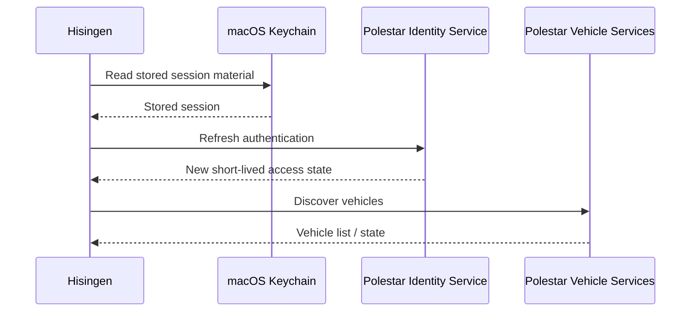
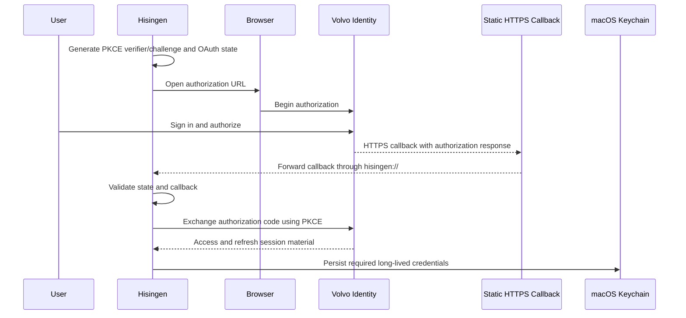
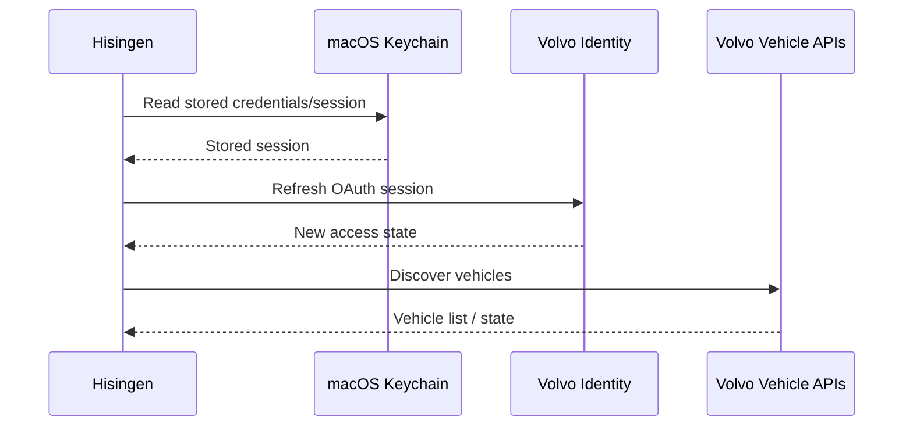
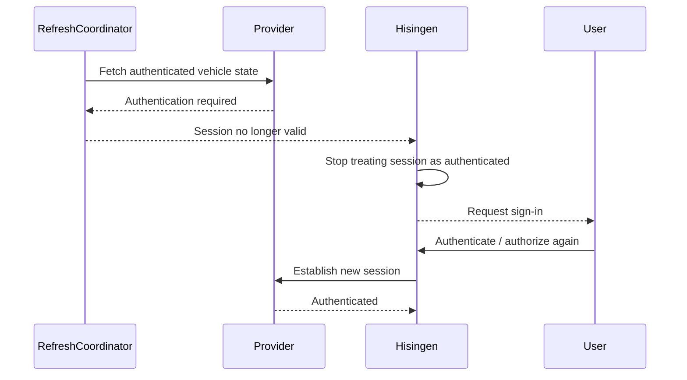

# Authentication

Hisingen supports authentication with both Polestar and Volvo, but the two providers use substantially different integration models.

At a high level:

- **Polestar** uses an undocumented authentication flow derived from the behaviour of Polestar's first-party services.
- **Volvo** uses a documented OAuth 2.0 authorization flow through the Volvo Cars Developer Platform.

Both integrations use PKCE and validate authorization state before accepting a callback.

Long-lived credentials that need to survive an application restart are stored locally using the macOS Keychain. Hisingen does not operate an authentication server or account service of its own.

This document intentionally describes the authentication architecture without publishing provider-specific reverse-engineering details such as internal client identifiers, captured login forms, undocumented allowlist behaviour, raw responses or probing results.

---

## Security goals

The authentication implementation is designed around a few basic requirements:

1. Credentials should be sent only to the provider they belong to.
2. Hisingen should not operate an intermediary credential or token service.
3. Authorization callbacks must be tied to the flow that initiated them.
4. Long-lived secrets should not be stored in plaintext application preferences.
5. Short-lived credentials should remain in memory where practical.
6. Polestar and Volvo credentials must remain isolated from each other.
7. Authentication failure should fail closed and return the application to an unauthenticated state.

See:

- [Security Overview](../security/overview.md)
- [Keychain](../security/keychain.md)
- [Threat Model](../security/threat-model.md)

---

# Polestar Authentication

## Overview

Polestar does not currently provide a documented third-party authentication and vehicle-API integration intended for applications such as Hisingen.

Hisingen therefore authenticates using an OAuth/OIDC-style flow based on observed first-party behaviour.

The implementation uses:

- OpenID Connect discovery;
- authorization-code exchange;
- PKCE;
- redirect validation;
- OAuth state validation;
- refresh-token-based session restoration.

Because this is not a published third-party contract, Polestar can change the authentication flow without notice.

Changes to:

- the sign-in experience;
- identity-provider behaviour;
- authorization requirements;
- redirect behaviour;
- token issuance;
- account permissions

can require a Hisingen update.

---

## Authentication flow

Conceptually, Polestar authentication follows this sequence:

```mermaid
sequenceDiagram
    participant User
    participant App as Hisingen
    participant ID as Polestar Identity Service

    App->>App: Generate PKCE verifier/challenge and OAuth state
    App->>ID: Begin authorization
    User->>ID: Authenticate with Polestar account
    ID-->>App: Authorization callback
    App->>App: Validate callback and state
    App->>ID: Exchange authorization code using PKCE verifier
    ID-->>App: Access and refresh session material
    App->>App: Keep short-lived access state in memory
    App->>App: Persist required long-lived session material in Keychain
````

The exact provider-specific login mechanics are intentionally not documented publicly.

---

## PKCE

Hisingen uses Proof Key for Code Exchange (PKCE) when performing provider authorization.

For each new authorization:

1. Hisingen creates a cryptographically random verifier.
2. A SHA-256-derived challenge is sent with the authorization request.
3. The verifier remains local to the application.
4. The verifier is supplied during the authorization-code exchange.

An intercepted authorization code therefore cannot normally be exchanged without the verifier held by the Hisingen process that initiated the flow.

The shared PKCE implementation lives in:

```text
Sources/Hisingen/Support/PKCE.swift
```

---

## OAuth state validation

Every authentication request includes a freshly generated `state` value.

When the provider redirects back, Hisingen compares the returned value with the one associated with the pending authentication request.

A mismatched or missing state causes the callback to be rejected before token exchange.

This protects the flow against callback confusion and common OAuth request-forgery scenarios.

---

## Redirect validation

Hisingen only accepts authentication redirects matching the destination expected for the active authorization flow.

Unexpected redirects are not interpreted as successful authentication callbacks.

The implementation also validates provider-controlled URLs before using them where appropriate.

Authentication code should preserve this behaviour when modified.

---

## Credential handling

The user's Polestar credentials are used only for authentication against Polestar's identity services.

Hisingen does not send them to:

* Hisingen-operated infrastructure;
* Volvo;
* Open-Meteo;
* GitHub;
* Apple geocoding services.

Long-lived authentication state required for session restoration is stored using the macOS Keychain.

Short-lived access credentials are kept in process memory rather than persisted where practical.

See [Keychain](../security/keychain.md).

---

## Session restoration

After Hisingen restarts, it attempts to restore an existing Polestar session from locally stored session material.

Conceptually:



If the stored session can no longer be refreshed, Hisingen clears invalid authentication state and requires the user to sign in again.

---

## Authentication failures

Polestar authentication can fail because of:

* invalid credentials;
* expired or revoked session material;
* changed provider behaviour;
* network failure;
* malformed or unexpected provider responses;
* rejected authorization callbacks;
* changes to account permissions.

Failures that require user authentication are surfaced as authentication-required state rather than being retried indefinitely.

Transient network and provider errors are handled separately through the normal retry/backoff system.

See [Errors and Rate Limits](errors-and-rate-limits.md).

---

# Volvo Authentication

## Overview

Volvo uses a documented OAuth 2.0 authorization-code flow through the Volvo Cars Developer Platform.

Unlike Polestar, Volvo requires the user to create their own Developer Portal application.

Hisingen therefore requires Volvo users to provide the application credentials issued for their own registration.

Depending on the enabled API products and requested functionality, these can include:

* Client ID;
* Client Secret;
* VCC API Key.

The user's Volvo Developer application remains separate from Hisingen itself.

---

## Volvo authorization flow

Volvo authentication uses:

* OAuth 2.0 authorization code;
* PKCE;
* OAuth state validation;
* browser-based user sign-in;
* an HTTPS callback bridge;
* refresh-token-based session restoration.

Conceptually:



---

## Why an HTTPS callback bridge is required

Volvo's Developer Platform requires an HTTP(S) redirect URI for the OAuth application.

Hisingen is a native macOS application and ultimately needs the callback returned to the local app.

The registered callback is therefore:

```text
https://nicolaskheirallah.github.io/Hisingen/oauth-callback.html
```

That page is static.

Its only purpose is to return the OAuth callback to Hisingen through the application's registered:

```text
hisingen://
```

URL scheme.

The bridge:

* does not contain a Hisingen account system;
* does not exchange tokens;
* does not store credentials;
* does not process vehicle telemetry;
* does not authenticate the user itself.

The application validates the OAuth state after the callback is returned.

The bridge implementation is available in the public repository so its behaviour can be inspected.

---

## Callback handling

A Volvo sign-in remains pending while the user's browser completes authorization.

When macOS opens the Hisingen callback URL, the application routes the response back to the pending authorization operation.

Hisingen then:

1. verifies that an authorization is actually pending;
2. validates the OAuth state;
3. checks for provider errors;
4. extracts the authorization code;
5. exchanges it using the corresponding PKCE verifier.

A second authorization request should not silently overwrite an unrelated pending flow.

---

## Volvo Developer credentials

Volvo application credentials belong to the user's own Developer Portal registration.

Hisingen does not ship a shared Volvo Developer identity intended to impersonate every installation.

The relevant values are entered through Hisingen Settings.

Sensitive values that must persist are stored in the macOS Keychain.

The Client ID may be stored as non-secret application configuration because an OAuth Client ID is an identifier rather than a credential granting access on its own.

See [Keychain](../security/keychain.md).

---

## API key

Volvo's API gateway uses the VCC API Key associated with the user's Developer application.

This key is separate from the OAuth access token.

Authenticated Volvo requests can therefore require both:

* authorization associated with the user's account;
* application-level API access associated with the Developer registration.

The VCC API Key must be treated as sensitive configuration and must never be committed to the repository.

---

## OAuth scopes

Volvo API functionality is scope-based.

Hisingen requests scopes required for the functionality it implements and that the user's Developer application is allowed to access.

Some functionality can require:

* additional API products;
* additional OAuth scopes;
* approval through Volvo's Developer Platform;
* support from the vehicle itself.

A missing feature or HTTP permission error should therefore not automatically be interpreted as a Hisingen implementation failure.

See [Volvo Integration](volvo.md).

The exact private configuration of a developer application's approved permissions should not be published in bug reports or examples.

---

## Session restoration

Volvo sessions are restored from locally persisted credentials where possible.

Conceptually:



If the refresh token is revoked, expired or otherwise rejected, Hisingen clears the invalid session and asks the user to authorize again.

---

# Token Refresh

Both provider implementations use refreshable authentication sessions.

Refresh can occur:

* when Hisingen launches;
* before an access credential expires;
* after an authenticated request indicates that the current access credential is no longer valid.

Concurrent refresh requests should be coalesced so multiple callers do not independently perform the same refresh operation.

A refresh failure requiring new credentials is surfaced to the application as an authentication-required condition.

---

## Access credentials

Short-lived access credentials should not be written to disk unless there is a clear need.

Where practical, Hisingen retains them in memory only.

Application relaunch should restore access through the provider-supported long-lived session mechanism rather than relying on an old cached access credential.

---

# Keychain Storage

Sensitive persisted authentication material is stored using the macOS Keychain.

Hisingen currently uses:

```text
kSecAttrAccessibleAfterFirstUnlockThisDeviceOnly
```

for persisted Keychain items.

This means the data:

* is tied to the current Mac;
* is excluded from iCloud Keychain synchronization;
* becomes accessible after the Mac has been unlocked once following startup;
* can remain accessible while the screen is subsequently locked.

The latter property allows a menu-bar application to continue background refreshes while the user is not actively using the Mac.

This should not be described as Secure Enclave storage.

See [Keychain](../security/keychain.md) for the current storage model.

---

# Provider Isolation

Polestar and Volvo authentication state is kept separate.

Signing into one provider does not reuse the other provider's:

* password;
* OAuth application credentials;
* refresh session;
* access token;
* API key.

A provider implementation must never send credentials belonging to one brand to the other brand.

This separation is part of the shared provider architecture described in [Provider Architecture](../architecture/providers.md).

---

# Sign Out

Signing out should remove both:

1. active in-memory authentication state;
2. persisted session material belonging to that provider.

It should also invalidate provider-specific network session state that could otherwise preserve authentication cookies or stale authorization information.

Signing out of one provider should not delete credentials belonging to the other provider.

---

# Authentication Recovery

Authentication failure is handled differently from an ordinary transient provider error.

Conceptually:



Hisingen should not continually retry a permanently invalid credential as though it were a temporary network error.

---

# Error Handling

Authentication-related failures are translated into Hisingen's shared provider error model.

Common categories include:

* invalid credentials;
* expired session;
* revoked authorization;
* application not configured;
* insufficient permissions;
* rejected callback;
* invalid provider response;
* Keychain failure;
* network failure;
* provider/server failure.

Only errors that are reasonably transient should be automatically retried.

See [Errors and Rate Limits](errors-and-rate-limits.md).

---

# Logging

Authentication code must never intentionally log:

* passwords;
* Client Secrets;
* API keys;
* access tokens;
* refresh tokens;
* authorization codes;
* PKCE verifiers;
* full authentication responses.

Error logs should describe the operation and failure category without including the secret value involved.

This rule applies equally to:

* application logs;
* test output;
* GitHub Actions;
* issue reports;
* diagnostic archives.

---

# CI and Test Credentials

The normal deterministic test suite does not require real provider credentials.

Tests that require a live provider account are isolated from normal CI execution and must be explicitly enabled.

Credentials used for live testing must be supplied through secure environment or secret storage rather than committed files.

Live-provider fixtures must never be produced by committing a raw response first and sanitizing it later.

Sanitization must occur **before the first Git commit**.

See:

* [Testing Strategy](../testing/strategy.md)
* [Fixtures](../testing/fixtures.md)
* [Security Policy](../../SECURITY.md)

---

# Repository Rules

Never commit:

* `.env` files containing live credentials;
* passwords;
* Client Secrets;
* VCC API Keys;
* access tokens;
* refresh tokens;
* authorization codes;
* captured authenticated HTTP responses;
* browser cookies;
* unredacted authentication logs;
* raw provider traffic containing account information.

Use obviously fake placeholders in examples.

Prefer values such as:

```text
example-client-id
example-client-secret-not-real
fixture-access-token-not-real
fixture-refresh-token-not-real
```

over random strings that could be mistaken for real credentials.

---

# Public Documentation Boundary

Public authentication documentation should explain:

* which authentication model each provider uses;
* where trust boundaries exist;
* how PKCE and state validation are used;
* what classes of credentials are stored;
* how sessions are restored;
* how sign-out and failure recovery work;
* which security guarantees users can rely on.

Public documentation should not reproduce:

* first-party OAuth client identifiers discovered through reverse engineering;
* provider-internal allowlists;
* raw authorization requests or responses from real accounts;
* undocumented scope experiments;
* captured sign-in HTML;
* cookies;
* backend-specific authentication bypass research;
* probing transcripts;
* detailed provider implementation material that is unnecessary to use or contribute to Hisingen.

Such information is not required to understand Hisingen's architecture and creates unnecessary maintenance, security and provider-relationship risk.

---

# Contributor Guidance

When modifying authentication:

1. Preserve PKCE.
2. Preserve OAuth state validation.
3. Validate callbacks before token exchange.
4. Do not weaken provider-domain validation.
5. Keep provider credentials isolated.
6. Do not persist short-lived secrets unnecessarily.
7. Keep long-lived secrets in Keychain.
8. Never add credential values to logs.
9. Ensure sign-out removes persisted session material.
10. Ensure an invalid refresh session returns to unauthenticated state.
11. Add tests for callback validation and failure handling.
12. Never commit raw authentication captures.
13. Keep undocumented reverse-engineering material out of public documentation.

Authentication changes should generally be treated as security-sensitive changes even when they appear to be simple provider compatibility fixes.

---

# Related Documentation

* [API Overview](overview.md)
* [Polestar Integration](polestar.md)
* [Volvo Integration](volvo.md)
* [Errors and Rate Limits](errors-and-rate-limits.md)
* [Provider Architecture](../architecture/providers.md)
* [Security Overview](../security/overview.md)
* [Keychain](../security/keychain.md)
* [Privacy](../security/privacy.md)
* [Threat Model](../security/threat-model.md)
* [Testing Strategy](../testing/strategy.md)
* [Security Policy](../../SECURITY.md)

---

# Disclaimer

Authentication behaviour ultimately depends on Polestar and Volvo services that Hisingen does not control.

The Volvo integration uses the documented Volvo Developer Platform but still depends on provider availability, application configuration and granted permissions.

The Polestar integration relies on undocumented first-party behaviour and may require changes when Polestar modifies its authentication systems.

Hisingen should fail conservatively when an authentication assumption is no longer valid rather than attempting to bypass provider security controls.


