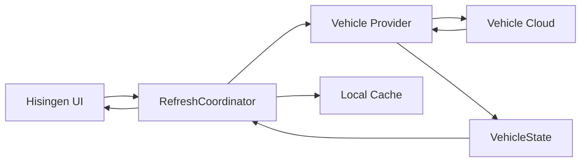

# API Overview

Hisingen integrates with two vehicle providers — Polestar and Volvo — through different API models.

The most important distinction is:

- **Volvo** provides documented developer APIs intended for third-party applications.
- **Polestar** does not currently provide a supported public third-party vehicle API for this use case, so Hisingen relies on undocumented vehicle-cloud interfaces derived from first-party behaviour and compatibility testing.

Because of that difference, the two integrations have different stability and support characteristics.

This document describes the public architecture of those integrations without publishing reverse-engineering material such as internal backend inventories, first-party client identifiers, protocol field maps, probing results or captured traffic.

---

## Providers

| Provider | Integration model | Stability |
| --- | --- | --- |
| Polestar | Undocumented vehicle-cloud integration | Can change without notice |
| Volvo | Documented Volvo Cars Developer APIs | API-version and permission dependent |

Both providers are translated into the same Hisingen vehicle domain so the rest of the application does not need to understand provider-specific response formats.

See [Provider Architecture](../architecture/providers.md).

---

# Polestar

## Integration model

Polestar does not currently publish a supported public third-party vehicle API covering the functionality Hisingen provides.

Hisingen therefore integrates with several vehicle-cloud services based on observed first-party behaviour and testing.

These services provide functionality such as:

- authentication;
- vehicle discovery;
- battery and range;
- charging;
- exterior state;
- vehicle health;
- climate;
- trip and odometer information;
- software/update information;
- connectivity;
- location;
- vehicle imagery;
- supported remote operations.

The exact provider implementation is intentionally not documented here.

See [Polestar Integration](polestar.md).

---

## Reliability expectations

The Polestar integration should be considered less stable than a documented API integration.

Provider-side changes can affect:

- authentication;
- endpoint behaviour;
- field availability;
- response formats;
- remote controls;
- software/update information;
- vehicle images.

Hisingen is designed to degrade individual capabilities independently where possible.

A failure in an optional feature should not normally make unrelated vehicle data unavailable.

---

## API confidence

Not every part of the Polestar integration has the same confidence level.

Hisingen treats provider behaviour using categories such as:

| Classification | Meaning |
| --- | --- |
| **Verified** | Confirmed through real-world use or repeatable provider behaviour |
| **Strongly inferred** | Consistent observed behaviour, but not documented by Polestar |
| **Experimental** | Limited observations or behaviour likely to change |
| **Unknown** | Insufficient evidence to make a reliable claim |

These classifications describe Hisingen's confidence in behaviour, not official Polestar support.

A capability may also be supported on one vehicle platform while remaining unknown or unavailable on another.

See [Capability Matrix](../domain/capability-matrix.md).

---

# Volvo

## Integration model

Volvo support uses the documented Volvo Cars Developer Platform.

Depending on the feature, Hisingen uses API families including:

- Connected Vehicle API;
- Energy API;
- Location API.

Volvo API access requires the user to configure their own application through the Volvo Cars Developer Portal.

The application can require:

- Client ID;
- Client Secret;
- VCC API Key;
- appropriate API products;
- appropriate OAuth permissions.

See [Volvo Integration](volvo.md).

---

## Connected Vehicle

The Connected Vehicle API provides information such as:

- vehicle discovery;
- vehicle identity;
- doors;
- windows;
- locks;
- odometer;
- diagnostics;
- warnings;
- service information;
- climate state;
- command availability;
- supported remote commands.

The exact fields available vary by vehicle.

---

## Energy

The Energy API provides electric and charging-related information where supported.

Depending on the vehicle, this can include:

- battery state of charge;
- electric range;
- charging state;
- charging power;
- charging current;
- charging target;
- energy capabilities.

Hisingen uses provider-reported capability information where available instead of assuming every Volvo supports the same charging functions.

---

## Location

Vehicle location is optional.

When the Volvo Location API is configured and authorized, Hisingen can retrieve the latest position made available by Volvo.

Location data should be considered the latest provider-reported position rather than guaranteed real-time tracking.

See [Privacy](../security/privacy.md).

---

# Authentication

The two providers use different authentication mechanisms.

## Polestar

Polestar authentication is based on an undocumented OAuth/OIDC-style flow derived from first-party behaviour.

Hisingen uses protections including:

- PKCE;
- state validation;
- redirect validation;
- secure session storage.

Because this is not a documented third-party contract, provider authentication changes may require Hisingen updates.

## Volvo

Volvo uses a documented OAuth 2.0 authorization-code flow with PKCE.

Volvo authentication additionally depends on the user's own Developer Portal application and configured API access.

See [Authentication](authentication.md).

---

# Shared Vehicle Domain

Provider responses are not exposed directly to the UI.

Both integrations translate their respective formats into Hisingen's shared vehicle domain.

Conceptually:

```text
Polestar services ─┐
                   ├──> VehicleProviding ──> VehicleState ──> Hisingen
Volvo APIs ────────┘
````

This keeps provider-specific protocol details isolated from:

* UI code;
* notifications;
* charging history;
* capability handling;
* persistence;
* menu-bar presentation.

See:

* [Provider Architecture](../architecture/providers.md)
* [Vehicle Domain Model](../domain/vehicle.md)

---

# Capability Model

Hisingen deliberately separates provider implementation from vehicle capability.

A feature is not considered available merely because:

* the provider exposes a related endpoint;
* another vehicle model supports it;
* Hisingen has code capable of issuing the request.

Availability can depend on:

* provider implementation;
* vehicle model;
* model year;
* vehicle configuration;
* region;
* account permissions;
* Developer application permissions;
* vehicle software;
* backend rollout;
* runtime observations.

Capabilities can therefore be reported as:

* supported;
* vehicle-managed;
* backend-dependent;
* unavailable.

See:

* [Capabilities](../architecture/capabilities.md)
* [Capability Matrix](../domain/capability-matrix.md)

---

# Remote Commands

Remote commands are treated differently from read-only telemetry because they can affect the physical vehicle.

A command is only made available when the relevant layers permit it.

These include:

1. Hisingen implements the command for the provider.
2. The vehicle capability model allows it.
3. The corresponding feature is enabled.
4. Required confirmation succeeds.
5. Required local authentication succeeds.
6. The provider accepts the command.

Supported command categories can include:

* climate;
* locks;
* windows/openings;
* horn and lights;
* charging settings;
* schedules;
* other provider-specific operations.

Availability varies by provider and vehicle.

See [Security Overview](../security/overview.md).

---

## Command outcomes

Vehicle commands are often asynchronous.

Hisingen distinguishes between provider acknowledgement and confirmed vehicle state.

Conceptually:

```text
Request sent
    ↓
Accepted by provider
    ↓
Delivered toward vehicle
    ↓
Vehicle completes operation
    ↓
Fresh telemetry confirms state
```

Not every provider exposes every stage.

Hisingen should therefore avoid presenting a weak acknowledgement as proof that the requested physical operation occurred.

---

# Data Flow

At a high level:



Provider-specific protocol handling remains inside the provider layer.

The UI consumes shared domain state.

See [Data Flow](../architecture/data-flow.md).

---

# Optional External Services

In addition to Polestar and Volvo, Hisingen can communicate with a small number of external services for optional functionality.

| Service                  | Purpose                                             |          Optional          |
| ------------------------ | --------------------------------------------------- | :------------------------: |
| Apple geocoding services | Convert vehicle coordinates into readable locations |             Yes            |
| Open-Meteo               | Weather at the vehicle's reported location          |             Yes            |
| GitHub Pages + Releases  | Serve signed Hisingen appcast and update archive    |             Yes            |
| GitHub Pages             | Volvo OAuth callback bridge                         | Required for Volvo sign-in |

These services do not receive Polestar or Volvo account credentials.

See [Privacy](../security/privacy.md).

---

# Feature-Gated Requests

Many provider requests correspond directly to Hisingen feature settings.

Where practical, disabling a feature also prevents Hisingen from making the corresponding provider request.

For example, disabling an optional location or weather feature should prevent the associated network operation rather than merely hiding its UI.

This reduces:

* unnecessary provider traffic;
* unnecessary data processing;
* privacy exposure for disabled features.

---

# Refresh Behaviour

Hisingen coordinates provider refreshes centrally.

The refresh architecture includes:

* a single coordinated refresh pipeline;
* request coalescing;
* transient retry handling;
* rate-limit handling;
* per-feature degradation;
* cooldowns for repeatedly failing optional capabilities.

This is particularly important for vehicle backends because parked vehicles and provider services can temporarily return incomplete data.

See [Refresh System](../architecture/refresh-system.md).

---

# Error Handling

Provider-specific errors are translated into a shared Hisingen error model.

Typical categories include:

* authentication required;
* permission denied;
* capability unavailable;
* rate limiting;
* network failure;
* server failure;
* invalid response;
* decoding failure.

Optional capability failures should usually affect only that capability.

Session-wide failures such as invalid authentication are handled separately and surfaced to the user.

See [Errors and Rate Limits](errors-and-rate-limits.md).

---

# Rate Limiting

Hisingen should behave conservatively toward provider infrastructure.

The application uses:

* scheduled refresh intervals;
* request coalescing;
* transient retry backoff;
* rate-limit awareness;
* per-capability cooldowns.

Manual refresh should not be used to aggressively bypass a provider cooldown.

The goal is to retrieve useful vehicle state without creating unnecessary provider load.

---

# Privacy

Provider requests necessarily include information required to identify the user's vehicle and authorized account.

Depending on the requested capability, that can include:

* account session credentials;
* VIN;
* requested vehicle telemetry;
* vehicle location.

Hisingen does not operate its own vehicle telemetry backend.

Optional third-party services receive only the data required for their specific function.

See [Privacy](../security/privacy.md) for the detailed data-flow and persistence model.

---

# Security

Vehicle APIs expose sensitive information and, in some cases, physical vehicle controls.

Hisingen's provider layer therefore follows several security principles:

* long-lived secrets stored in macOS Keychain;
* provider credentials kept separate;
* HTTPS/TLS for network requests;
* OAuth PKCE where applicable;
* state validation for authorization callbacks;
* remote commands disabled unless explicitly enabled;
* capability validation before dispatch;
* additional authentication for sensitive actions;
* no intentional credential logging.

See:

* [Security Overview](../security/overview.md)
* [Threat Model](../security/threat-model.md)
* [Security Policy](../../SECURITY.md)

---

# Public Documentation Boundary

The public repository documents enough of the provider architecture to:

* understand how Hisingen works;
* contribute safely;
* diagnose ordinary integration problems;
* understand provider limitations;
* understand privacy and security implications.

It intentionally does not publish detailed material such as:

* raw authenticated traffic captures;
* provider-internal service inventories;
* first-party OAuth client identifiers;
* provider allowlists;
* undocumented method enumeration;
* protobuf field maps;
* raw probing transcripts;
* detailed OTA control-plane research;
* live credential-bearing responses.

Those details are not necessary for using or contributing to Hisingen and create unnecessary security and maintenance exposure.

---

# Development Guidelines

When modifying a provider integration:

1. Keep provider-specific wire formats inside the provider layer.
2. Translate responses into the shared domain.
3. Preserve optional values as optional.
4. Do not fabricate missing data.
5. Make new requests feature-aware where appropriate.
6. Respect rate limiting and cooldowns.
7. Handle partial responses gracefully.
8. Keep capabilities separate from provider implementation.
9. Add sanitized fixtures for response-format changes.
10. Never commit raw provider responses containing real account or vehicle data.
11. Avoid publishing reverse-engineering notes in public documentation.
12. Treat remote-command changes as security-sensitive.

---

# Related Documentation

* [Authentication](authentication.md)
* [Polestar Integration](polestar.md)
* [Volvo Integration](volvo.md)
* [Errors and Rate Limits](errors-and-rate-limits.md)
* [Provider Architecture](../architecture/providers.md)
* [Vehicle Domain Model](../domain/vehicle.md)
* [Capabilities](../architecture/capabilities.md)
* [Capability Matrix](../domain/capability-matrix.md)
* [Refresh System](../architecture/refresh-system.md)
* [Privacy](../security/privacy.md)
* [Security Overview](../security/overview.md)
* [Threat Model](../security/threat-model.md)

---

# Disclaimer

Hisingen is independent open-source software.

It is not affiliated with, endorsed by, sponsored by, or maintained by Polestar Performance AB or Volvo Car Corporation.

The Volvo integration depends on Volvo's published Developer Platform and the permissions granted to the user's application.

The Polestar integration depends on undocumented provider behaviour that may change without notice.

Provider functionality, availability and compatibility cannot be guaranteed.
