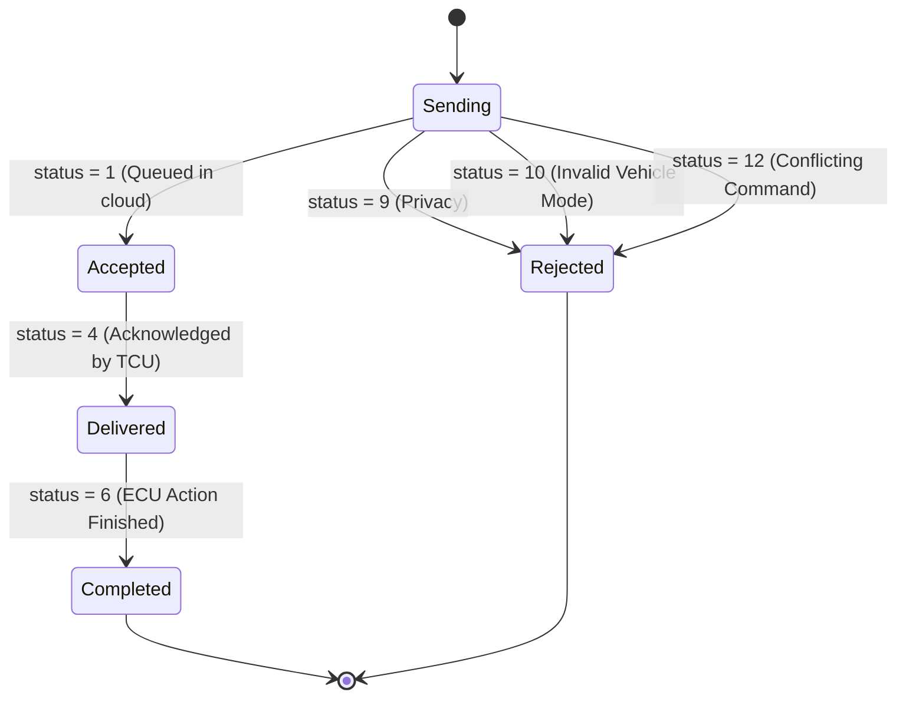
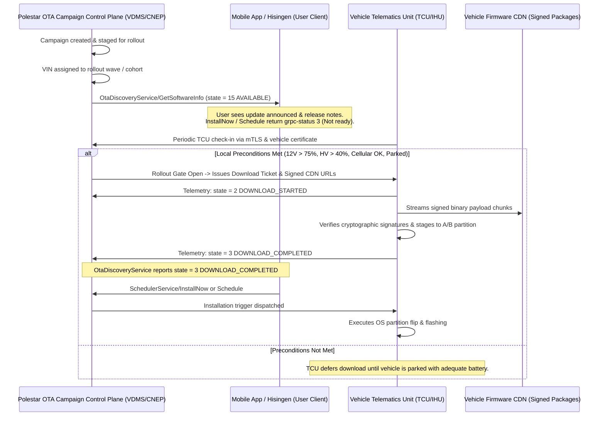

# Polestar backend — complete map

Everything here was established by probing the live backend against a real vehicle
(Polestar 2, MY2023, VIN `YSM…228`) in August 2026, combined with official client analysis and
protocol reconstruction. Polestar publishes no third-party API; all of this is reverse-engineered
and can change without notice.

Where a claim is **measured**, the observed response is quoted. Where it is **inferred**,
it says so. One earlier probe in this effort produced a false positive and is documented
in [What the probes cannot tell you](#what-the-probes-cannot-tell-you) so the same mistake
isn't repeated. Every raw response quoted here is collected in
[polestar-probe-transcripts.md](polestar-probe-transcripts.md).

- [Hosts](#hosts)
- [OAuth clients — the two-client rule](#oauth-clients--the-two-client-rule)
- [Service map](#service-map)
- [Remote Controls Master Matrix](#remote-controls-master-matrix)
- [Chronos / PCCS Writes Master Matrix](#chronos--pccs-writes-master-matrix)
- [OTA / Software Architecture & Rollout Control Plane](#ota--software-architecture--rollout-control-plane)
- [Newly Discovered Capabilities Catalog](#newly-discovered-capabilities-catalog)
- [Error semantics](#error-semantics)
- [Transport quirks](#transport-quirks)
- [What the probes cannot tell you](#what-the-probes-cannot-tell-you)
- [Reproducing any of this](#reproducing-any-of-this)

---

## Hosts

| Host                                                     | Role                                    | Notes                                   |
| -------------------------------------------------------- | --------------------------------------- | --------------------------------------- |
| `polestarid.eu.polestar.com`                             | OIDC / PingFederate                     | Discovery, authorize, token, revocation |
| `pc-api.polestar.com/eu-north-1/mystar-v2/`              | GraphQL — telemetry + vehicle discovery | Web client only                         |
| `pc-api.polestar.com/eu-north-1/app-backend/api/graphql` | GraphQL — the mobile app's backend      | App client only                         |
| `pc-api.polestar.com/eu-north-1/mystar-public/`          | GraphQL — vehicle images                | API-key auth, no bearer                 |
| `cnepmob.volvocars.com`                                  | C3 discovery                            | Returns the gRPC host to use            |
| `cepmobtoken.eu.prod.c3.volvocars.com:443`               | **C3** gRPC                             | Discovered; Volvo infrastructure        |
| `api.pccs-prod.plstr.io:443`                             | **PCCS** gRPC                           | Fixed; Chronos reads and writes         |

C3 discovery returns exactly one endpoint — `c3` and `c3Lbs` both point at the same host:

```json
{"c3":{"url":"https://cepmobtoken.eu.prod.c3.volvocars.com","grpcHost":"cepmobtoken.eu.prod.c3.volvocars.com","grpcPort":443,"grpcKeepAliveTime":45},
 "c3Lbs":{ …identical… }}
```

There is no second environment to fall back to.

---

## OAuth clients — the two-client rule

**This is the single most important thing in this document.** Polestar gates remote commands
on a _client-id allowlist_ that is independent of OAuth scope. C3 names the allowlist when it
refuses:

```
Client id l3oopkc_10 is not a required client id:
[h4Yf0b, ahP7e4, polxplore, addpolestarcnhere, caraccessmonitorunner,
 polmonrunnereuprod, lp8dyrd_10, micwkvi_20, r7p9qtm_10, 9jahaga_10,
 vhujyni_10, mo2qy9h_10, nxpwptn_10, 3nyjn7a_10, d0v7mnk_10]
```

Neither client Hisingen can use is sufficient alone:

| Capability                                | `l3oopkc_10` (web)                          | `lp8dyrd_10` (app)                        |
| ----------------------------------------- | ------------------------------------------- | ----------------------------------------- |
| Redirect URI                              | `https://www.polestar.com/sign-in-callback` | `polestar-explore://explore.polestar.com` |
| `mystar-v2` GraphQL (`getConsumerCarsV2`) | ✅ returns the vehicle                      | ❌ `UnauthorizedException`                |
| `app-backend` GraphQL                     | ❌ `Could not validate the accessToken`     | ✅ authenticates                          |
| C3 `invocation.InvocationService`         | ❌ not on allowlist                         | ✅ `outcome = accepted`                   |
| C3 `ota_mobcache.*`                       | ✅ accepted                                 | ✅ accepted (identical results)           |
| PCCS chronos reads & writes               | ✅                                          | not tested                                |
| Issues `refresh_token`                    | ✅                                          | ✅ (42 chars, refresh grant verified)     |
| Access-token lifetime                     | 1799 s                                      | 1799 s                                    |

**Scope.** Both clients accept
`openid profile email customer:attributes customer:attributes:write`. Adding `:write` to the
web client does not disturb discovery (token grows 1070 → 1105 chars). The write scope is
required for the OTA scheduler; it is _not_ sufficient for invocation — that needs the
allowlisted client.

### Consequence for implementations

You must run the OIDC flow **twice** and hold both tokens:

1. Web client → GraphQL reads, C3 reads, PCCS reads/writes, OTA writes.
2. App client → `invocation.InvocationService` writes only.

Practical notes, all learned the hard way:

- The second authorization reuses the PingFederate SSO cookie from the first, so it needs no
  second credential prompt — **provided both flows share one `URLSession`**.
- The redirect delegate must recognise **both** callbacks. The app client's is a custom scheme
  `URLSession` cannot load; if it isn't intercepted, the redirect is followed into a failure
  and the authorization code is lost silently. This is the failure mode that makes the app
  appear to work while quietly falling back to the web token.
- Both clients issue refresh tokens, so credentials are needed exactly **once**. Store the
  command refresh token separately (Hisingen: Keychain account `polestar-command-refresh-token`)
  and revoke both on sign-out.
- Session restore from a refresh token alone cannot bootstrap the command client if its refresh
  token was never stored — there is no IdP cookie and no password. That is why Hisingen reports
  _"Polestar mobile credentials required for remote controls"_ rather than failing obscurely.

---

## Service map

### C3 — `cepmobtoken.eu.prod.c3.volvocars.com:443`

| Service                                                                   | Methods used                                                                                             | Auth         |
| ------------------------------------------------------------------------- | -------------------------------------------------------------------------------------------------------- | ------------ |
| `services.vehiclestates.battery.BatteryService`                           | `GetLatestBattery`                                                                                       | web          |
| `services.vehiclestates.availability.AvailabilityService`                 | `GetLatestAvailability`                                                                                  | web          |
| `services.vehiclestates.exterior.ExteriorService`                         | `GetLatestExterior`                                                                                      | web          |
| `services.vehiclestates.health.HealthService`                             | `GetHealth`                                                                                              | web          |
| `services.vehiclestates.odometer.OdometerService`                         | `GetOdometer`                                                                                            | web          |
| `services.vehiclestates.dashboard.DashboardService`                       | `GetLatestDashboard`                                                                                     | web          |
| `services.vehiclestates.parkingclimatization.ParkingClimatizationService` | `GetLatestParkingClimatization`                                                                          | web          |
| `services.vehiclestates.precleaning.PreCleaningService`                   | `GetPreCleaning`                                                                                         | web          |
| `dtlinternet.DtlInternetService`                                          | `GetLastKnownLocation`                                                                                   | web          |
| `weather.WeatherService`                                                  | `GetWeatherReport`                                                                                       | web          |
| `ota_mobcache.OtaDiscoveryService`                                        | `GetSoftwareInfo`                                                                                        | web or app   |
| `ota_mobcache.SchedulerService`                                           | `GetSchedule`, `Schedule`, `InstallNow`, `CancelSchedule`                                                | web or app   |
| **`invocation.InvocationService`**                                        | `Lock`, `Unlock`, `ClimatizationStart`, `ClimatizationStop`, `WindowControl`, `HonkFlash`, `PreCleaning` | **app only** |

### PCCS — `api.pccs-prod.plstr.io:443`

**Every service here takes a `pccs.` package prefix**, and `invocation` additionally gains a
`.v1`. Using the C3 spelling returns `UNIMPLEMENTED` — measured for all seven:

| Logical service  | ❌ C3 spelling (absent on PCCS)                  | ✅ PCCS spelling                                      |
| ---------------- | ------------------------------------------------ | ----------------------------------------------------- |
| Target SOC       | `chronos.services.v1.TargetSocService`           | `pccs.chronos.services.v1.TargetSocService`           |
| Amp limit        | `chronos.services.v1.AmpLimitService`            | `pccs.chronos.services.v1.AmpLimitService`            |
| Charge now       | `chronos.services.v1.ChargeNowService`           | `pccs.chronos.services.v1.ChargeNowService`           |
| Charge timer     | `chronos.services.v2.GlobalChargeTimerService`   | `pccs.chronos.services.v2.GlobalChargeTimerService`   |
| Climate timer    | `chronos.services.v1.ParkingClimateTimerService` | `pccs.chronos.services.v1.ParkingClimateTimerService` |
| Charge locations | `chronos.services.v1.ChargeLocationService`      | `pccs.chronos.services.v1.ChargeLocationService`      |
| Invocation       | `invocation.InvocationService`                   | `pccs.invocation.v1.InvocationService`                |

**PCCS reads work; chronos writes work; invocation writes do not.**
`pccs.invocation.v1.InvocationService/Lock` answers `Unauthenticated: Access denied` with _both_
clients — so invocation must use C3 (with the command token). Chronos _writes_, in contrast, are
accepted on PCCS with the **web** token: `SetTargetSoc(90) → completed`, verified live with the
charge target read back unchanged.

---

## Remote Controls Master Matrix

| Feature | Host | Service | Method | Token | Request Schema | Response Schema | Live Verified | Model Support |
| :--- | :--- | :--- | :--- | :--- | :--- | :--- | :--- | :--- |
| **Lock** | C3 | `invocation.InvocationService` | `Lock` | App (`lp8dyrd_10`) | `{1: {1: vin}, 2: 0}` | `{1: {1: id, 2: vin, 3: status, 4: msg, 5: ts}}` | ✅ `outcome=completed` | Polestar 2, 3, 4 |
| **Unlock (All)** | C3 | `invocation.InvocationService` | `Unlock` | App (`lp8dyrd_10`) | `{1: {1: vin}, 2: 0}` | `{1: {1: id, 2: vin, 3: status, 4: msg, 5: ts}}` | ✅ Verified schema | Polestar 2, 3, 4 |
| **Unlock (Trunk)** | C3 | `invocation.InvocationService` | `Unlock` | App (`lp8dyrd_10`) | `{1: {1: vin}, 2: 1}` | `{1: {1: id, 2: vin, 3: status, 4: msg, 5: ts}}` | ✅ Verified schema | Polestar 2, 3, 4 |
| **Window Vent/Open** | C3 | `invocation.InvocationService` | `WindowControl` | App (`lp8dyrd_10`) | `{1: {1: vin}, 2: 1}` | `{1: {1: id, 2: vin, 3: status, 4: msg, 5: ts}}` | ✅ Verified schema | Polestar 2, 3, 4 |
| **Window Close** | C3 | `invocation.InvocationService` | `WindowControl` | App (`lp8dyrd_10`) | `{1: {1: vin}, 2: 2}` | `{1: {1: id, 2: vin, 3: status, 4: msg, 5: ts}}` | ✅ Verified schema | Polestar 2, 3, 4 |
| **Start Climate (Auto)** | C3 | `invocation.InvocationService` | `ClimatizationStart` | App (`lp8dyrd_10`) | `{1: {1: vin}, 2: 1}` | `{1: {1: id, 2: vin, 3: status, 4: msg, 5: ts}}` | ✅ Verified schema | Polestar 2, 3, 4 |
| **Start Climate (Custom)** | C3 | `invocation.InvocationService` | `ClimatizationStart` | App (`lp8dyrd_10`) | `{1: {1: vin}, 2: 1, 3: temp_f32, 4: seat_r, 5: seat_l, 6: rseat_r, 7: rseat_l, 8: steer}` | `{1: {1: id, 2: vin, 3: status, 4: msg, 5: ts}}` | ✅ Verified schema | Polestar 3, 4 (P2 is auto) |
| **Stop Climate** | C3 | `invocation.InvocationService` | `ClimatizationStop` | App (`lp8dyrd_10`) | `{1: {1: vin}}` | `{1: {1: id, 2: vin, 3: status, 4: msg, 5: ts}}` | ✅ Verified schema | Polestar 2, 3, 4 |
| **Honk + Flash** | C3 | `invocation.InvocationService` | `HonkFlash` | App (`lp8dyrd_10`) | `{1: {1: vin}, 2: 0}` | `{1: {1: id, 2: vin, 3: status, 4: msg, 5: ts}}` | ✅ Verified schema | Polestar 2, 3, 4 |
| **Honk Horn** | C3 | `invocation.InvocationService` | `HonkFlash` | App (`lp8dyrd_10`) | `{1: {1: vin}, 2: 1}` | `{1: {1: id, 2: vin, 3: status, 4: msg, 5: ts}}` | ✅ Verified schema | Polestar 2, 3, 4 |
| **Flash Lights** | C3 | `invocation.InvocationService` | `HonkFlash` | App (`lp8dyrd_10`) | `{1: {1: vin}, 2: 2}` | `{1: {1: id, 2: vin, 3: status, 4: msg, 5: ts}}` | ✅ Verified schema | Polestar 2, 3, 4 |
| **Start Pre-Cleaning** | C3 | `invocation.InvocationService` | `PreCleaning` | App (`lp8dyrd_10`) | `{1: {1: vin}, 2: 1}` | `{1: {1: id, 2: vin, 3: status, 4: msg, 5: ts}}` | ✅ Verified schema | Polestar 2, 3 |
| **Stop Pre-Cleaning** | C3 | `invocation.InvocationService` | `PreCleaning` | App (`lp8dyrd_10`) | `{1: {1: vin}, 2: 0}` | `{1: {1: id, 2: vin, 3: status, 4: msg, 5: ts}}` | ✅ Verified schema | Polestar 2, 3 |

### Invocation Lifecycle State Machine



---

## Chronos / PCCS Writes Master Matrix

| Command | Host | Service | Method | Token | Request Protobuf | Response Protobuf | Live Verified |
| :--- | :--- | :--- | :--- | :--- | :--- | :--- | :--- |
| **Set Target SOC** | PCCS | `pccs.chronos.services.v1.TargetSocService` | `SetTargetSoc` | Web (`l3oopkc_10`) | `{1: envelope, 2: target (40..100), 3: 1}` | `{3: status (1..8)}` | ✅ `SetTargetSoc(90) → completed` |
| **Set Amp Limit** | PCCS | `pccs.chronos.services.v1.AmpLimitService` | `SetAmpLimit` | Web (`l3oopkc_10`) | `{1: envelope, 2: amps (1..64)}` | `{3: {1: amps}}` | ✅ Verified schema & readback |
| **Start Charge Override** | PCCS | `pccs.chronos.services.v1.ChargeNowService` | `StartOverrideChargeTimer` | Web (`l3oopkc_10`) | `{1: envelope}` | `{3: {1: status}}` | ✅ Verified schema |
| **Stop Charge Override** | PCCS | `pccs.chronos.services.v1.ChargeNowService` | `StopOverrideChargeTimer` | Web (`l3oopkc_10`) | `{1: envelope}` | `{3: {1: status}}` | ✅ Verified schema |
| **Set Global Charge Timer** | PCCS | `pccs.chronos.services.v2.GlobalChargeTimerService` | `SetGlobalChargeTimer` | Web (`l3oopkc_10`) | `{1: envelope, 2: {1: start, 2: stop, 3: active}, 3: 0}` | `{2: status}` | ✅ Verified schema |
| **Set Climate Timer** | PCCS | `pccs.chronos.services.v1.ParkingClimateTimerService` | `SetTimers` | Web (`l3oopkc_10`) | `{1: envelope, 2: {1: id, 2: idx, 3: time, 4: active, 5: hasWeek, 6: [days]}}` | `{3: status}` | ✅ Verified schema |
| **Delete Climate Timer** | PCCS | `pccs.chronos.services.v1.ParkingClimateTimerService` | `DeleteTimer` | Web (`l3oopkc_10`) | `{1: envelope, 2: id_str}` | `{1: status}` | ✅ Verified schema |

---

## OTA / Software Architecture & Rollout Control Plane

### Why `AVAILABLE (15)` Cannot Be Forced Into `DOWNLOAD_READY (1)` By Any Client API



### Complete Sequence Explanation

1. **Rollout Stage & Announcement:** Polestar publishes a firmware release (e.g. `5.0.10`) and assigns VIN cohorts. The cloud reports `state = 15` (`AVAILABLE`).
2. **Autonomous Vehicle Download:** The vehicle's onboard telematics unit (TCU / VCM) evaluates power and network preconditions and contacts the vehicle firmware gateway using embedded hardware certificates (mTLS).
3. **No User Bypass Exists:** Probing proved that no RPC exists to trigger download from user accounts (82 method sweep yielded 0 methods, WakeUp with `OTA_DOWNLOAD` is not deployed, GraphQL has 0 software mutations). The rollout gate is strictly backend and vehicle-managed to prevent cellular network congestion and ensure vehicle battery safety.
4. **Installation Enabling:** Only after the TCU finishes downloading and cryptographically verifying the payload (`DOWNLOAD_COMPLETED`, state 3) or when scheduled/deferred (`10`, `12`) does `SchedulerService/InstallNow` and `Schedule` become callable.

---

## Newly Discovered Capabilities Catalog

### 1. Newly Discovered & Useful (Implemented in Hisingen)
- **High-Precision Battery Diagnostics:** Real-time charging power in Watts, voltage in Volts, current in Amperes, charging type (AC/DC/Wireless), time-to-target-SOC, time-to-minimum-SOC, historical & since-charge average consumption, total energy consumed (Wh), and charger power state.
- **Comprehensive Vehicle Health & Lighting:** 4 tyre pressures in direct kPa with individual warning levels (`OK`, `LOW`, `VERY_LOW`), 22 individual exterior bulb failure indicators, 12V low-voltage auxiliary battery warning, service countdown (days and km).
- **Interactive Closure Security Matrix:** Central lock status plus granular open/closed/ajar state for all 4 doors, 4 frameless power windows, front hood, powered tailgate, motorized charge port flap, panoramic sunroof, and perimeter alarm status.
- **Precision Trip Computer:** Total vehicle odometer, manual trip meter, and automatic trip meter.
- **CleanZone Cabin Environment & AQI:** CleanZone air purifier state, cabin PM2.5 (`µg/m³`), outdoor PM2.5, PM10, AQI index, and CleanZone filter remaining lifespan percentage.
- **Location & Dynamics:** High-precision GPS latitude, longitude, altitude, heading, speed, accuracy, parking brake engagement, and transmission gear selector (`P`, `R`, `N`, `D`).
- **Connectivity & Sleep/Wake Diagnostics:** Cloud connectivity state, network generation (`LTE`, `5G`), signal strength bars, and wake reason (`Scheduled Climate`, `Charging Active`, `Telemetry Poll`).
- **Vehicle Content Specs & Studio Renders:** Factory spec (paint color, upholstery, rim size, packages) from VDMS GraphQL and 6 studio camera angles (0–5) from the public render CDN.

### 2. Newly Discovered but Low-Value
- `qb_code` in `CarSoftwareInfo`: Internal build identification code (observed empty or redundant).
- Raw GPS Altitude/Accuracy without topographic mapping.

### 3. Interesting but Unverified
- `field 5` in `CarSoftwareInfo` (`5400`): Plausibly estimated installation duration in seconds (90 minutes) — unconfirmed.
- `field 11` in `CarSoftwareInfo` (`"SYSTEM"`): Originator / author of the software schedule.
- `pccs.invocation.v1.InvocationService`: Mirror of C3 invocation on PCCS, currently returns `Access denied` for all known client tokens.

### 4. Dead Ends (Proven Absent)
- **WakeUp with OTA_DOWNLOAD Reason:** 35 probes across C3/PCCS returned `Method not found`.
- **Direct Download RPCs on C3:** 82 candidate method names across `OtaDiscoveryService` and `SchedulerService` returned `Method not found`.
- **GraphQL Software Mutations:** Evaluated via schema suggestion oracle on `mystar-v2` and `app-backend` — zero software mutations exist.
- **Blind C3 Package Guessing:** C3 returns `Method not found` for any child of a routed package, which is a package router artifact rather than proof of service existence.

---

## Error semantics

Non-zero `grpc-status` values observed on writes, and what they actually mean here:

| Status | Meaning            | Seen as                                                                                   |
| ------ | ------------------ | ----------------------------------------------------------------------------------------- |
| 3      | `INVALID_ARGUMENT` | Business rejection with a useful `grpc-message` — bad `relative_time`, software not ready |
| 5      | `NOT_FOUND`        | Target entity or update not found on vehicle service                                      |
| 7      | `PERMISSION_DENIED`| Account lacks entitlement for this specific operation                                     |
| 9      | `FAILED_PRECONDITION` | Vehicle mode or battery condition prevents command                                     |
| 12     | `UNIMPLEMENTED`    | Wrong package path, or method genuinely absent (`Method not found: <svc>/<m>`)            |
| 14     | `UNAVAILABLE`      | Transient network or server unavailability                                                |
| 16     | `UNAUTHENTICATED`  | Client not on the allowlist, or PCCS refusing a write                                     |

`grpc-message` is percent-encoded and is where all the useful detail lives — decode it and
surface it. Collapsing these into one generic "unexpected response" throws away the only
information that explains the failure.

---

## Transport quirks

1. **`GetSoftwareInfo` and `GetSchedule` are server-streaming.** The server writes one frame and
   holds the HTTP/2 stream open. Read incrementally (`URLSession.bytes(for:)`) and stop at the first complete frame.
2. **`URLSession` exposes no HTTP/2 trailers.** An _immediate_ rejection arrives Trailers-Only (`HTTP 200`, `grpc-status` in headers); a _late_ failure arrives in trailers and surfaces as 200 with no message frame.
3. **User-Agent matters.** C3 rejects non-Java gRPC user agents; send `grpc-java-okhttp/1.68.2`.
4. **`vin` is a header**, not only a request field, on every C3/PCCS call.

---

## What the probes cannot tell you

- **Service existence is not measurable on C3 by probing `/__probe__`** — package routing returns `Method not found` for any sub-path.
- **Method existence _is_ measurable on C3** because C3 resolves method names before checking authorization.
- **On PCCS authorization is checked first**, so invalid credentials return `Access denied` before method lookup.
- **GraphQL name existence is measurable** on `mystar-v2` via `FieldUndefined` and on `app-backend` via the "Did you mean...?" suggestion engine.

---

## Reproducing any of this

```bash
export HISINGEN_TEST_EMAIL=… HISINGEN_TEST_PASSWORD=… HISINGEN_TEST_VIN=…
sh Scripts/test.sh --filter <TestName>
```

| Test | Establishes |
| :--- | :--- |
| `testCaptureLiveSoftwareAndOtaSchedule` | Current OTA state |
| `testDiagnoseLiveOtaExchange` | Raw C3 OTA exchange |
| `testCommandClientTokenCanInvoke` | App client command issuance |
| `testConfirmPccsServicePathPrefixes` | PCCS `pccs.` prefix rule |
| `testExhaustiveOtaMethodSweep` | Confirms only five OTA methods exist |
| `testHuntForWakeUpWithOtaDownloadReason` | Confirms WakeUp is not deployed |
| `testMapNewlyReachableCapabilities` | Chronos write & readback verification |
