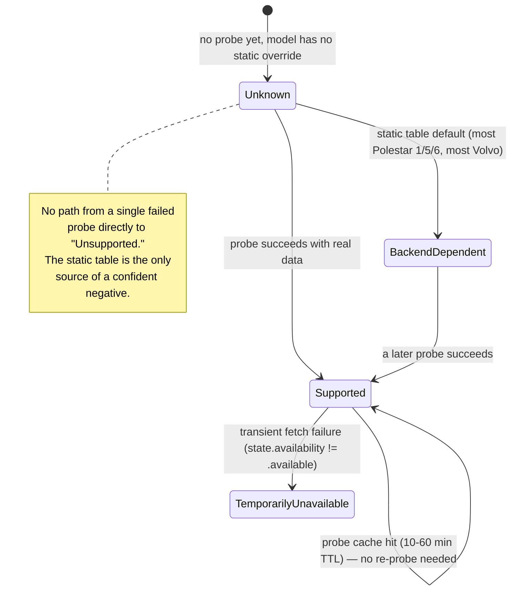

# Capability System

The central rule this whole system exists to enforce:

> **A failed API request does not automatically mean the vehicle does not support that capability.** It might mean the vehicle is asleep, the backend is having a bad day, the account role doesn't have permission, or the endpoint genuinely doesn't exist for this model. Hisingen only treats a capability as confidently "unsupported" via a conservative static per-model table — never by inferring it from one failed call.

## Two sources of truth, merged at read time

`VehicleCapabilityProfile.support(for:)` (`Domain/VehicleCapabilities.swift`) resolves every capability query this way:

1. **If a non-stale runtime observation exists** (`VehicleProbedCapabilities`, attached to the current `VehicleState`, with a 6-hour staleness window), use it.
2. **Otherwise, fall back to a static per-`VehicleModelFamily` table** — hand-written, conservative, and honest about what's genuinely unknown (`.backendDependent` is the table's "I don't know, ask the backend" answer, used liberally for Polestar 1/5/6 and most Volvo capabilities).

`VehicleCapabilitySupport` has four states: `.supported`, `.vehicleManaged` (the vehicle handles it automatically, no user control needed — e.g. Polestar 2's climate temperature), `.unavailable` (confident negative, from the static table only), `.backendDependent` (unknown — ask, don't assume). `permitsRequest` is true for every state except `.unavailable`.

Separately, `FeatureAvailability` captures *why* a feature isn't usable right now even if it's supported in principle: `.available`, `.vehicleOffline`, `.temporarilyUnavailable`, `.authenticationRequired`, `.unknown`. `VehicleFeatureStatus` combines both axes (`support` × `availability`) — a capability can be `.supported` but currently `.vehicleOffline`, which is a completely different UI treatment than `.unavailable`.

## Positive-result caching and negative-result backoff

Neither provider records an explicit "unsupported" observation from a failed probe — only `.supported` is ever written into `VehicleProbedCapabilities` by a probe. What *does* happen on failure is a cool-down so the same broken/unsupported endpoint isn't re-hit on every refresh cycle:

**Polestar** (`PolestarAPI.optionalCapability`):
- Positive cache: 10 minutes for `.climateStatus`/`.exteriorStatus`/`.airQuality`, 60 minutes for everything else.
- Negative backoff, keyed by error type: `PolestarError.incompatibleAPI` → 6 hours, `.invalidResponse` → 1 hour, anything else → 5 minutes.
- `PolestarError.authenticationRequired` and `.rateLimited` are treated as **global failures** and bypass this per-capability logic entirely — they propagate immediately rather than being swallowed into a single field's backoff, since they indicate a session-wide problem, not a missing capability.
- Tyre-pressure support additionally requires the health response to contain at least one *numeric* pressure value, not just a successful call with only warning flags — a successful-but-empty response does not record `.tyrePressureValues` as supported.

**Volvo** (`VolvoAPI.optional`):
- The `/energy/v2/vehicles/{vin}/capabilities` endpoint is the one explicit, backend-provided capability signal Volvo offers — cached 1 hour per VIN, and its `targetBatteryLevel`/`chargingPower` flags directly set `.chargeTarget`/`.chargingCurrentLimit` to a definite `.supported` or `.unavailable` (Volvo is the only place in the codebase where a probe *can* record `.unavailable`, because this is an explicit backend answer, not an inferred one).
- Every other optional field failure gets a flat 5-minute `endpointBackoff` per `"\(vin)|\(key)"`.
- `.authenticationRequired`, `.appNotConfigured`, `.rateLimited` are global failures, same exemption as Polestar.

## Static per-model defaults (fallback table)

From `VehicleCapabilityProfile.support(for:)`:

| Model | Notable overrides |
|---|---|
| Polestar 2 | Climate temperature, seat heating, steering-wheel heating → `.vehicleManaged` (not user-selectable); tyre pressure values → `.unavailable`; software install control → `.backendDependent`; everything else `.supported` |
| Polestar 3 | Climate temperature/seat/steering heating → `.supported`; connectivity, software install control, pre-cleaning, charging current limit → `.backendDependent`; everything else `.supported` |
| Polestar 4 | Climate temperature/seat/steering heating → `.supported`; charging current limit, pre-cleaning, connectivity, software install control → `.unavailable`; software status → `.backendDependent`; everything else `.supported` |
| Polestar 1, 5, 6 | `.backendDependent` for every capability — genuinely unverified, deliberately not guessed |
| Any Volvo model | Locks, honk & flash, exterior status, climate start/stop, service warnings → `.supported`; software install control → `.unavailable`; everything else (charge target, current limit, tyre pressure values, trunk, windows, schedules, connectivity, etc.) → `.backendDependent` unless a live probe overrides it |
| Unrecognized model | `.backendDependent` across the board |

This table is intentionally conservative — a Polestar 3 or 4 owner will typically see more capabilities marked `.supported` than a Polestar 1/5/6 owner not because Hisingen has verified less about those models, but because the table only asserts what's been reasonably confirmed. See [domain/capability-matrix.md](../domain/capability-matrix.md) for the full per-model, per-capability table with confidence labels.

## Consequence for remote commands

`RemoteCommand.adapted(to:)` uses this same profile to *silently downgrade* a command before sending it — e.g., if `hasSelectableClimateTemperature` is false (Polestar 2, `.vehicleManaged`), a `startClimate` command's requested temperature and seat-heating levels are reset to "unspecified" rather than sent and likely rejected. `VehicleCapabilityProfile.permits(_:)` is also the gate `AppDelegate.performRemoteCommand` checks before dispatching anything at all — an unsupported command never reaches the network layer.
