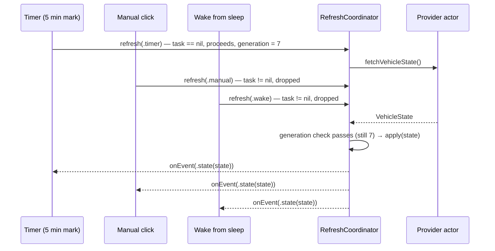

# Refresh System

`RefreshCoordinator` (`Services/Refresh/RefreshCoordinator.swift`, `@MainActor`) owns the polling lifecycle for one `VehicleProviding` instance. `VehicleSessionController` constructs a fresh coordinator when the active brand changes. Credential resolution and restoration live in `SessionManager`; the coordinator owns retry timing and cancellation.

## Cadence

`RefreshPolicy.regularInterval(isCharging:)`:

- **120 seconds** while charging or climate is active
- **600 seconds (10 minutes)** otherwise

Plus jitter on every scheduled refresh: `maxJitter = min(15, max(1, interval * 0.1))`, then `Double.random(in: 0...maxJitter)` added on top — so scheduled polls receive up to 15 seconds of jitter, preventing every Hisingen instance from hitting the backend on a perfectly synchronized clock edge.

## Retry / backoff

`RefreshPolicy.retryDelay(failureCount:retryAfter:)`:

- If the failure carried a server-supplied `Retry-After` value, use it, clamped to **30–3600 seconds**.
- Otherwise, exponential: `30 × 2^(failureCount − 1)` seconds, with `failureCount` clamped to `0...5` internally — so the sequence is 30, 60, 120, 240, 480, 900, and it plateaus at **900 seconds (15 minutes)** after the 6th consecutive failure. No further growth beyond that.

There is no separate rate-limit-specific state machine beyond this — a `.rateLimited` error just supplies its `retryAfter` value into the same `retryDelay` function, and `RefreshCoordinator.rateLimitedUntil` short-circuits any new refresh attempt (manual or timer) until that time passes, republishing diagnostics with the pending `nextRefresh` instead of issuing a request.

## Coalescing — how duplicate API calls are avoided

One `task: Task<Void, Never>?` plus a `generation: UInt64` counter. Every entry point (`refresh(trigger:)`, `selectCar`, `reloadVehicleMetadata`) does:

```swift
guard task == nil else { return }   // an equivalent refresh is already in flight — drop this trigger
```

Callers that arrive while a refresh is already running simply don't get a second network call — they'll receive the in-flight refresh's result through the single typed `onEvent` channel. Every async completion additionally checks `requestGeneration == generation && !Task.isCancelled` before committing its result, so if `selectCar`/`credentialsChanged`/`signOut` bumped the generation while a fetch was in flight (superseding it), that stale result is silently discarded rather than overwriting newer state.



All three triggers converge on exactly one network call.

## Triggers

| Trigger | Source |
|---|---|
| `.timer` | One-shot `Timer` rescheduled after every fetch (success or failure) |
| `.manual` | `AppDelegate`'s `onRefresh` closure (menu-bar click, context-menu "Refresh", or footer button) |
| `.wake` | `NSWorkspace.didWakeNotification` |
| `.networkRestored` | `NWPathMonitor` flipping from unavailable to available |

`refreshIfStale()` — called from `applicationDidBecomeActive` — is a sixth, softer path: it only issues a refresh if `Date().timeIntervalSince(latest.fetchedAt) >= RefreshPolicy.regularInterval(isCharging:)`, i.e. bringing the app to the foreground doesn't force a network call if the current data isn't old enough to need one yet.

## Vehicle switching

`selectCar(vin:)` no-ops when that VIN is already settled. Otherwise it cancels superseded work, records the requested VIN, and displays its cached snapshot while fetching `api.fetchVehicleState(vin:features:)`. The provider prepares that vehicle internally. Success applies the fetched state directly; a transient `notConfigured` preparation failure receives bounded retries. Selecting a vehicle does not schedule a full garage scan.

## Credential changes

The app calls `VehicleSessionController.credentialsDidChange(for:)` once. That operation adopts the brand, asks the shell to reconcile settings, and restarts the coordinator. The caller does not retain or pass a previous-brand flag.

`RefreshCoordinator.credentialsChanged(preferredVIN:)` cancels work and resets failure/backoff state. A changed account email clears the previous account's snapshots and in-memory fleet; durable history follows the existing erase-history preference. It resets the provider and invokes `SessionManager.restore` with the credential-change intent. After successful restoration, later retries use routine resume and re-read the stored token, including any token rotated by the provider.

## Sleep / wake and network loss / restoration

- **Sleep** (`NSWorkspace.willSleepNotification`): `cancelCurrentWork(preservingCommandConfirmation: true)` bumps the generation, cancels network work and timers, pauses any active confirmation deadline, and sets `sleeping = true`. No refresh attempts happen while asleep.
- **Wake** (`NSWorkspace.didWakeNotification`): clears `sleeping`, issues `refresh(trigger: .wake)` (or `beginSession` if the session isn't ready yet).
- **Network loss**: `NWPathMonitor.pathUpdateHandler` sets `networkAvailable = false`; `networkDidChange(false)` cancels current work while retaining the command receipt and remaining confirmation window.
- **Network restoration**: `networkDidChange(true)` issues `refresh(trigger: .networkRestored)` (or `beginSession` if not yet authenticated) — but only if the app isn't currently `sleeping`.

## Stale-on-activation

Distinct from staleness on the *data* (see [data-flow.md](data-flow.md#freshness)): `refreshIfStale()` is stale-on-*activation* — it's the mechanism that makes bringing Hisingen back to focus after a while trigger a refresh without waiting for the next timer tick, but without forcing one if the last fetch is still fresh enough per the current cadence.

## Cancellation

`cancelCurrentWork()` increments `generation`, cancels the `Task`, invalidates the pending `Timer`, and clears `nextRefresh`. Sleep and temporary network loss use its preservation mode, which retains the command receipt and pauses the confirmation deadline. Permanent resets, sign-out, and vehicle selection clear the receipt. Cancellation does **not** propagate into the provider actor's in-flight network call; the underlying `URLSession`/gRPC request is allowed to finish and its result is discarded by the generation check. See [concurrency.md](concurrency.md#cancellation) for why that is a deliberate trade-off.

## Diagnostics

`RefreshCoordinatorEvent` is the sole outward lifecycle channel. It carries state, loading,
selection, session establishment, failures, clearing, and diagnostics as mutually explicit events;
session establishment carries the fleet and selected VIN together, while a paused switch carries
its rate-limit error in the same event. `VehicleSessionController` is the only consumer that maps
these events into shell updates.

`DiagnosticsSnapshot` is republished after nearly every state transition: `lastSuccess`, `lastError`, `latency`, `nextRefresh`, `sessionValid`, `networkAvailable`, `refreshInProgress` (`task != nil`). `VehicleSessionController` uses `diagnostics.sessionValid` (OR'd with `Preferences.hasResumableSession`) to decide whether the UI should be in the authenticated or sign-in state.

## Vehicle-asleep backoff (2026-08-22)

`RefreshPolicy.interval` combines the activity cadence (120 s charging/climate, 600 s idle)
with availability: when the vehicle reports `.unavailable` (asleep, power saving, service),
the interval stretches to a **1,800 s floor** — a deep-sleeping car answers every poll with the
same stale snapshot, so faster polling only burns the provider's rate budget. `.unknown`
availability keeps the base cadence. Normal polling resumes on the first fetch where the
vehicle reports available.

## Live streaming (2026-09-09)

Polestar exposes server-streaming gRPC endpoints for battery state (and exterior state for
lock/window confirmation). `RefreshCoordinator` owns exactly **one stream task per selected
vehicle**; the purpose (`VehicleLiveStreamPurpose`) selects which endpoint that task consumes.

**The honesty gate.** `LiveStreamPolicy.shouldStream` streams only for an *available vehicle
that is charging*. The Polestar stream carries battery/charging state only — keeping it open
because climate is running would consume a connection without improving climate freshness, so
climate stays on the 120 s poll. A `.unavailable` (asleep) vehicle never streams: its frames
are stale on arrival.

**Streaming and polling are mutually aware:**

| Stream state | Polling |
| --- | --- |
| Connected | Routine polling disabled; only a 30-min integrity poll runs |
| Degraded (retrying) | Normal activity cadence returns; pending commands use a 5 s targeted poll |
| Disconnected (circuit open) | Fallback polling continues; reconnect waits out the circuit |
| Observable command pending | Confirmation stream when a suitable endpoint exists, plus a 2 s first fetch and 5 s targeted polls until confirmed |

**Reconnect rules.** The stream reconnects only when the server closes it, the network
changes, the user changes vehicle, or authentication actually expires — never on a timer.
The per-request idle timeout is 20 minutes, because a parked car legitimately pushes no
frames. Backoff is exponential with jitter (5 s → 15 s → 30 s → 1 m → 2 m → 5 m cap) and
respects server `Retry-After` values (floored at 5 s, capped at 1 h). Failure counters
reset only after a connection has held for `stabilityInterval` (10 minutes) — opening a
socket is not stability.

**Circuit breakers.** Authorization failures recover through the shared single-flight token
refresh exactly once; a repeat failure opens a 30-minute circuit instead of looping 401s.
Unsupported-method, permission-denied, and incompatible-schema failures open a 6-hour
circuit. Generic transient failures open a circuit after `maximumFailuresBeforeCircuit`
(6) consecutive failures. While a circuit is open, fallback polling covers the vehicle.

**Command confirmation.** `RefreshCoordinator` exclusively owns the command receipt after
`CommandCoordinator` atomically hands it the optimistic display state. Charging override uses
the battery stream; lock, window, and tailgate commands use the exterior stream. Charge target,
current limit, and air-cleaning commands use targeted polling because the available streams do
not carry those values. A fresh matching reading ends confirmation immediately. If a stream
drops, it reconnects while the command remains pending and a targeted poll runs every 5 seconds.
The first check is scheduled after 2 seconds. Commands such as honk and flash do not open a
stream because no returned reading can prove their effect.

The five-minute `commandConfirmationWindow` is a safety cap, not the normal close condition. A
watchdog moves the receipt to `timedOut` even when the stream is quiet, then the normal charging
gate and polling cadence resume. Confirmed and timed-out receipts remain visible across later
refreshes until dismissed, replaced, or cleared with the vehicle/session. Dismissal hides the
receipt without stopping an active background confirmation. If confirmation ends while the
vehicle still qualifies for the same charging stream, the transport remains open and simply
returns to its normal purpose.

**Relaunch.** Command receipts are stored per VIN outside `VehicleState`, so cached telemetry
remains provider-only. Relaunch never resends a command. A receipt that was still awaiting
confirmation resumes targeted reads and any applicable stream only until its original deadline.
If that deadline passed while Hisingen was not running, the restored receipt is marked timed out.
Confirmed and timed-out receipts are restored as-is. Dismissing a receipt removes its stored
record, and switching vehicles, changing credentials, or signing out clears the affected record.

**Identity-safe cleanup.** The stream task carries a UUID. Cleanup code that stops the
stream nils the ID first, so an expired task's `defer` block can only reclaim coordinator
state when it is still the registered owner — an expired confirmation stream can never
clobber a newer stream's state or fake liveness.

**Token reuse.** Starting a stream never acquires a token; it reuses the shared access
token until its real renewal window. An authentication failure on the stream goes through
`refreshLiveStreamAuthorization` (single-flight, replacing only the token the server
rejected) and reconnects once.

**Metrics.** `LiveStreamMetrics` (connection attempts, successful connections, disconnects,
messages, authorization refreshes, fallback polls, concurrent streams, connection
durations, disconnect reasons, circuit-open deadlines) is published through
`DiagnosticsSnapshot` and exported in support bundles. A credential-gated soak test
(`HISINGEN_SOAK_SECONDS`) asserts the invariants above against the real backend over
sustained time; simulated-failure behavior is covered by `StreamPolicyTests` and
`RefreshCoordinatorStreamTests`.
