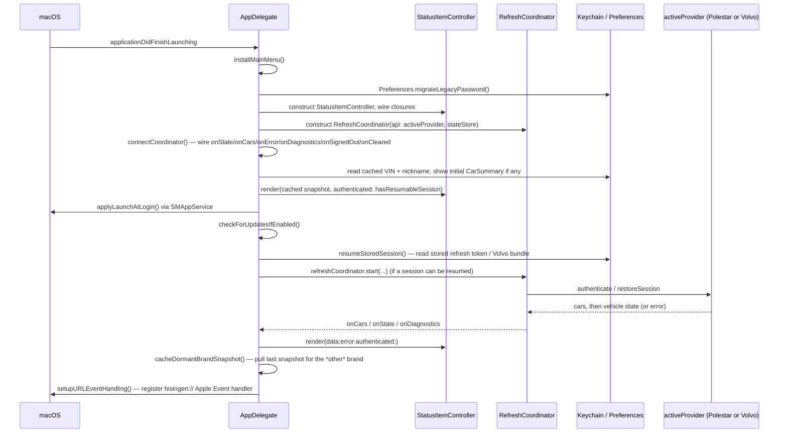

# Runtime Flow

## Application launch

`main.swift` runs `MainActor.assumeIsolated { ... }`, constructs `NSApplication.shared`, assigns `AppDelegate` as its delegate, sets `app.setActivationPolicy(.accessory)` (no Dock icon — this is an `LSUIElement` app), and calls `app.run()`.

`AppDelegate.applicationDidFinishLaunching(_:)` then runs, in this order:



Notes on that sequence:

- **The UI renders twice before real data arrives.** Once immediately with whatever `VehicleStateStore` has cached for the active VIN (so the menu bar never shows a blank icon), then again once `RefreshCoordinator` produces a live `VehicleState`.
- **`resumeStoredSession()` branches per brand.** For Polestar it needs `Preferences.email` non-empty and either a Keychain session token or a Keychain password. For Volvo it needs client ID (Preferences) + client secret + VCC API key + session token (all Keychain), and it `configure()`s `VolvoAPI` inside a `Task` before starting the coordinator, since that's an async call.
- **If no session can be resumed**, `RefreshCoordinator` never starts and `HisingenContentView` renders `WelcomeSignInView` instead of the tab bar.
- **`cacheDormantBrandSnapshot()`** exists so that if the user has both a Polestar and a Volvo session stored, switching brands shows the other brand's last-known snapshot immediately instead of a blank/loading state.

## What changes under different conditions

| Condition | What happens differently |
|---|---|
| **No valid session** | `resumeStoredSession()` returns early, `RefreshCoordinator` is constructed but never `start()`-ed, UI shows `WelcomeSignInView`. |
| **Account has multiple vehicles** | `PolestarAPI`/`VolvoAPI` discovery returns `[CarSummary]` with more than one entry; `StatusItemController.cars` gets all of them, the footer vehicle switcher and multi-car chip strip appear, `RefreshCoordinator.selectCar(vin:)` handles switching (see [refresh-system.md](refresh-system.md#vehicle-switching)). |
| **Selected vehicle is asleep** | The provider still returns a `VehicleState` (from cached/backend-cached data), but `VehicleState.isStale(at:)` returns true once `dataTimestamp` (vehicle-reported time, not fetch time) is old enough. The UI dims the menu-bar icon and shows a "Vehicle asleep" freshness string. See [data-flow.md](data-flow.md#freshness). |
| **One optional API is unavailable** | Both providers wrap each optional field fetch (`optionalCapability`/`optional`) so a single failing endpoint degrades only that field — `unavailableFeatures` on `VehicleState` records which — while the rest of the refresh still succeeds. See [capabilities.md](capabilities.md). |
| **Cached telemetry exists** | `RefreshCoordinator.start`/`selectCar` show `stateStore.snapshot(for: vin)` synchronously before the first network round-trip completes, and `VehicleState.mergingLastKnown(from:features:)` fills gaps in every subsequent fetch from the last good value per enabled feature. |

## UI bridging

`StatusItemController` (AppKit) and the SwiftUI view tree are connected with the simplest possible pattern — no `ObservableObject`, no Combine:

```
StatusItemController.render(data:error:authenticated:diagnostics:)
  → stores the new state on `self`
  → refreshPopoverIfNeeded()
      → if popover.isShown: rebuild a fresh `HisingenContentView` struct from current state
      → reassign hosting.rootView = view
```

The `NSPopover`'s `contentViewController` is an `NSHostingController<HisingenContentView>` built once when the popover is first shown; every subsequent state change just replaces its `rootView`. The Settings "window" is not a separate `NSWindow` — it's the same popover with a `settingsMode` flag flipped, so `HisingenContentView`'s body swaps to `SettingsView`.

See [architecture/components.md](components.md#ui-uiswift) and [architecture/state-management.md](state-management.md) for what state lives where in this chain.
