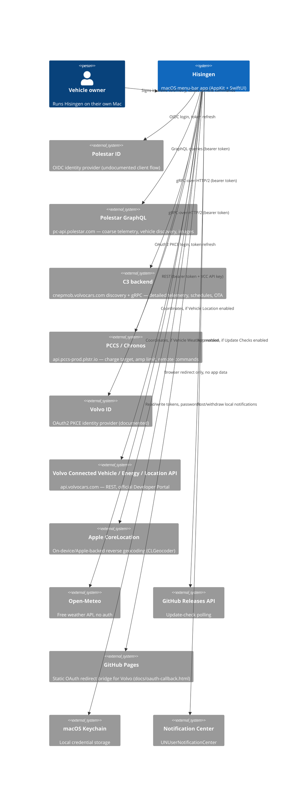

# System Context

What Hisingen talks to, and why. Everything here is a direct connection from the user's Mac — there is no Hisingen-operated server in the middle of any of these.

## External systems and why Hisingen talks to them

| System | Host(s) | Purpose | Opt-in? |
|---|---|---|---|
| Polestar ID | `polestarid.eu.polestar.com` | OIDC login and token refresh | No — required for Polestar |
| Polestar GraphQL | `pc-api.polestar.com/eu-north-1/{mystar-v2,mystar-public,app-backend}` | Vehicle discovery, coarse telemetry, studio images | No — required for Polestar |
| C3 backend | `cnepmob.volvocars.com` (discovery) + discovered gRPC host | Detailed telemetry, schedules, OTA, location, weather fallback | No — required for Polestar detail views |
| PCCS / Chronos | `api.pccs-prod.plstr.io:443` | Target SOC, amp limit, remote command invocation | No — required for Polestar charging/remote features |
| Volvo ID | `volvoid.eu.volvocars.com` | OAuth2 PKCE login and token refresh | No — required for Volvo |
| Volvo Connected Vehicle / Energy / Location API | `api.volvocars.com` | All Volvo telemetry and remote commands | No — required for Volvo |
| Apple CoreLocation (`CLGeocoder`) | Apple-operated | Reverse-geocode vehicle coordinates into a street address | **Yes** — only when "Vehicle Location" is enabled |
| Open-Meteo | `api.open-meteo.com` | Weather at the vehicle's parked location | **Yes** — only when "Vehicle Weather" is enabled |
| GitHub Releases API | `api.github.com/repos/NicolasKheirallah/hisingen` | Check for a newer Hisingen release | **Yes** — only when "Update Checks" is enabled |
| GitHub Pages | `nicolaskheirallah.github.io/Hisingen/oauth-callback.html` | Static bridge page: Volvo requires an `http(s)` redirect URI, so this page forwards the OAuth callback query string to Hisingen's `hisingen://` URL scheme. It never sees or stores anything — see [api/authentication.md](../api/authentication.md#volvo-oauth2-pkce-with-a-redirect-uri-bridge). | No — required for Volvo sign-in |
| macOS Keychain | Local | Credential/token storage | No |
| Notification Center | Local | Charging/warning/security notifications | **Yes** — gated by the Notifications feature and OS permission |

Not present: no Hisingen-operated backend, no analytics/telemetry endpoint, no crash reporter, no ad network, no gRPC/GraphQL proxy. Every non-Apple network call in the app is to Polestar, Volvo, Open-Meteo, or GitHub, and every one of those is enumerated above — see [security/privacy.md](../security/privacy.md) for what data crosses each connection.

## Two provider surfaces, one shared client

Note that Polestar alone spans four hosts and three protocols (OIDC, GraphQL, hand-rolled gRPC) because Hisingen is reconstructing what the official Polestar mobile app does — there is no single documented Polestar API. Volvo is one documented REST API family behind one gateway. This asymmetry shows up throughout the codebase; see [api/overview.md](../api/overview.md#api-confidence) for the confidence rating on each.
