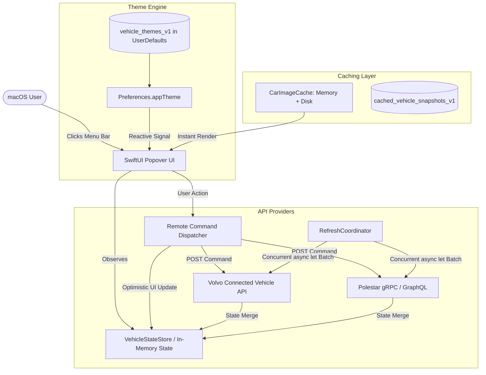
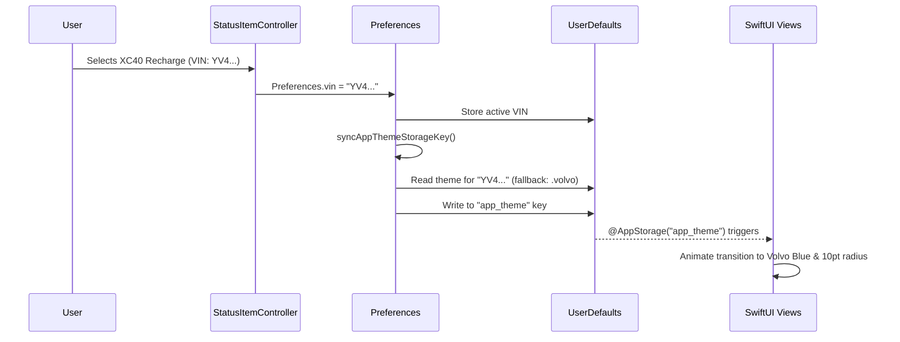

# Theme, Caching, and Telemetry Lifecycle Architecture

This document provides an in-depth architectural breakdown of how Hisingen handles **per-vehicle visual theming**, **high-performance image/telemetry caching**, **concurrent endpoint batching**, and the **remote command state lifecycle**.

It is written to be accessible to junior developers and non-specialists while retaining deep technical rigor for senior engineers.

---

## 1. High-Level System Context



---

## 2. Per-Vehicle Theming Architecture

### 2.1 The Concept
Different car brands have distinct design languages:
- **Polestar**: Minimalist, high-contrast monochrome, sharp rectangular panels (`cornerRadius: 0`), subtle tracking.
- **Volvo**: Scandinavian warmth, Swedish Iron blue accents (`#1c6bba`), soft curves (`cornerRadius: 10`), bold/light typography contrast.
- **Hisingen (Default)**: Modern macOS design with translucent materials (`ultraThinMaterial`), subtle border glows, and Polestar Amber accents.

In Hisingen, users with multiple cars (or a mixed fleet of Polestar + Volvo) don't have to choose a single global theme. **Each car remembers its own theme**, and switching cars in the menu bar instantly swaps the entire interface style.

### 2.2 How It Works Under the Hood



1. **Storage Structure (`UserDefaults`)**:
   - `vehicle_themes_v1`: Dictionary mapping `[VIN_UPPERCASED : "volvo" | "polestar" | "hisingen"]`.
   - `theme_for_volvo` / `theme_for_polestar`: Brand-level fallback defaults.
   - `app_theme`: Global key observed by SwiftUI's `@AppStorage("app_theme")`.
2. **Reactive Synchronization**:
   - Whenever `Preferences.vin` or `Preferences.activeBrand` changes, `Preferences.syncAppThemeStorageKey()` executes automatically.
   - This writes the vehicle's specific theme to `app_theme`, which triggers a seamless SwiftUI view redraw across the whole popover.

---

## 3. High-Performance Caching & Batching

### 3.1 Two-Tier Image Caching (`CarImageCache`)
Vehicle exterior images can be 500 KB to 2 MB high-resolution PNG/JPEGs.
- **The Problem**: Storing raw image binary data in `UserDefaults` causes severe performance degradation, slow launch times, and disk thrashing. Fetching images from the cloud on every popover click causes blank placeholder flickers.
- **The Solution**: Hisingen implements a two-tier caching architecture:
  1. **Tier 1 (Memory Cache)**: Fast `[String: Data]` dictionary guarded by `NSLock` for zero-latency retrieval during UI renders.
  2. **Tier 2 (Disk Cache)**: Persistent files saved to `~/Library/Caches/Hisingen/CarImages/<VIN>.jpg`.

```
[UI Request Image]
       │
       ▼
[Tier 1: Memory Cache?] ──YES──► Return image (0.01ms)
       │ NO
       ▼
[Tier 2: Disk Cache?]   ──YES──► Load into Memory Cache ──► Return image (1.5ms)
       │ NO
       ▼
[Cloud API Fetch]       ───────► Save to Disk & Memory  ──► Return image (150ms)
```

### 3.2 Concurrent Batching (`async let`)
When fetching live vehicle state for Volvo, the app must query **13 independent REST endpoints**:
1. Energy State (Battery %, Range, Charging status)
2. Doors & Tailgate status
3. Windows & Sunroof status
4. Tyres (TPMS warning states)
5. Diagnostics & Service intervals
6. Odometer & total distance
7. Trip statistics (average speed, fuel/electric consumption)
8. Vehicle GPS Location & heading
9. Brake fluid diagnostics
10. 16+ Exterior lighting sensors
11. Engine / ignition status
12. Command delivery accessibility
13. Climatization status

**Architectural Design**: Rather than querying them sequentially (which would take $13 \times 200\text{ms} = 2.6\text{ seconds}$), Hisingen launches all 13 requests simultaneously using Swift structured concurrency (`async let`). The entire batch completes in parallel within ~250ms (the duration of the single slowest endpoint).

---

## 4. State Reconciliation & The Climate Bug Fix

### 4.1 The Reversion Bug Explained
A common problem in IoT / Connected Car apps is **state flapping**:
1. User taps **"Start Climate"**.
2. App sends `POST /climatization-start` and immediately updates the UI optimistically: *Fan spinning, "Stop Climate" button shown*.
3. 2 seconds later, a background refresh occurs.
4. If the cloud API endpoint `/climatization-status` returns `404 Not Found` (or the car's cellular modem takes 15 seconds to wake up and acknowledge), an unhandled parser returned `climateActivity = .idle`.
5. The refresh parser overwrote the active session with `.idle`, causing the fan to stop after 1 second even though the heater was actually running in the car!

### 4.2 The Solution: Defensiveness & Session Preservation
1. **Strict `nil` vs `.idle` distinction**:
   - If the API returns a status payload containing `"OFF"` or `"STOPPED"`, the API returns `.idle`.
   - If the endpoint is **absent, 404, or unacknowledged**, the API returns `nil` (meaning *"no definitive update"*).
2. **State Merging Pipeline (`VehicleState.mergingLastKnown`)**:
   - When merging a new snapshot, if the incoming `climateStatus` is `nil`, Hisingen preserves the existing active climate session (`previous.climateStatus`).
   - The active status remains intact with its 30-minute timer until the user explicitly stops it or a new definitive status arrives.

---

## 5. Architectural Quality Checklist

- [x] **Zero Memory Leaks**: Binary assets kept out of `UserDefaults`, managed via dedicated disk caches.
- [x] **Fault Isolation**: Failure of any individual non-critical telemetry endpoint (e.g. GPS or Sunroof) does not break primary charging / battery rendering.
- [x] **Optimistic Responsiveness**: Commands provide instant haptic and visual feedback in 0ms, followed by background synchronization.
- [x] **Theme Persistence**: Complete isolation of design tokens across multiple vehicles and brands.
