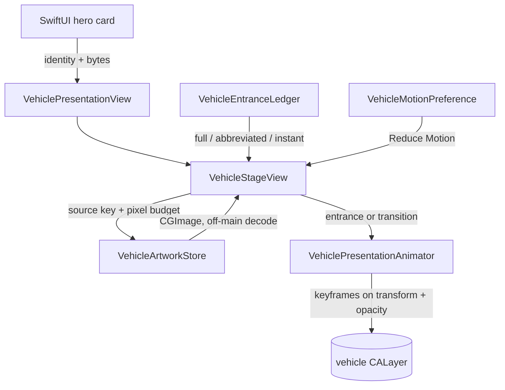

# Vehicle Motion

How the car gets onto the screen: the roll-in when a presentation first appears, the crossover when the user changes angle, and the rules that keep both from firing when nothing has actually changed.

The card, the glow behind the car, the angle strip and every label stay in SwiftUI. Only the render itself is AppKit, hosted in a layer-backed `NSView`, because that is what gives per-property animation curves, a single defensible resting state, and interruption that cannot leave a stale transform behind.

---

## 1. Where the pieces live

| File | Owns |
| --- | --- |
| `UI/VehicleMotion.swift` | Pure decisions and maths: what counts as a change, which way a transition travels, how much entrance a presentation has earned, the braking and settle curves. No Core Animation, no views. |
| `UI/VehiclePresentationAnimator.swift` | Turns those decisions into `CALayer` animations. Owns nothing but the short-lived ghost layer used for a crossover. |
| `UI/VehicleStageView.swift` | The layer-backed `NSView` the render lives on, its resting geometry, and the `NSViewRepresentable` (`VehiclePresentationView`) that drops it into SwiftUI. |
| `Services/Persistence/VehicleArtworkStore.swift` | Decoded, display-sized artwork. Keeps a ~65 ms PNG decode off the main thread and out of the render pass. |

Both hero cards use it: `HisingenContentView.heroCard` (Vehicle tab) and `InfoTabView.heroVisualSection` (Info tab, with the angle strip).



---

## 2. Resting geometry

`VehicleStageGeometry` reproduces the SwiftUI layout the hero cards used before the stage existed: an 8 pt horizontal inset, a 205 pt content height, `1.33` zoom about the centre, inside a 220 pt container that clips. The render is aspect-fitted into the content box, rounded to the backing grid, then zoomed — the same order SwiftUI did it in, which is what keeps the resting pixels unchanged.

At the popover's 430 pt width the stage is 406 × 220 and a 16:9 render rests at `(-39.06, -26.33, 484.12, 272.65)` — deliberately wider and taller than the stage. The overflow is clipped, which is also why the car can roll in from behind the edge rather than across the card.

Verified against the previous implementation by rendering the old SwiftUI chain with `ImageRenderer` and diffing it against the stage's resting frame: position, size and crop match; the residual is resampler choice, symmetric on every edge, and smaller than the difference between Core Graphics and SwiftUI drawing the same full-resolution source.

**The resting state is canonical and total:** `transform` is identity, `opacity` is 1, `frame` is the resting frame. Nothing animated ever leaves the model values anywhere else — see §5.

---

## 3. Lifecycle: what triggers what

Hisingen is a menu bar app. Clicking the status item builds a fresh `NSHostingController`, so the whole SwiftUI tree and every layer under it is new on every open. A telemetry refresh does the opposite: it assigns `hosting.rootView`, and SwiftUI re-evaluates bodies while keeping the views. The two have to be told apart, and no per-view flag can do it.

**What counts as a change.** `VehiclePresentationRequest` is `(identity, byteCount)` — identity being VIN plus angle. Telemetry refreshes arrive several times a minute with the same identity and the same bytes from `CarImageCache`, and `present(identity:imageData:)` returns on the equality check without touching a layer. The byte count stands in for the bytes: the cache hands back the same buffer, and comparing megabytes per body evaluation would cost more than the check saves. A genuinely re-downloaded render for the same angle has a different length, so it crosses over rather than popping.

**Entrance.** When artwork lands on an empty stage, the identity is stashed in `pendingEntrance` and the layer stays hidden until the view is in a window with a non-empty resting frame — so a deferred decode or a not-yet-laid-out stage cannot produce a car that appears at rest and *then* rolls in. `VehicleEntranceLedger` (keyed by VIN, living outside the view hierarchy) then decides how much entrance is owed:

| Since that car last rolled in | Style |
| --- | --- |
| Never, or more than 10 min | `.full` — 660 ms, 124 pt of travel |
| 2.5 s – 10 min | `.abbreviated` — 400 ms, 44 pt |
| Under 2.5 s | `.instant` — no animation |

A mis-click, or a hop to the Info tab and back, is one continuous glance at the car and gets nothing. Coming back later reads as a fresh visit and earns the full roll-in. Only presenting the car writes to the ledger; telemetry never reaches it.

**Which side it enters from.** Not simply "the right". The studio turntable holds the car nose-right in the side profile, so it stays right-ish through the front three-quarter and the overhead frame and swings away to the left in the rear three-quarter; the dead-on front and rear frames have no horizontal axis at all. `VehiclePresentationIdentity.facing` records that, and `entrySide` turns it into the side the car must start on to be **driving forwards**: opposite the way it points.

| Angle | Nose points | Enters from |
| --- | --- | --- |
| 3/4 front, side, top | right | left |
| 3/4 rear | left (away) | right |
| Front, rear (dead-on) | neither | right, by convention |

Entering from the right with a nose-right render is the car reversing into place, and it fights the scale-up that reads as approaching. The distance and the curve are identical either way; only the sign of `VehicleEntranceMotion.travel` changes, so one constant flips the whole thing back if a different artwork set faces the other way.

**Transition.** A changed identity on an occupied stage crosses over instead. Direction comes from the on-screen angle strip, which is ordered the way you walk around the car (3/4 front, front, side, 3/4 rear, rear, top — `CarRenderAngle.allCases`, so there is no second copy of the order to drift). Moving toward the rear sends the old picture left and brings the new one in from the right; moving toward the front mirrors it. The cabin photo, an unknown angle and a different car have no spatial relationship and get a straight crossfade.

**Decode.** The studio renders are ~4900 × 2750 PNGs: ~65 ms and ~54 MB each, and PNG cannot be sub-sampled during decode. `VehicleArtworkStore` decodes off the main thread at exactly the pixel size the render will be drawn at (the source's dimensions are read from its header first, ~0.2 ms, no pixels), coalesces duplicate requests, and keeps the last 8. After the first picture installs, the remaining exterior angles are decoded at utility priority so changing angle does not wait. Late decodes are checked against the current request and dropped if the user has clicked on.

---

## 4. Curves

Everything is driven by `VehicleRollCurve`, kept free of Core Animation so the shapes can be tested on their own.

**Travel** is a braking profile, not a bezier: velocity is constant for the first 34% of the travel time, then follows a raised cosine to exactly zero. Half the distance is behind the car in the first third of the time, and the stop has zero terminal velocity *and* zero terminal acceleration — no jerk at the end. That last property is what separates "car parking" from "element sliding in", and a cubic bezier cannot express it as directly.

**Ride height** sways once, `sin(π · travel progress)`, about 1.1 pt, back to zero by the time the car stops.

**Suspension** compresses as the brakes release: a damped sine normalised so amplitude is the compression in points (1.45 pt full, 0.7 pt abbreviated). One dip of 1.45 pt, one rebound of about a third of that, back to exactly zero. Measured live, compression peaks about 47 ms after the car has visually stopped, which is where weight transfer actually happens.

**Scale** runs 0.976 → 1 tied to distance covered, so it reads as perspective rather than as a separate effect.

The composite — travel, sway, settle, scale, opacity — is sampled at 120 Hz into a single `CAKeyframeAnimation` on `transform`, with a second on `opacity`, grouped. Sampling rather than per-segment `timingFunctions` because Core Animation cannot reliably compose concurrent animations on `transform.scale` and `transform.translation`, and per-segment curves would force every axis to share one shape. Each axis keeps its own curve, the wheels can be handed the exact travel the body used (§7), and it still runs entirely on the compositor — no timers, no per-frame CPU, no layout passes.

Transitions are simpler and do use `CAMediaTimingFunction`: a custom deceleration `(0.16, 0.72, 0.20, 1)` for the picture arriving, a standard ease-in for the one leaving, with the incoming fade held back 10% of the duration so the two are not both half-opaque over the same pixels.

Sampled live from the presentation layer on a real display, the full entrance covers `123.4 pt` at 0 ms, `81.9` at 128 ms, `40.5` at 256 ms, `8.0` at 400 ms, `0.7` at 494 ms, compression peak `−1.14 pt` at 525 ms, rest at 660 ms. Opacity reaches 1 at 176 ms, while the car is still 66 pt out — it arrives, it does not fade in. Half the distance is gone in the first 150 ms and the travel is visually over by ~490 ms; the remaining 170 ms is the suspension settling.

To retune: `duration` and `travel` on `VehicleEntranceMotion.full` set the pace, `VehicleRollCurve.speedHoldFraction` sets how long it holds speed before braking (raise it for a later, harder stop; lower it for a lazier one), and `settleStart` moves the dip relative to the stop.

**Motion blur** is not used. A real-time `CIFilter` on `layer.filters` is exactly the expensive per-frame work a menu bar popover should not do, and it dilates the layer past the clip it is supposed to respect. A duplicated semi-transparent smear layer is cheap but on a downscaled studio render reads as a double image rather than blur. The fast early frames are covered by the entry fade instead, which costs nothing.

---

## 5. Cancellation

Every animation is arranged so the layer's **model values are already the resting ones** and only the animation departs from them. Removing an animation — for any reason, at any point — therefore lands on the canonical state. No completion handler has to repair anything, which is what makes interruption safe rather than merely handled.

- `animateEntrance` adds a keyframe group whose last sample is exactly identity/opacity 1, and never writes a non-resting model value.
- `transition` sets the incoming layer's model values to the resting ones and animates *from* the entry state with `fromValue`.
- The outgoing picture is a ghost layer whose model values are the *end* of its departure (exit transform, opacity 0), so a lost completion block leaves an invisible layer rather than a stuck one.
- `cancel()` bumps a run token (so completion blocks from superseded runs do nothing), removes the ghost, removes all animations, and restores identity/opacity 1 inside a transaction with actions disabled.

Every new animation calls `cancel()` first, so rapid clicking replaces rather than stacks: **never more than one ghost layer**, whatever the click rate. A transition that interrupts another one reads the outgoing layer's *presentation* transform and opacity first and starts the ghost from there, so the car hands its position over instead of snapping back to rest.

Implicit animations are suppressed on every layer the stage touches (`VehicleStageView.suppressedActions`). A bare `CALayer` inside a view's layer animates every property change by default, which would smear into the explicit animations and leave model updates lagging reality.

A mid-flight layout change (theme switch, display move) cancels first, then moves the layer, rather than animating toward a stale frame.

---

## 6. Reduce Motion

`VehicleMotionPreference.prefersReducedMotion` is the only place `NSWorkspace.accessibilityDisplayShouldReduceMotion` is read, and it carries a test override so both paths can be exercised. It is read at the moment of animating, so a change to the setting applies to the next animation without an observer.

When it is on, `VehicleEntranceMotion.reduced` and the reduced transition plan drop travel, scale, sway and settle entirely; what is left is a 160 ms fade for an entrance and a 140 ms crossfade for an angle change — short enough to read as appearance rather than animation. `.instant` stays instant either way. The cabin photo has no exterior orientation, so it never rolls even with motion enabled.

---

## 7. Adding genuine rotating wheels

The renders are flattened: one PNG per angle, ~4900 × 2750, alpha, with the shadow baked in. There is no wheel to rotate and no masking trick worth the ugliness, so the illusion is carried by the braking curve, the ride-height sway and the settle. The shadow travels and scales with the body because it is part of the same picture — which is also why the settle scales it, without a synthetic contact shadow that would break the pixel-identical resting state.

The seam for real wheels is already there and is deliberately small.

**Asset convention.** Per model and angle, beside the flattened render:

```
Polestar2/
    side/
        body.png
        front-wheel.png
        rear-wheel.png
        metadata.json
```

`metadata.json` carries wheel centres and radii in **unit coordinates of the body image** (0–1), never points, so one file survives every render size and every backing scale:

```json
{
  "wheels": [
    { "image": "front-wheel.png", "center": [0.723, 0.688], "radius": 0.091 },
    { "image": "rear-wheel.png",  "center": [0.214, 0.688], "radius": 0.091 }
  ]
}
```

**What to change.**

1. `VehicleArtworkStore.Artwork` gains a `wheels: [Wheel]` array, decoded alongside the body and empty for every flattened asset. Keep the unit coordinates; convert to points only when the resting frame is known.
2. `VehicleStageView` adds a sublayer per wheel under the vehicle layer, positioned from `center × restingFrame.size` with `bounds` from `radius`, and passes them to `animateEntrance(_:wheels:)` as `VehicleWheelLayer(layer:radius:)`.
3. Nothing in the animator changes. It already rotates any wheels it is handed from the same travel samples as the body, via `VehicleRollCurve.wheelRotation(travelled:radius:)` — rolling without slipping, one circumference of travel per turn. Because rotation is a function of distance covered and the travel curve stops with zero velocity, rotation necessarily starts, holds and stops with the car; and because the wheel's resting model value is set to the final angle, a wheel that has rolled stays rolled with no snap when the animation is removed.

**Rotation direction is already right.** Because the entry side is derived from the render's facing (§3), and `travel` is signed, `travelled` is negative when the car drives rightwards and positive when it drives leftwards — so `wheelRotation` produces clockwise rotation for rightward travel and counter-clockwise for leftward, with no extra bookkeeping. Wheels added to these assets will spin the way the car is going.

The one thing to move when the assets arrive: `facing` is currently a table over `CarRenderAngle`, correct for the Polestar turntable. If a model's renders face the other way, that per-angle facing belongs in the same `metadata.json`, read alongside the wheel geometry, rather than in a growing switch statement.

---

## 8. Tests

`Tests/HisingenTests/Unit/VehiclePresentationAnimationTests.swift` covers the control logic; the animation itself is judged on screen.

- a telemetry refresh is not a picture change, and a re-downloaded render is
- the ledger rolls in on first sight, holds back on a quick reopen, and never hears about telemetry
- angle changes travel the way the selection moved, in both directions, with cabin/unknown/other-car falling back to a crossfade
- the braking curve is monotonic, covers the distance, and arrives at a crawl
- the settle dips once, rebounds smaller, and returns to exactly zero
- every entrance plan starts offstage and its last sample is exactly identity/opacity 1
- the full entrance never overshoots its place or exceeds its resting size
- wheel rotation tracks travel, only ever turns forwards, and is already still before the suspension finishes
- Reduce Motion removes travel, scale, sway and settle from both plans
- rapid angle changes leave exactly one ghost layer, and cancellation restores identity/opacity 1
- a missing or undecodable picture leaves no ghost and no stale transform
- the resting frame matches the static layout, stays centred, and overflows the stage on every side
- artwork is decoded once, at the drawn size, with the aspect ratio taken from the true source dimensions
