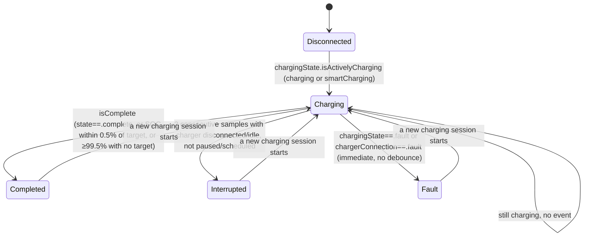

# Charging

## Fields and where they come from

| Field | Source | Measured or calculated |
|---|---|---|
| `batteryPercentage`, `rangeKm` | Polestar: GraphQL + gRPC battery (newer timestamp wins). Volvo: Energy API `state` endpoint. | Measured (vehicle-reported) |
| `chargingState` | Both: mapped from a provider-specific string enum into the shared `ChargingState` | Measured |
| `chargingPowerWatts`, `chargingCurrentAmps`, `chargingVoltageVolts` | Polestar: gRPC battery extras only (not in GraphQL). Volvo: Energy API `state` (`chargingPower` in kW, converted ×1000 to watts). | Measured |
| `chargeTargetPercentage` | Polestar: PCCS `TargetSocService`, 15-min cache. Volvo: Energy API `state`. | Measured |
| `estimatedChargingTimeToFullMinutes` | Both, from the same telemetry call as battery% | Measured (backend-calculated) |
| `chargingType` (AC/DC), `chargerConnection` | Polestar: gRPC battery extras. Volvo: Energy API `state`. | Measured |
| Charging-speed estimate (km/h or mph) | `Format.chargingRateFormatted` | **Calculated** — `chargingPowerWatts ÷ model's average Wh/km consumption constant` (Polestar: per-model nominal constant; generic fallback 180 Wh/km) |
| Estimated completion time | `Format.completionTime` | **Calculated** — `vehicleReportedAt (or fetchedAt) + estimatedChargingTimeToFullMinutes`, suppressed if the state is stale |
| Estimated completion cost | UI layer, from `Preferences.electricityPricePerKwh` | **Calculated**, user-configured rate — not a real cost from any API |
| Current Range vs Model WLTP | `VehicleState.currentRangeVsModelWltpPercent(specification:)` | **Calculated** from live range/SOC and a static model-family (or VIN-specific override) reference; explicitly not battery SOH — see [domain/vehicle.md](vehicle.md) |
| `ChargingSession` history entries | `ChargingSession.completed(previous:current:pricePerKwh:)`, appended by `RefreshCoordinator.apply` | **Calculated** from consecutive polls, not a real session log from either backend |

There is no vehicle-reported "State of Health" or measured usable-capacity figure available from either provider's APIs, and Hisingen doesn't fabricate one — `VehicleState.batteryDegradationPercent` stays `nil` for exactly this reason and always will, until a validated measured field appears. Volvo's `batteryCapacityKWH` is treated as a vehicle specification, not a health measurement, though `BatteryHealthEstimator` does prefer it over the generic model-family table as a more accurate *reference* capacity when no user override exists.

Separately, `BatteryHealthEstimator.estimate` (`Domain/BatteryHealthEstimator.swift`) *does* now combine charge-power integration, range-vs-WLTP, long-term consumption, and an age/mileage prior into a clearly-labeled **calculated** SoH estimate, persisted as milestones in `battery_health_history`. It is explicitly not presented as a BMS measurement anywhere it's shown — see [domain/vehicle.md](vehicle.md#battery-health--soh-calculated) for the full signal breakdown, weighting, and accuracy caveats.

## Charging state machine

`ChargingTransitionDetector` (`Services/Notifications/ChargingTransitionDetector.swift`) — a pure, stateless `struct` evaluated on every fetched `VehicleState` against a persisted `ChargingBaseline` (per VIN, see [architecture/persistence.md](../architecture/persistence.md)).

Notes on the transitions:

- **Fault** is immediate and edge-triggered — no debounce — because it's an unambiguous, high-priority signal.
- **Started** fires once per session (guarded by a `chargingSessionActive` flag on the baseline), not on every poll while charging.
- **Completed** requires the session to have been active (prevents firing on app launch if the vehicle is already mid-charge from before Hisingen last ran).
- **Interrupted requires two consecutive qualifying samples**, not one — a single idle/disconnected reading could be a momentary blip; two in a row is treated as a real interruption. `isInterruptionCandidate` explicitly excludes `.paused`/`.scheduled`/`.smartCharging` states from counting as interruptions (those are expected, not anomalies).
- Samples older than **20 minutes** relative to the vehicle-reported timestamp are suppressed entirely (`maximumEventAge`) — a stale poll after the app was closed for a while shouldn't retroactively fire a "charging started two hours ago" notification.
- A **sample-freshness gate** runs before any transition logic: if the current fetch's `vehicleReportedAt` isn't newer than the baseline's, no events are evaluated at all — prevents re-firing the same event from a duplicate/repeated poll of the same underlying sample.
- Each emitted event is fingerprinted (`vin|eventType|timestamp`) and compared against the baseline's last fingerprint, as a second line of defense against duplicate emission.
- Switching vehicles (VIN mismatch against the baseline) resets to a fresh baseline with no events — no false transitions bleed across vehicles.

## Anti-phantom-charging protection

The interruption debounce (2 consecutive samples) and the exclusion of `.paused`/`.scheduled`/`.smartCharging` from counting as an interruption are the app's phantom-charging safeguards — a momentary charger-communication blip or a normal scheduled pause doesn't read as "charging interrupted." There is no separate wattage-delta or regenerative-braking filter beyond this state-machine debounce; "anti-phantom charging" in Hisingen's marketing copy refers to this transition logic, not a distinct signal-processing step.

## Low battery — a separate hysteresis, not part of the state machine

Independent of the charging transitions above: if battery% drops to or below `Preferences.lowBatteryThreshold` (5–50%, default 20%) while not charging, a `.lowBattery` event fires once (`lowBatteryNotified` latches true). It only re-arms once battery% rises above `threshold + 5` (a fixed 5-point hysteresis band) or charging resumes — preventing repeated notifications from battery% bouncing right at the threshold.

## Charging session history

`ChargingSession.completed(previous:current:pricePerKwh:)` builds a session record whenever a charging→not-charging transition is observed with a real SOC gain, using the model's nominal usable-capacity constant to estimate kWh delivered (`percentageAdded / 100 × nominalUsableCapacityKwh`) — this is only meaningful for Polestar models with verified nominal specs. Sessions are capped at 20 per vehicle (`RefreshCoordinator.apply` trims the oldest), and only recorded at all if `Preferences.storeChargingHistory` is enabled (default off).

## Charging sample buffer (for the sparkline)

While charging, `VehicleState.mergingLastKnown` appends a `ChargingSample(timestamp:batteryPercentage:powerWatts:)` throttled to at most one sample per 20 seconds or 0.2% SOC change, capped at 50 samples, cleared entirely once charging stops.

## Notifications tied to charging

See [domain/notifications.md](notifications.md) — `.started`/`.completed`/`.fault`/`.interrupted`/`.lowBattery` each map to an independently-toggleable `Preferences` notification setting.
