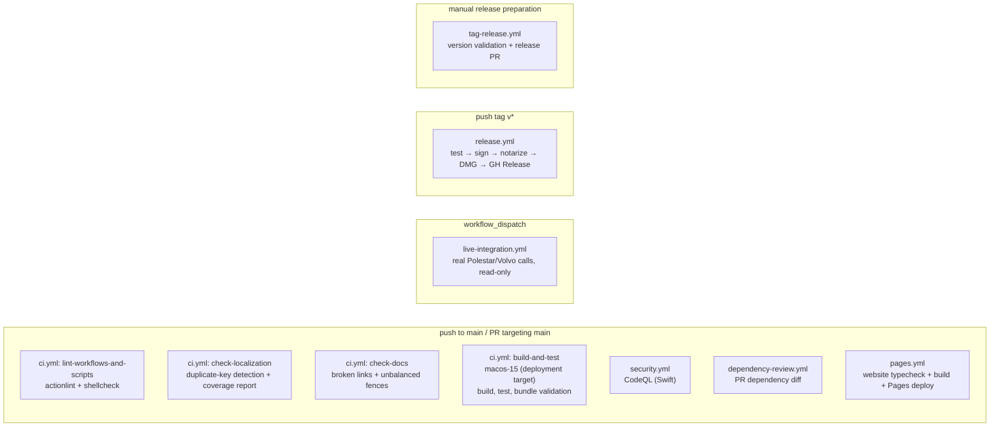

# CI

Seven GitHub Actions workflows live in `.github/workflows/`: `ci.yml`,
`security.yml`, `dependency-review.yml`, `pages.yml`, `live-integration.yml`,
`tag-release.yml`, and `release.yml`. All actions used
across them are pinned to commit SHAs with a version comment (e.g.
`actions/checkout@3d3c42e5aac5ba805825da76410c181273ba90b1 # v7.0.1`) —
preserve that pinning style when bumping any of them. This document covers
`ci.yml` and `security.yml`; see [releases.md](./releases.md) for
`release.yml` and `live-integration.yml`.



## `ci.yml`

**Trigger:** `push` to `main`, and pull requests targeting `main`.
**Permissions:** `contents: read`.
**Concurrency:** `ci-${{ github.workflow }}-${{ github.event.pull_request.number || github.ref }}`, cancels in-progress runs on a new push to the same PR/branch.
**Secrets:** none.

### Job `lint-workflows-and-scripts` (ubuntu-latest, ~2 min)

Validates the automation itself before spending macOS runner time: `actionlint`
(installed via `go install github.com/rhysd/actionlint/cmd/actionlint@v1.7.12`
— the Go module proxy checksum-verifies this against sum.golang.org, so it
doesn't need its own pinned third-party Action) against every workflow file,
and `shellcheck` against `Scripts/*.sh`.

### Job `check-localization` (ubuntu-latest, ~1 min)

Runs `Scripts/check-localization.py` against every `*.lproj/Localizable.strings`
file. **Fails on duplicate keys** within a single locale file (whichever line
wins is unspecified — a real bug). **Reports, but does not fail on**,
translation coverage relative to the base `en` locale — `L10n.swift` falls
back to English for any key missing from the active locale, so an
incomplete/stub locale is expected, not a defect.

### Job `check-docs` (ubuntu-latest, ~1 min)

`TERMS.md`, and everything under `docs/`. Fails on a relative Markdown link
that doesn't resolve to a real file, or an unterminated code fence
(``` ``` ```) — the two cheapest, highest-signal documentation defects to
catch automatically. Does not check external `http(s)` links (no network
access in this job) or Mermaid diagram *syntax* (only that fences are
balanced) — Mermaid syntax errors are still visible whenever the page
actually renders on GitHub.

### Job `build-and-test` (matrix: `macos-15`, `fail-fast: false`, 25-minute timeout)

Checkout → cache SwiftPM checkout data (keyed on
`${{ matrix.os }}-spm-${{ hashFiles('Package.resolved','Package.swift') }}`)
→ select the runner's active full Xcode with `Scripts/select-xcode.sh` →
`swift --version` + `make doctor` → `swift build` → `swift test --disable-xctest
--enable-swift-testing --skip Live`
→ `make app` → bundle validation: binary executable bit
set, `plutil -lint` on `Info.plist`, `codesign --verify --deep --strict`, and
an explicit assertion that `LSUIElement == true`. The `macos-15` leg also
builds and verifies an ad-hoc DMG and uploads it as a validation artifact.

`--skip Live` is defense-in-depth, not the only safeguard: the live
integration suites already gate themselves on credential env vars via Swift
Testing's `.disabled(if:)` trait, and CI never sets those secrets — but one
of those suites (`LivePolestarRemoteCommandIntegrationTests`) dispatches a
real `startClimate` command, so a second, independent guard (skip anything
named `Live` outright) means that stays true even if those credentials were
ever accidentally added as repository-level rather than
environment-scoped secrets.

**No Swift linting step exists** — no SwiftLint/SwiftFormat configuration
anywhere in the repo (workflow/shell-script linting now does exist, via
`lint-workflows-and-scripts` above). The Swift 6 language mode and complete
concurrency checking (declared in `Package.swift`) are the closest thing to
automated Swift style/correctness enforcement beyond the test suite itself.

**No production signing/notarization** — CI uses ad-hoc signing (`IDENTITY=-`).

**Artifacts:** the `macos-15` leg uploads `Hisingen.dmg` and its SHA-256 file.

**Fails on:** a bad toolchain (`make doctor`), a build or test failure, an
actionlint/shellcheck finding, a duplicate localization key, a broken docs
link/unterminated fence, or any bundle-validation assertion failing
(including the `LSUIElement` check — a regression there would silently turn
Hisingen into a Dock-visible app, which this check exists specifically to
catch).

## `security.yml`

**Trigger:** `push` to `main`, a weekly schedule (Mondays 04:17 UTC), and manual
dispatch. Pull requests use the separate `dependency-review.yml`; the normal CI
matrix still compiles and tests every pull request before merge.
**Secrets:** none.

### Job `codeql` (macos-15, `security-events: write`, 60-minute timeout)

CodeQL Swift analysis using `build-mode: manual`, the shared Xcode-selection
script, and the same plain `swift build` command as CI rather than
the `autobuild` heuristic. Whole-module optimization must not be added here: it
previously caused index-output mismatches and compiler type-check timeouts under
CodeQL tracing. Results land under the
repo's **Security → Code scanning alerts**.

The instrumented Swift build has taken 26–28 minutes on hosted runners, followed
by roughly 2–3 minutes of analysis and cleanup. The 60-minute timeout leaves
headroom for runner variance; the former 30-minute timeout could cancel a valid
analysis immediately after a successful build.

## `dependency-review.yml`

**Trigger:** pull requests targeting `main` only. Keeping this in a dedicated
workflow means push, scheduled, and manually dispatched Security runs do not
create a permanently skipped job.

### Job `dependency-review` (ubuntu-latest, ~1 min)

Diffs the dependency graph between base and head (GitHub Actions used in
workflows are part of that graph; Hisingen has zero external SwiftPM
dependencies today). Fails on `high`/`critical` severity findings only.

Neither security workflow is currently wired into required branch checks
(see the branch protection recommendation in [releases.md](./releases.md)) —
treat them as advisory signal to triage unless you decide otherwise.

The repository currently allows all GitHub Actions and does not enforce SHA
pinning at the repository-settings layer. The workflows nevertheless pin every
action to an immutable commit. Enabling repository-level SHA enforcement is a
useful additional control once all future workflows are expected to follow the
same convention.

## `live-integration.yml` and `release.yml`

Covered in full in [releases.md](./releases.md), including the secrets
checklist for both.

## `pages.yml`

**Trigger:** changes under `website/` on `main`, changes to the workflow itself,
or manual dispatch. It installs the lockfile-resolved Node dependencies, runs
the website typecheck and production build, verifies required static entry
points, uploads the Pages artifact, and deploys it with job-scoped `pages: write`
and `id-token: write` permissions. Every third-party action is commit-pinned and
checkout credentials are not persisted.

## Troubleshooting

- **Bundle validation fails**: re-run locally with `make app` then run the
  same `plutil`/`lipo`/`codesign` commands from `ci.yml` directly.
- **`lint-workflows-and-scripts` fails**: `actionlint` output includes the
  exact file/line; most failures are invalid `${{ }}` expressions or
  step-output typos.
- **CodeQL fails to build**: check the "Build (same command as CI)" step
  logs first — if `swift build` fails there, it's a real build break, not a
  CodeQL-specific issue.
