# Releases

The real, current release process — traced from `make release` through to a published GitHub Release.

## Repository configuration (live)

- **Branch ruleset `protect-main`** (Settings → Rules → Rulesets): the ruleset
  exists but is currently **disabled**. Until it is re-enabled, PRs and CI
  status checks are not enforced before updates to `main`. Review its required
  checks against the current workflow job names before enabling it.
- **Tag ruleset `protect-release-tags`** (pattern `refs/tags/v*`): blocks
  deletion and re-pointing of existing release tags. Creating new `v*` tags
  (what `make release` does) is unaffected.
- **`dependabot_security_updates`**: enabled (auto-PRs if a dependency gets a
  published vulnerability advisory).
- **`secret_scanning_validity_checks`**: attempted, but the API left it
  `disabled` — this feature may not be available for this account/repo tier.
  Check **Settings → Code security** if you want it and it's offered there;
  secret scanning and push protection themselves are already enabled and
  unaffected either way.
- **`production-release` environment**: exists without protection rules or a
  deployment branch policy. **`live-integration` does not yet exist** and will
  be created by GitHub when the workflow first references it. Configure scoped
  secrets and protection rules before relying on either environment as a gate.

```mermaid
flowchart TD
    A["make release VERSION=x.y.z"] --> B["Validate: VERSION matches x.y.z,<br/>matching CHANGELOG entry exists,<br/>working tree clean (incl. untracked)"]
    B --> C["Bump CFBundleShortVersionString (PlistBuddy),<br/>increment CFBundleVersion by 1"]
    C --> D["git commit 'Release vX.Y.Z'"]
    D --> E["git tag vX.Y.Z"]
    E --> F["git push origin HEAD vX.Y.Z"]
    F -->|triggers| G["release.yml (tag push v*)"]
    G --> H["Validate required secrets, pinned tools checksum,<br/>tag, Info.plist, CHANGELOG, and main ancestry"]
    H --> I["swift test --skip Live — full deterministic<br/>suite gates the release"]
    I --> J["Import Developer ID cert into ephemeral<br/>runner Keychain"]
    J --> K["Build universal signed app with embedded Sparkle"]
    K --> L["Verify architectures, updater configuration,<br/>framework load path, launch, and signatures"]
    L --> M["Notarize and staple the app"]
    M --> N["Build, sign, notarize, and staple the DMG"]
    N --> O["Create and verify Hisingen.zip and Hisingen.app.zip"]
    O --> P["Generate and verify SHA256SUMS"]
    P --> Q["Download pinned Sparkle tools; verify SHA-256"]
    Q --> R["Decode updater private key; derive public key;<br/>require exact match"]
    R --> S["Extract exact dated changelog section;<br/>generate signed appcast"]
    S --> T["Verify feed, archive, and release-note signatures"]
    T --> U["Attest provenance for DMG and both ZIPs"]
    U --> V["Publish six release assets"]
    V --> W["Verify release and all six attached assets"]
    W --> X["Publish appcast to Pages source;<br/>dispatch Pages deploy"]
    X --> Y["Always-run cleanup: certificate, keychain,<br/>updater private key, and Sparkle tools"]
```



`release.yml`'s job runs under `environment: production-release` and has
`--skip Live` on its test step (same defense-in-depth as `ci.yml` — see
[ci.md](./ci.md)) — a release run never executes the live/remote-command
test suites even though it runs the rest of the deterministic suite in full.

## Starting a release

First add the release notes under `## [x.y.z] - YYYY-MM-DD` in the root
[`CHANGELOG.md`](../../CHANGELOG.md). Then use either of the supported paths:

1. Run the **Prepare Release** workflow with an exact version or semantic bump.
   It validates monotonic versioning and the changelog entry, creates a
   `release/vX.Y.Z` branch, updates `Info.plist`, and opens a pull request. After
   opening the PR it explicitly dispatches CI and Security on the release branch
   because GitHub suppresses ordinary workflow triggers from `GITHUB_TOKEN`.
   After those checks pass and the PR is merged, create the protected
   `vX.Y.Z` tag on the merge commit.
2. From a clean local `main`, run:

```bash
make release VERSION=2.6.0
```

Both paths enforce version format and a matching changelog entry. The local path
also requires a clean worktree, bumps both version fields, commits, and pushes
the exact tag `release.yml` listens for. Manually tagging without first updating
`Info.plist` and `CHANGELOG.md` will fail the release workflow before signing.

## Gating checks (in order, all must pass)

1. **Secure configuration** — every required backend, Developer ID, notarization, and Sparkle secret must be non-empty, and the pinned Sparkle tools checksum must be configured.
2. **Tag format** — must match `vMAJOR.MINOR.PATCH` exactly.
3. **Version match** — `Info.plist`'s `CFBundleShortVersionString` (stripped of the `v` prefix) must equal the tag.
4. **Changelog match** — `CHANGELOG.md` must contain `## [MAJOR.MINOR.PATCH]`, optionally followed by a date.
5. **Tag is on `main`** — `git merge-base --is-ancestor HEAD origin/main` — a release can't be cut from a branch that hasn't been merged.
6. **`Info.plist` validity** — `plutil -lint`.
7. **Full deterministic test suite** — `swift test --skip Live -Xswiftc -strict-concurrency=complete -Xswiftc -warn-concurrency`. A release does not proceed on a failing test, regardless of what a prior `ci.yml` run on the same commit showed.

If any of these fail, nothing is signed, notarized, or published.

## Signing and notarization

See [signing-and-notarization details below](#signing-and-notarization-detail). Both the `.app` and the `.dmg` are independently signed, notarized, and stapled — not just the app inside the DMG. The workflow's final verification step is deliberately paranoid: it mounts the *published* DMG and unzips the *published* zip and re-runs `codesign --verify`/`spctl --assess` on those extracted copies, not just on the build artifacts still sitting in the runner's working directory — catching a class of bug where packaging (zipping/DMG creation) subtly corrupts an otherwise-valid signature.

## Checksums

`SHA256SUMS`, generated via `shasum -a 256` over the final DMG and zip, published alongside them as a release asset. Users can verify a download with:

```bash
shasum -a 256 -c SHA256SUMS
```

## Sparkle appcast publication

The workflow downloads the pinned Sparkle `2.9.6` tools archive and rejects it unless its
SHA-256 digest matches the `SPARKLE_TOOLS_SHA256` repository variable. It decodes the temporary
private-key export, derives its Ed25519 public key, and requires an exact match with the
32-byte `SPARKLE_PUBLIC_ED_KEY` before calling `generate_appcast --ed-key-file`.

The matching dated changelog section is extracted into `Hisingen.app.md`; extraction stops at
the next release heading. Appcast generation adds two release assets:

- `appcast.xml`
- `Hisingen.app.md`

Before publication, an independent verifier requires the signed-feed block, archive Ed25519
signature, and release-notes signature. Missing notes, malformed keys, mismatched key pairs,
or incomplete signatures fail the release.

## Release artifact verification

Two independent checks exist specifically to prevent a run showing green in
Actions while leaving an unusable or incomplete release behind:

1. **Pre-publish**: before `softprops/action-gh-release` runs at all, a step
   asserts `Hisingen.dmg`, `Hisingen.zip`, `Hisingen.app.zip`, and
   `SHA256SUMS` exist, are non-empty, and verifies every checksum. The appcast
   step separately requires non-empty, fully signed `appcast.xml` and
   `Hisingen.app.md`.
2. **Post-publish**: after publishing, `gh release view "$GITHUB_REF_NAME"
   --json assets` is queried and the job fails unless exactly the six expected
   assets are attached — the specific gap that matters, since it's
   possible for an upload step to report success while silently attaching
   zero files (e.g. a glob matching nothing).

## Build provenance

`actions/attest-build-provenance` generates a signed attestation for
`Hisingen.dmg`, `Hisingen.zip`, and `Hisingen.app.zip`, linking the published binaries back to
this exact workflow run, commit, and repository via Sigstore/GitHub's
attestation API (`attestations: write` + `id-token: write` permissions on the
release job). Anyone can verify a downloaded release asset was actually built
by this repository's `release.yml` — not just re-signed or repackaged
elsewhere — with:

```bash
gh attestation verify Hisingen.dmg --owner NicolasKheirallah
gh attestation verify Hisingen.zip --owner NicolasKheirallah
```

This is a supply-chain integrity check layered on top of, not a replacement
for, Apple code signing and notarization — it proves *provenance* (which
workflow run produced this file), while codesign/notarization prove the
binary is trusted to run on macOS.

## `live-integration.yml`

**Trigger:** `workflow_dispatch` only (manual, from the Actions tab), with a
`provider` choice (`all` / `polestar` / `volvo`). Never runs automatically.
**Permissions:** `contents: read` — this workflow only ever runs tests, never
publishes anything.
**Environment:** `live-integration` (both jobs).
**Concurrency:** group `live-account-test`, shared across *both* jobs, so a
Polestar and a Volvo run can never overlap the same test account(s) even if
triggered close together.

Only suites whose names make the read-only contract explicit are ever
invoked: `--filter LivePolestarReadOnlyIntegrationTests` and `--filter
LiveVolvoReadOnlyIntegrationTests`. `LivePolestarIntegrationTests.swift` also
defines `LivePolestarRemoteCommandIntegrationTests`, which dispatches a real
`startClimate` command against the configured vehicle — this workflow does
not filter it in, and it must stay that way; it's reachable only by running
that Swift Testing suite directly and locally with a developer's own
consciously-supplied credentials, never from CI.

- **`live-polestar`** — requires `HISINGEN_TEST_EMAIL`, `HISINGEN_TEST_PASSWORD`
  (checked for non-emptiness before any test runs); `HISINGEN_TEST_VIN` is
  optional.
- **`live-volvo`** — requires `HISINGEN_TEST_VOLVO_CLIENT_ID`,
  `HISINGEN_TEST_VOLVO_CLIENT_SECRET`, `HISINGEN_TEST_VOLVO_VCC_API_KEY`, and
  `HISINGEN_TEST_VOLVO_REFRESH_TOKEN` (all four checked); `HISINGEN_TEST_VOLVO_VIN`
  is optional.

**Running it:** Actions tab → **Live Account Integration** → **Run
workflow** → choose `all`/`polestar`/`volvo`.

## Secrets checklist

Configure under **Settings → Secrets and variables → Actions**, scoped to
the environment noted (not the repository as a whole), so a same-repo PR
branch can never read them.

| Secret | Workflow | Environment | Purpose |
|---|---|---|---|
| `MACOS_CERT_P12` | release.yml | `production-release` | Base64-encoded Developer ID Application `.p12` certificate. |
| `MACOS_CERT_PASSWORD` | release.yml | `production-release` | Password protecting the `.p12` above. |
| `NOTARY_APPLE_ID` | release.yml | `production-release` | Apple ID used for `notarytool submit`. |
| `NOTARY_TEAM_ID` | release.yml | `production-release` | Apple Developer Team ID. |
| `NOTARY_APP_PASSWORD` | release.yml | `production-release` | App-specific password for the Apple ID above (not the account password). |
| `VOLVO_CLIENT_ID` / `VOLVO_CLIENT_SECRET` / `VOLVO_VCC_API_KEY` | release.yml | `production-release` | Volvo Developer API credentials embedded in the production build configuration. |
| `SPARKLE_PUBLIC_ED_KEY` | release.yml | `production-release` | Base64-encoded 32-byte Ed25519 public key embedded in the app. |
| `SPARKLE_PRIVATE_ED_KEY` | release.yml | `production-release` | Base64 encoding of the Sparkle private-key export, used only to sign the appcast. |
| `HISINGEN_TEST_EMAIL` / `HISINGEN_TEST_PASSWORD` / `HISINGEN_TEST_VIN` | live-integration.yml (`live-polestar`) | `live-integration` | Dedicated Polestar test account — never a personal account. VIN is optional. |
| `HISINGEN_TEST_VOLVO_CLIENT_ID` / `_CLIENT_SECRET` / `_VCC_API_KEY` / `_REFRESH_TOKEN` / `_VIN` | live-integration.yml (`live-volvo`) | `live-integration` | Dedicated Volvo Developer Portal test app registration + test account refresh token. VIN is optional. |

Rotate `NOTARY_APP_PASSWORD` and the Volvo refresh token if you suspect
exposure — both are revocable without needing a new certificate or client
registration. Check the Developer ID certificate's expiry with `security
find-identity -v -p codesigning` against a local copy before it lapses, since
an expired cert fails `release.yml` at the "Import Developer ID certificate"
step with no advance warning otherwise.

Set repository variable `SPARKLE_TOOLS_SHA256` to the expected SHA-256 digest of
`Sparkle-2.9.6.tar.xz`. This is a variable rather than a secret, but a release
still fails before signing if it is empty.

## Release notes

Every release must have a hand-maintained entry in the root
[`CHANGELOG.md`](../../CHANGELOG.md). GitHub also generates release-page notes
from merged PRs and commits through `generate_release_notes: true`; those notes
supplement the changelog rather than replacing it.

The signed Sparkle note asset contains only the exact tagged changelog section.
A dated heading such as `## [1.2.4] - 2026-08-28` is supported and preferred.

## Signing and notarization detail

**Certificate handling:** the Developer ID certificate (`.p12`, base64-encoded in the `MACOS_CERT_P12` secret) is imported into a fresh, ephemeral Keychain created just for the CI run (`security create-keychain`), never the runner's default login keychain. `security find-identity -v -p codesigning` resolves the exact identity string dynamically rather than hardcoding it — the workflow fails clearly if no matching identity is found after import, rather than silently falling back to ad-hoc signing.

**Hardened runtime:** `make app`/`make app-universal` sign with `--options runtime --timestamp` whenever `IDENTITY` contains "Developer ID" — required for notarization to succeed.

**Notarization:** `ditto` zips the app, `xcrun notarytool submit --wait` submits it to Apple and blocks until a result, then `stapler staple` attaches the notarization ticket so the app can be verified offline afterward, and `stapler validate` confirms the staple took. The DMG goes through the same submit/staple/validate sequence separately.

**Gatekeeper assessment:** `spctl --assess` is run against both the app and the DMG as a final "would Gatekeeper actually let a user open this" check, not just a signature check.

**Cleanup:** an `if: always()` step deletes the temporary `.p12`, any intermediate zip, the decoded Sparkle private key and downloaded tools archive, and the ephemeral signing keychain — even if an earlier step in the job failed, so a failed release run never leaves signing material sitting on a shared runner.

## What's real vs. what's aspirational

Everything in this document describes the workflow as it exists in
`.github/workflows/release.yml`, `.github/workflows/tag-release.yml`, and the
local release scripts today. Production signing and notarization still require
an actual protected release run with the configured environment secrets.
