# Releases

The real, current release process — traced from `make release` through to a published GitHub Release.

## Repository configuration (live)

- **Branch ruleset `protect-main`** (Settings → Rules → Rulesets): PRs
  required into `main`, required status checks `lint-workflows-and-scripts`,
  `check-localization`, `check-docs`, `build-and-test (macos-14)`,
  `build-and-test (macos-15)`; conversation resolution required; no
  force-push or deletion. No bypass actor is configured — this applies to
  the repo owner too, so even solo changes go through a PR now.
- **Tag ruleset `protect-release-tags`** (pattern `refs/tags/v*`): blocks
  deletion and re-pointing of existing release tags. Creating new `v*` tags
  (what `make release` does) is unaffected.
- **`dependabot_security_updates`**: enabled (auto-PRs if a dependency gets a
  published vulnerability advisory).
- **`secret_scanning_validity_checks`**: attempted, but the API left it
  `disabled` — this feature may not be available for this account/repo tier.
  Check **Settings → Code security** if you want it and it's offered there;
  secret scanning and push protection themselves are already enabled and
  unaffected either way.
- **`production-release` / `live-integration` environments**: created
  automatically by `release.yml`/`live-integration.yml` referencing them, but
  have no protection rules or scoped secrets yet — see "Secrets checklist"
  below for what to move into each.

```mermaid
flowchart TD
    A["make release VERSION=x.y.z"] --> B["Validate: VERSION matches x.y.z,<br/>working tree clean (incl. untracked)"]
    B --> C["Bump CFBundleShortVersionString (PlistBuddy),<br/>increment CFBundleVersion by 1"]
    C --> D["git commit 'Release vX.Y.Z'"]
    D --> E["git tag vX.Y.Z"]
    E --> F["git push origin HEAD vX.Y.Z"]
    F -->|triggers| G["release.yml (tag push v*)"]
    G --> H["Verify: tag matches vMAJOR.MINOR.PATCH,<br/>Info.plist version matches tag,<br/>tag commit is an ancestor of main"]
    H --> I["swift test --skip Live — full deterministic<br/>suite gates the release"]
    I --> J["Import Developer ID cert into ephemeral<br/>runner Keychain (security create-keychain/import)"]
    J --> K["make app-universal IDENTITY='Developer ID Application: ...'"]
    K --> L["Verify: lipo -verify_arch arm64 x86_64,<br/>codesign --verify --deep --strict"]
    L --> M["Notarize + staple the .app<br/>(ditto zip → notarytool submit --wait → stapler staple/validate → spctl --assess)"]
    M --> N["make dmg"]
    N --> O["Sign, notarize, staple, validate the DMG too"]
    O --> P["Re-verify by mounting the DMG and unzipping<br/>the app zip, re-running codesign/spctl on each"]
    P --> Q["shasum -a 256 → SHA256SUMS"]
    Q --> Q2["Verify DMG/zip/SHA256SUMS exist and are<br/>non-empty, BEFORE publishing anything"]
    Q2 --> Q3["Attest build provenance for DMG + zip<br/>(actions/attest-build-provenance)"]
    Q3 --> R["softprops/action-gh-release — publish DMG, zip,<br/>SHA256SUMS with generate_release_notes: true"]
    R --> R2["Verify all 3 assets are actually attached<br/>to the published release (gh release view --json assets)"]
    R2 --> S["Always-run cleanup: delete temp .p12/zip<br/>and the ephemeral signing keychain"]
```



`release.yml`'s job runs under `environment: production-release` and has
`--skip Live` on its test step (same defense-in-depth as `ci.yml` — see
[ci.md](./ci.md)) — a release run never executes the live/remote-command
test suites even though it runs the rest of the deterministic suite in full.

## Starting a release

```bash
make release VERSION=2.6.0
```

This is the **only** supported way to cut a release — it enforces version format, a clean working tree (including untracked files, not just staged changes), bumps both version fields in `Info.plist` correctly, and pushes the exact tag `release.yml` listens for. Manually tagging without going through `make release` risks a version mismatch that the release workflow's own verification step (`Info.plist` version vs. tag) will catch and fail on — which is the intended safety net, not a workaround to route around.

## Gating checks (in order, all must pass)

1. **Tag format** — must match `vMAJOR.MINOR.PATCH` exactly.
2. **Version match** — `Info.plist`'s `CFBundleShortVersionString` (stripped of the `v` prefix) must equal the tag.
3. **Tag is on `main`** — `git merge-base --is-ancestor HEAD origin/main` — a release can't be cut from a branch that hasn't been merged.
4. **`Info.plist` validity** — `plutil -lint`.
5. **Full test suite** — `swift test --disable-xctest --enable-swift-testing -Xswiftc -strict-concurrency=complete -Xswiftc -warn-concurrency`. A release does not proceed on a failing test, regardless of what a prior `ci.yml` run on the same commit showed — the release workflow re-runs tests itself rather than trusting a separate workflow's result.

If any of these fail, nothing is signed, notarized, or published.

## Signing and notarization

See [signing-and-notarization details below](#signing-and-notarization-detail). Both the `.app` and the `.dmg` are independently signed, notarized, and stapled — not just the app inside the DMG. The workflow's final verification step is deliberately paranoid: it mounts the *published* DMG and unzips the *published* zip and re-runs `codesign --verify`/`spctl --assess` on those extracted copies, not just on the build artifacts still sitting in the runner's working directory — catching a class of bug where packaging (zipping/DMG creation) subtly corrupts an otherwise-valid signature.

## Checksums

`SHA256SUMS`, generated via `shasum -a 256` over the final DMG and zip, published alongside them as a release asset. Users can verify a download with:

```bash
shasum -a 256 -c SHA256SUMS
```

## Release artifact verification

Two independent checks exist specifically to prevent a run showing green in
Actions while leaving an unusable or incomplete release behind:

1. **Pre-publish**: before `softprops/action-gh-release` runs at all, a step
   asserts `Hisingen.dmg`, `Hisingen.zip`, and `SHA256SUMS` exist, are
   non-empty, and that `SHA256SUMS` actually references both filenames.
2. **Post-publish**: after publishing, `gh release view "$GITHUB_REF_NAME"
   --json assets` is queried and the job fails if any of the three expected
   assets isn't actually attached — the specific gap that matters, since it's
   possible for an upload step to report success while silently attaching
   zero files (e.g. a glob matching nothing).

## Build provenance

`actions/attest-build-provenance` generates a signed attestation for
`Hisingen.dmg` and `Hisingen.zip`, linking the published binaries back to
this exact workflow run, commit, and repository via Sigstore/GitHub's
attestation API (`attestations: write` + `id-token: write` permissions on the
release job). Anyone can verify a downloaded release asset was actually built
by this repository's `release.yml` — not just re-signed or repackaged
elsewhere — with:

```bash
gh attestation verify Hisingen.dmg --owner NicolasKheirallah
gh attestation verify Hisingen.zip --owner NicolasKheirallah
```

This is a supply-chain integrity check layered on top of, not a replacement
for, Apple code signing and notarization — it proves *provenance* (which
workflow run produced this file), while codesign/notarization prove the
binary is trusted to run on macOS.

## `live-integration.yml`

**Trigger:** `workflow_dispatch` only (manual, from the Actions tab), with a
`provider` choice (`all` / `polestar` / `volvo`). Never runs automatically.
**Permissions:** `contents: read` — this workflow only ever runs tests, never
publishes anything.
**Environment:** `live-integration` (both jobs).
**Concurrency:** group `live-account-test`, shared across *both* jobs, so a
Polestar and a Volvo run can never overlap the same test account(s) even if
triggered close together.

Only suites whose names make the read-only contract explicit are ever
invoked: `--filter LivePolestarReadOnlyIntegrationTests` and `--filter
LiveVolvoReadOnlyIntegrationTests`. `LivePolestarIntegrationTests.swift` also
defines `LivePolestarRemoteCommandIntegrationTests`, which dispatches a real
`startClimate` command against the configured vehicle — this workflow does
not filter it in, and it must stay that way; it's reachable only by running
that Swift Testing suite directly and locally with a developer's own
consciously-supplied credentials, never from CI.

- **`live-polestar`** — requires `HISINGEN_TEST_EMAIL`, `HISINGEN_TEST_PASSWORD`
  (checked for non-emptiness before any test runs); `HISINGEN_TEST_VIN` is
  optional.
- **`live-volvo`** — requires `HISINGEN_TEST_VOLVO_CLIENT_ID`,
  `HISINGEN_TEST_VOLVO_CLIENT_SECRET`, `HISINGEN_TEST_VOLVO_VCC_API_KEY`, and
  `HISINGEN_TEST_VOLVO_REFRESH_TOKEN` (all four checked); `HISINGEN_TEST_VOLVO_VIN`
  is optional.

**Running it:** Actions tab → **Live Account Integration** → **Run
workflow** → choose `all`/`polestar`/`volvo`.

## Secrets checklist

Configure under **Settings → Secrets and variables → Actions**, scoped to
the environment noted (not the repository as a whole), so a same-repo PR
branch can never read them.

| Secret | Workflow | Environment | Purpose |
|---|---|---|---|
| `MACOS_CERT_P12` | release.yml | `production-release` | Base64-encoded Developer ID Application `.p12` certificate. |
| `MACOS_CERT_PASSWORD` | release.yml | `production-release` | Password protecting the `.p12` above. |
| `NOTARY_APPLE_ID` | release.yml | `production-release` | Apple ID used for `notarytool submit`. |
| `NOTARY_TEAM_ID` | release.yml | `production-release` | Apple Developer Team ID. |
| `NOTARY_APP_PASSWORD` | release.yml | `production-release` | App-specific password for the Apple ID above (not the account password). |
| `HISINGEN_TEST_EMAIL` / `HISINGEN_TEST_PASSWORD` / `HISINGEN_TEST_VIN` | live-integration.yml (`live-polestar`) | `live-integration` | Dedicated Polestar test account — never a personal account. VIN is optional. |
| `HISINGEN_TEST_VOLVO_CLIENT_ID` / `_CLIENT_SECRET` / `_VCC_API_KEY` / `_REFRESH_TOKEN` / `_VIN` | live-integration.yml (`live-volvo`) | `live-integration` | Dedicated Volvo Developer Portal test app registration + test account refresh token. VIN is optional. |

Rotate `NOTARY_APP_PASSWORD` and the Volvo refresh token if you suspect
exposure — both are revocable without needing a new certificate or client
registration. Check the Developer ID certificate's expiry with `security
find-identity -v -p codesigning` against a local copy before it lapses, since
an expired cert fails `release.yml` at the "Import Developer ID certificate"
step with no advance warning otherwise.

## Release notes

`generate_release_notes: true` on `softprops/action-gh-release` — GitHub auto-generates notes from merged PRs/commits since the last tag. There is no separate hand-written release-notes step; `changelog.md` (a single consolidated entry, not a per-version log — see [testing/strategy.md](../testing/strategy.md)) is the project's own running summary, maintained separately from GitHub's auto-generated notes.

## Signing and notarization detail

**Certificate handling:** the Developer ID certificate (`.p12`, base64-encoded in the `MACOS_CERT_P12` secret) is imported into a fresh, ephemeral Keychain created just for the CI run (`security create-keychain`), never the runner's default login keychain. `security find-identity -v -p codesigning` resolves the exact identity string dynamically rather than hardcoding it — the workflow fails clearly if no matching identity is found after import, rather than silently falling back to ad-hoc signing.

**Hardened runtime:** `make app`/`make app-universal` sign with `--options runtime --timestamp` whenever `IDENTITY` contains "Developer ID" — required for notarization to succeed.

**Notarization:** `ditto` zips the app, `xcrun notarytool submit --wait` submits it to Apple and blocks until a result, then `stapler staple` attaches the notarization ticket so the app can be verified offline afterward, and `stapler validate` confirms the staple took. The DMG goes through the same submit/staple/validate sequence separately.

**Gatekeeper assessment:** `spctl --assess` is run against both the app and the DMG as a final "would Gatekeeper actually let a user open this" check, not just a signature check.

**Cleanup:** an `if: always()` step deletes the temporary `.p12`, any intermediate zip, and the ephemeral signing keychain — even if an earlier step in the job failed, so a failed release run never leaves a certificate sitting on a shared runner.

## What's real vs. what's aspirational

Everything in this document describes the workflow as it exists in `.github/workflows/release.yml` and `Makefile` today — traced directly from those files, not from an idealized description. The one caveat: this documentation set has not itself executed a live release run; if you're the maintainer verifying this against a real run, cross-check the "Remaining external verification" checklist in `changelog.md`, which lists items like confirming a green CI matrix on hosted runners and exercising the production signing/notarization path with real secrets as still-open verification items as of the last update.
