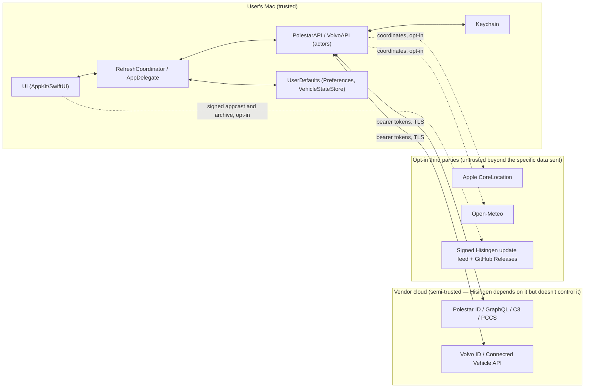

# Security Overview

Hisingen has no backend, no account system, and no analytics of its own — every trust boundary is between the user's Mac and a vendor's cloud service. This document covers the practical security posture; see [threat-model.md](threat-model.md) for a structured STRIDE pass and [privacy.md](privacy.md) for exactly what data leaves the Mac.

## Trust boundaries

The boundary that matters most in practice: **credentials and tokens never cross from one provider to the other**, and **nothing about a user's vehicle, account, or credentials is ever sent anywhere except the vendor that owns that account** — no relay, no analytics pipeline, no crash reporter with vehicle data attached.

## Credentials

- **Polestar account email** — persisted in Keychain for relaunch sign-in; legacy
  plaintext `UserDefaults` values are migrated and removed after a successful
  Keychain write.
- **Polestar password** — entered once, sent directly to Polestar ID during login, then persisted to Keychain (so a relaunch can re-authenticate without prompting). Never logged, never sent anywhere except Polestar's own login endpoint.
- **Polestar refresh token** — the only Polestar credential kept long-term; the access token lives in memory only and is re-derived from the refresh token on every launch.
- **Volvo Client ID / Client Secret / VCC API Key** — the user's own Developer Portal application credentials, entered in Settings, persisted to Keychain (secret + API key) or `UserDefaults` (Client ID, not secret).
- **Volvo refresh token** — same role as Polestar's.

See [keychain.md](keychain.md) for exactly how and where these are stored.

## Network transport

Every request in the codebase is HTTPS (`https://` hardcoded, no scheme-downgrade path) or, for Polestar's gRPC calls, gRPC-over-HTTP/2 (also TLS). There is no custom certificate pinning — Hisingen relies on the system's standard TLS trust store via `URLSession`. OIDC discovery responses are additionally host-validated (must be `polestar.com` or a `*.polestar.com` subdomain, `https` only) before any of their URLs are used, as a defense against a compromised discovery document redirecting the login flow off-domain.

## Redirects and callbacks

- **Polestar's login redirect** is intercepted by a custom `URLSessionTaskDelegate` that only captures a redirect matching the exact expected scheme/host/path (`https://www.polestar.com/sign-in-callback`) — anything else is followed normally, not treated as a callback.
- **Volvo's OAuth callback** round-trips through a static GitHub Pages bridge page (required because Volvo's Developer Portal only accepts `http(s)` redirect URIs) before landing on Hisingen's `hisingen://` custom URL scheme. See [api/authentication.md](../api/authentication.md#volvo-oauth2-pkce-with-a-redirect-uri-bridge) for the exact mechanics and [threat-model.md](threat-model.md) for what this bridge page can and can't be used for.
- **`state` parameter validation** is enforced on both providers' callbacks before any token exchange is attempted.

## Logs

Hisingen uses `os.log` (`Logger`) sparingly — mostly for launch-at-login failures and similar operational events. No credential, token, or full vehicle-state payload is logged anywhere in the reviewed source. This isn't formally enforced (there's no lint rule preventing a future `logger.debug("\(token)")`), so it's a convention to preserve when touching authentication code, not a guarantee backed by tooling.

## Caches

`VehicleStateStore` deliberately strips PII (registration number, owner name, odometer/service details, fluid warnings, weather, image data) before writing a `VehicleState` to `UserDefaults` — see [architecture/persistence.md](../architecture/persistence.md#cache-design-vehiclestatestore) and [privacy.md](privacy.md). Precise saved-charge-location coordinates and location aliases are discarded before they ever reach the domain model at all, not just before caching.

## External services

Every third-party (non-Polestar-non-Volvo) network call is opt-in and enumerated in [system-context.md](../architecture/system-context.md) — reverse geocoding (Apple), weather (Open-Meteo), and signed update delivery (GitHub Pages/Releases). None receive credentials or account identifiers; the location-based ones receive coordinates only when the corresponding feature is explicitly enabled.

## Application signing and release integrity

Production releases are Developer ID signed, hardened-runtime enabled, notarized by Apple, stapled, and authenticated by Sparkle's Ed25519 signed appcast/archive chain. Local `make app` builds intentionally have no production updater key and are explicitly **not** trusted the same way — see [updater-architecture.md](../updater-architecture.md).

## Remote control posture

Remote-command dispatch is compiled into every build ([ADR-0009](../adr/0009-remote-commands-compiled-into-all-builds.md) removed the `HISINGEN_EXPERIMENTAL_REMOTE` flag that previously excluded it). The guard is now runtime rather than compile-time: no remote capability is enabled by default, each is an explicit Settings opt-in, and every non-routine command requires local device-owner authentication (Touch ID or Mac password) in addition to an explicit confirmation dialog. See [threat-model.md](threat-model.md#remote-control-surface).
